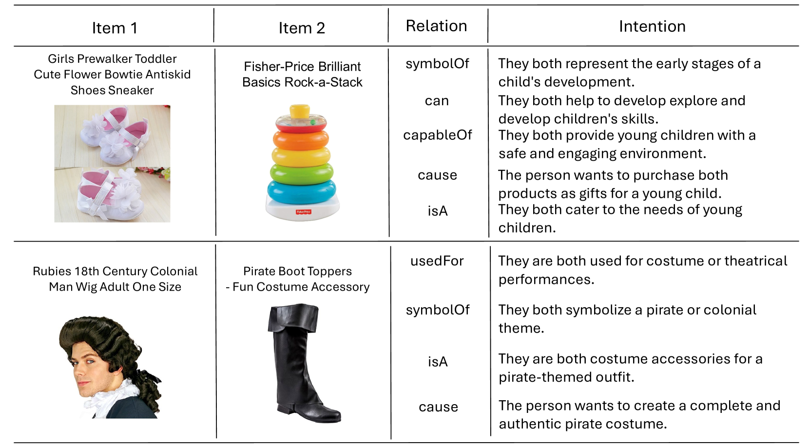
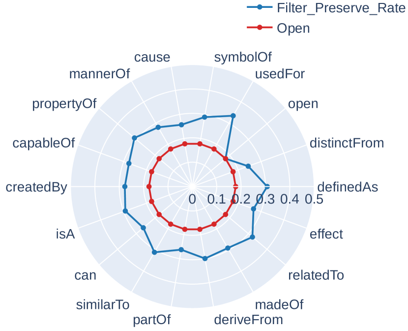

# MIND：大型视觉-语言模型中的多模态购物意图提取，助力电子商务购买洞察

发布时间：2024年06月15日

`Agent

理由：这篇论文介绍了一个名为MIND的框架，该框架利用大型视觉-语言模型从多模态产品元数据中提取以人为本的购买意图，并构建了一个多模态知识库。这个框架可以被视为一个智能Agent，因为它能够理解和预测用户的购买意图，从而提升电商平台的用户体验和个性化搜索。这与Agent的定义相符，即一个能够感知环境并采取行动以达到目标的系统。虽然这个框架涉及到了大型语言模型的应用，但其核心在于通过多模态数据分析来提升用户体验，因此更适合归类为Agent。` `个性化搜索`

> MIND: Multimodal Shopping Intention Distillation from Large Vision-language Models for E-commerce Purchase Understanding

# 摘要

> 在电商平台上，提升用户体验和个性化搜索的关键在于洞察购买意图。然而，现有方法多依赖于大型语言模型的人工标注验证，这不仅成本高昂，还容易忽视产品图片中的视觉信息，且往往聚焦于产品本身而非用户。为此，我们推出了MIND框架，它利用大型视觉-语言模型从多模态产品元数据中提取以人为本的购买意图。通过分析亚马逊的共同购买记录，我们构建了一个包含126万余条意图的多模态知识库。人工评估显示，这些意图既合理又典型，证明了我们框架和过滤机制的有效性。进一步的实验表明，这些意图极大地提升了大型语言模型在理解用户意图方面的能力。

> Improving user experience and providing personalized search results in E-commerce platforms heavily rely on understanding purchase intention. However, existing methods for acquiring large-scale intentions bank on distilling large language models with human annotation for verification. Such an approach tends to generate product-centric intentions, overlook valuable visual information from product images, and incurs high costs for scalability. To address these issues, we introduce MIND, a multimodal framework that allows Large Vision-Language Models (LVLMs) to infer purchase intentions from multimodal product metadata and prioritize human-centric ones. Using Amazon Review data, we apply MIND and create a multimodal intention knowledge base, which contains 1,264,441 million intentions derived from 126,142 co-buy shopping records across 107,215 products. Extensive human evaluations demonstrate the high plausibility and typicality of our obtained intentions and validate the effectiveness of our distillation framework and filtering mechanism. Additional experiments reveal that our obtained intentions significantly enhance large language models in two intention comprehension tasks.

[Arxiv](https://arxiv.org/abs/2406.10701)