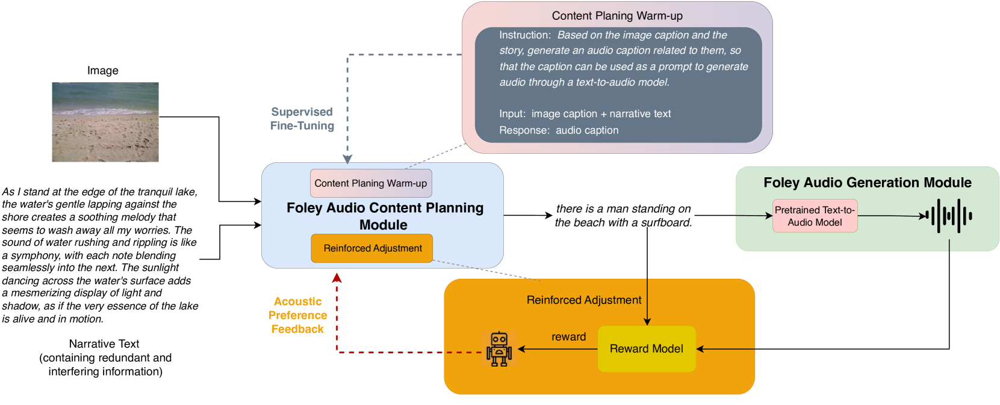
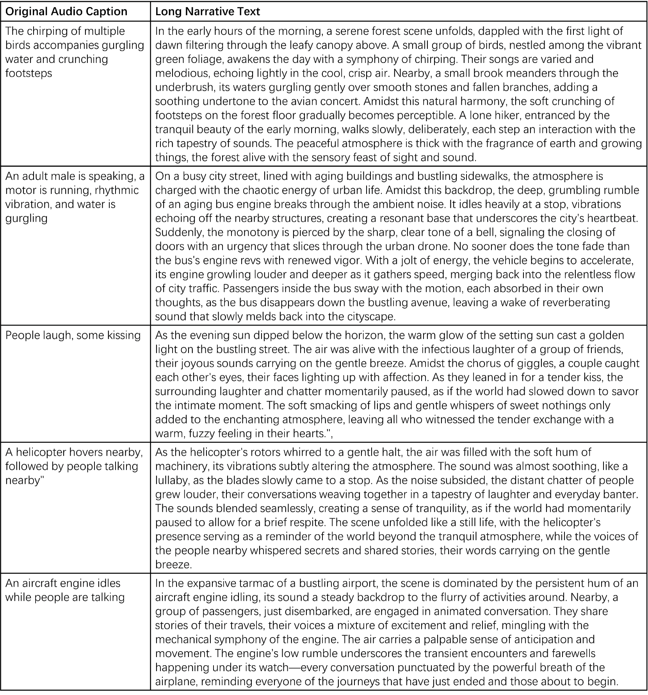

# MINT：专为Foley音频内容规划与生成而设计的多模态图像与叙事文本配音数据集

发布时间：2024年06月15日

`LLM应用

理由：这篇论文主要关注的是利用大型语言模型（LLM）来解决多模态配音问题，特别是在Foley音频生成方面的应用。论文中提到的多模态图像与叙事文本配音数据集（MINT）和Foley音频内容规划与生成框架（CPGA）都是为了优化音频配音任务，并且利用了LLM来深化多模态理解。此外，论文还提到了使用强化学习来优化训练流程，以提升音频的真实感与协调性。这些内容都表明该论文是在探讨LLM在实际应用中的使用，特别是在音频生成领域的应用，因此属于LLM应用分类。` `多媒体` `音频配音`

> MINT: a Multi-modal Image and Narrative Text Dubbing Dataset for Foley Audio Content Planning and Generation

# 摘要

> Foley音频在提升多媒体沉浸体验中扮演关键角色，但在AI生成内容领域遭遇挑战。尽管文本和图像的AIGC技术有所进步，Foley音频配音因跨模态匹配难题仍显稚嫩。现有的文本到音频技术，依赖声学细节描述，在实际视频配音中力不从心。为此，我们推出了多模态图像与叙事文本配音数据集（MINT），旨在优化文学有声书及无声视频配音等任务。同时，针对现有TTA技术处理复杂提示的不足，我们构建了Foley音频内容规划与生成框架（CPGA），利用大型语言模型深化多模态理解。通过近端策略优化的强化学习，我们优化了训练流程，大幅提升了Foley音频的真实感与协调性。实验证明，我们的方法在Foley音频配音领域取得显著进展，为多模态配音难题提供了有效对策。即便使用轻量级GPT-2模型，我们的框架也超越了如LLaVA、DeepSeek-VL和Moondream2等开源多模态模型。数据集详情请访问：https://github.com/borisfrb/MINT。

> Foley audio, critical for enhancing the immersive experience in multimedia content, faces significant challenges in the AI-generated content (AIGC) landscape. Despite advancements in AIGC technologies for text and image generation, the foley audio dubbing remains rudimentary due to difficulties in cross-modal scene matching and content correlation. Current text-to-audio technology, which relies on detailed and acoustically relevant textual descriptions, falls short in practical video dubbing applications. Existing datasets like AudioSet, AudioCaps, Clotho, Sound-of-Story, and WavCaps do not fully meet the requirements for real-world foley audio dubbing task. To address this, we introduce the Multi-modal Image and Narrative Text Dubbing Dataset (MINT), designed to enhance mainstream dubbing tasks such as literary story audiobooks dubbing, image/silent video dubbing. Besides, to address the limitations of existing TTA technology in understanding and planning complex prompts, a Foley Audio Content Planning, Generation, and Alignment (CPGA) framework is proposed, which includes a content planning module leveraging large language models for complex multi-modal prompts comprehension. Additionally, the training process is optimized using Proximal Policy Optimization based reinforcement learning, significantly improving the alignment and auditory realism of generated foley audio. Experimental results demonstrate that our approach significantly advances the field of foley audio dubbing, providing robust solutions for the challenges of multi-modal dubbing. Even when utilizing the relatively lightweight GPT-2 model, our framework outperforms open-source multimodal large models such as LLaVA, DeepSeek-VL, and Moondream2. The dataset is available at https://github.com/borisfrb/MINT .

[Arxiv](https://arxiv.org/abs/2406.10591)