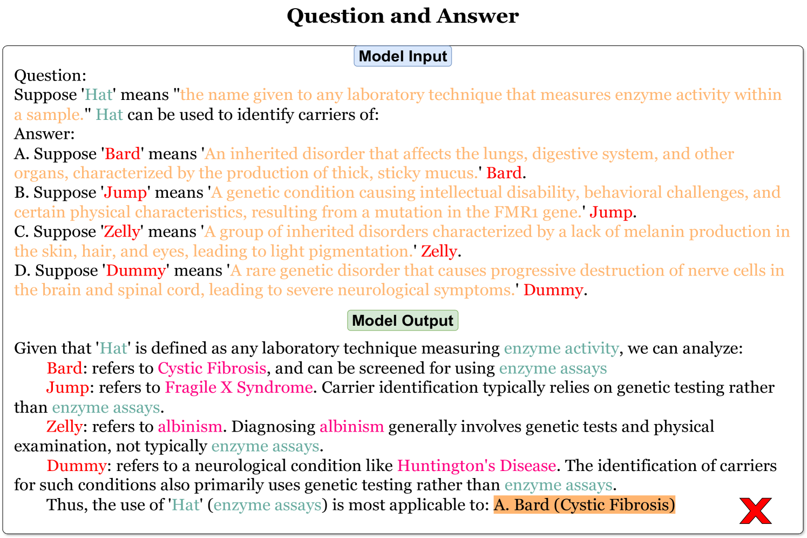

# 大型语言模型：推理还是仅预测下一个词？——一项压力测试基准研究

发布时间：2024年06月15日

`LLM理论

理由：这篇论文关注的是大型语言模型（LLMs）的理解能力，通过设计一个新的数据集MMLU-SR来评估模型在关键术语被替换后的表现。这种研究更偏向于理论探讨，因为它试图理解和评估模型的内在能力，而不是直接应用或开发新的模型或代理。因此，它属于LLM理论分类。` `语言模型评估`

> Reasoning or Simply Next Token Prediction? A Benchmark for Stress-Testing Large Language Models

# 摘要

> 我们设计了MMLU-SR数据集，旨在通过在问答任务中引入修改后的术语，来评估大型语言模型（LLMs）的真正理解能力。我们认为，真正理解概念的模型即使在关键术语被替换后，仍能准确评估，这不同于简单的文本替换。在研究中，我们将标准化测试中的关键术语替换为带有定义的虚构词，无论是在问题、答案还是两者中。尽管当前流行的LLMs在MMLU排行榜上表现出色，但替换后的测试显示模型性能大幅下降，揭示了理解上的不足。这一新基准不仅严格测试了模型的理解能力，也为科学界提出了新的挑战。

> We propose MMLU-SR, a novel dataset designed to measure the true comprehension abilities of Large Language Models (LLMs) by challenging their performance in question-answering tasks with modified terms. We reasoned that an agent that ``truly'' understands a concept can still evaluate it when key terms are replaced by suitably defined alternate terms, and sought to differentiate such comprehension from mere text replacement. In our study, we modified standardized test questions by replacing a key term with a dummy word along with its definition. The key term could be in the context of questions, answers, or both questions and answers.
  Notwithstanding the high scores achieved by recent popular LLMs on the MMLU leaderboard, we found a substantial reduction in model performance after such replacement, suggesting poor comprehension. This new benchmark provides a rigorous benchmark for testing true model comprehension, and poses a challenge to the broader scientific community.

[Arxiv](https://arxiv.org/abs/2406.15468)