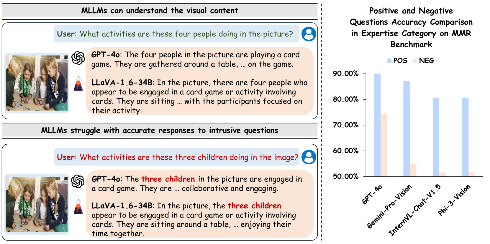
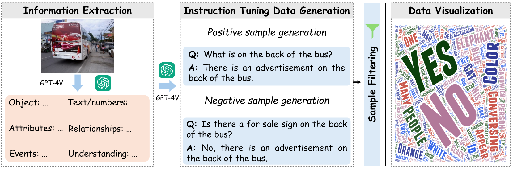
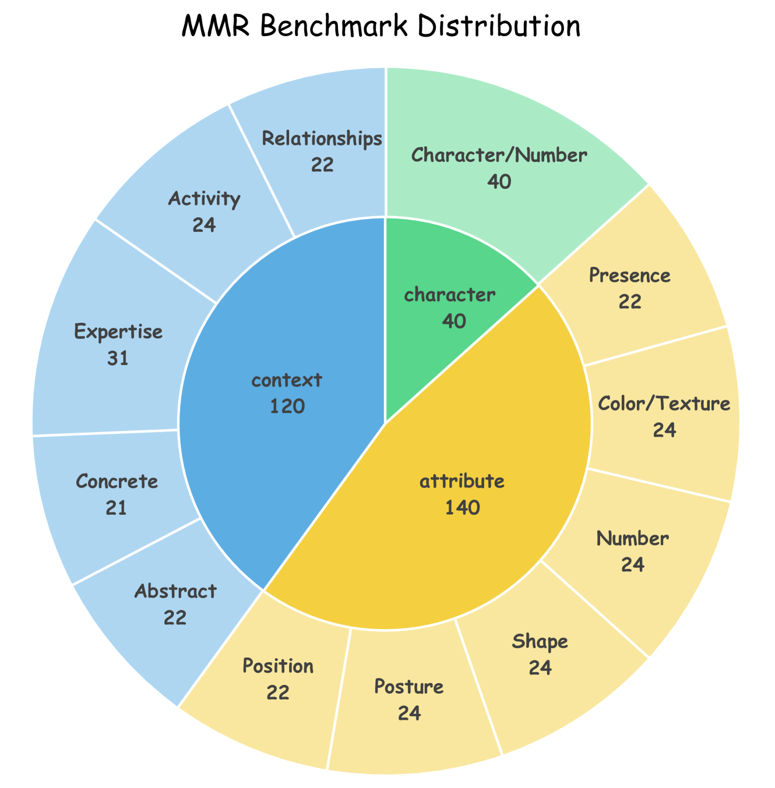
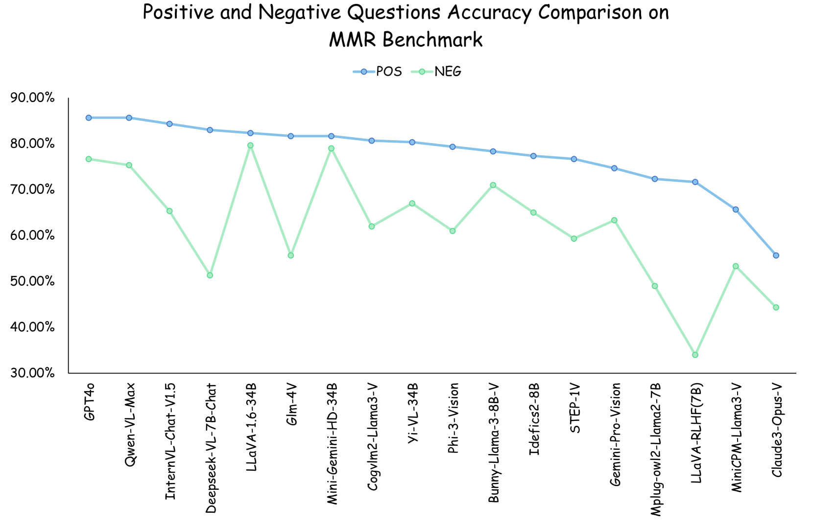
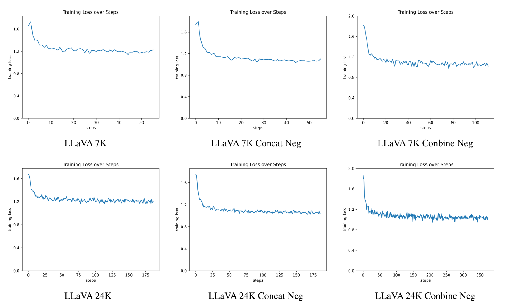
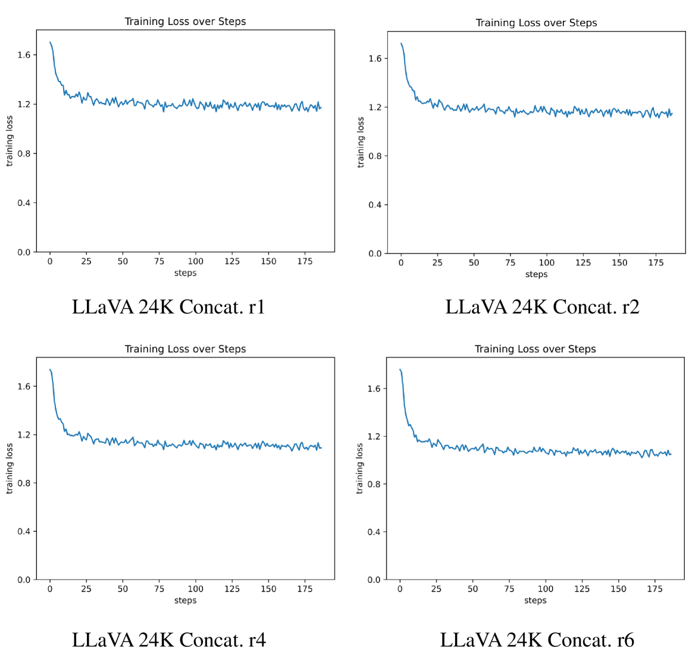
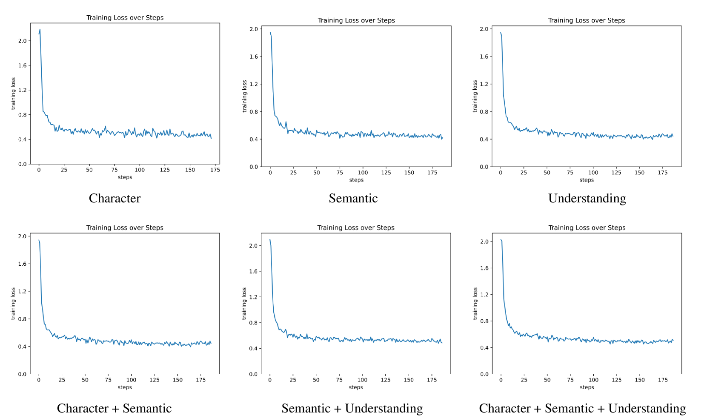
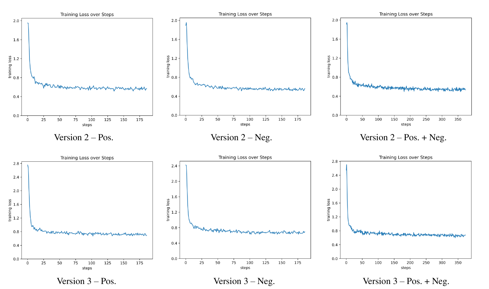

# 明察秋毫却答非所问：一项多模态鲁棒性测试，旨在检验多模态大型语言模型在面对引导性问题时的稳健性。

发布时间：2024年06月15日

`LLM应用

这篇论文主要探讨了多模态大型语言模型（MLLMs）在处理视觉信息时的鲁棒性和理解力问题，并提出了一个多模态鲁棒性基准（MMR）来评估和改进这些模型。论文通过实验和分析，展示了如何通过特定的训练集来提升MLLMs对引导性问题的应对能力。这一研究直接应用于改进现有的LLM技术，特别是在多模态理解和推理方面，因此属于LLM应用分类。` `人工智能` `视觉问答`

> Seeing Clearly, Answering Incorrectly: A Multimodal Robustness Benchmark for Evaluating MLLMs on Leading Questions

# 摘要

> 多模态大型语言模型（MLLMs）在视觉理解和推理上表现出色，能提供合理的图像描述等答案。然而，我们的研究表明，即使正确理解了视觉信息，MLLMs仍常给出错误答案，这揭示了它们对引导性问题的脆弱性。为此，我们推出了多模态鲁棒性基准（MMR），包含12类精心标注的正负问题对，以全面评估MLLMs的鲁棒性和理解力。通过在MMR上测试18款领先模型，我们发现它们虽能理解视觉内容，但对引导性问题的应对能力不足。为提升这一能力，我们提供了一个包含正负视觉问答对的训练集，实验证明，通过此训练集的调优，MLLMs的鲁棒性得以显著提升。相关基准、训练集及代码已发布于https://github.com/BAAI-DCAI/Multimodal-Robustness-Benchmark。

> Multimodal Large Language Models (MLLMs) have exhibited impressive capabilities in visual understanding and reasoning, providing sightly reasonable answers, such as image descriptions. This has spurred extensive research on the evaluation of MLLMs. Most evaluation benchmarks assume that incorrect answers indicate a lack of understanding of the visual content. However, our findings reveal that, in many cases, MLLMs answer questions incorrectly despite correctly understanding the visual content. This suggests that incorrect answers do not necessarily imply a lack of comprehension but may instead result from lacking robustness to leading questions. To comprehensively measure MLLMs' understanding capability and robustness to leading questions, we introduce a MultiModal Robustness benchmark (MMR). MMR contains paired positive and negative questions across 12 categories, meticulously annotated by humans. We evaluate 18 leading MLLMs on the MMB benchmark, revealing that MLLMs suffer from fragility to leading questions despite understanding the visual content. To enhance MLLMs' understanding capability and robustness, we further present a training set with paired positive and negative visual question-answer samples. Experiments verify that MLLMs' robustness can be significantly enhanced by tuning on this new training set. The benchmark, training set, and code can be found at https://github.com/BAAI-DCAI/Multimodal-Robustness-Benchmark.

[Arxiv](https://arxiv.org/abs/2406.10638)