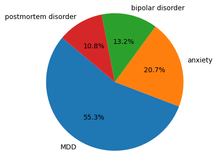

# 我们关注：融合多模态的抑郁症检测与知识驱动的心理健康治疗响应生成

发布时间：2024年06月15日

`Agent

这篇论文介绍了一个虚拟代理，该代理旨在作为心理健康患者的首个接触点，并提供基于认知行为疗法（CBT）的互动。该代理的核心功能包括识别抑郁症和提供CBT治疗回应。这与Agent分类相符，因为该论文主要关注的是开发和应用一个智能代理来处理特定任务（即心理健康支持）。此外，论文中提到的Mistral模型和TVLT模型在特定任务上的表现也支持了这一分类。虽然论文中提到了大型语言模型（如GPT3.5和GPT4），但它们主要是作为背景信息，而不是论文的主要研究对象。因此，LLM应用和LLM理论分类不适用。同时，论文并未涉及RAG（检索增强生成）的相关内容。` `心理健康` `视频分析`

> We Care: Multimodal Depression Detection and Knowledge Infused Mental Health Therapeutic Response Generation

# 摘要

> 通过非言语线索检测抑郁症的研究日益增多，但以往多在实验室环境下进行，难以反映真实生活中的个体行为。为此，我们推出了包含1,261个YouTube vlogs的扩展D-vlog数据集。同时，随着GPT3.5和GPT4等大型语言模型的兴起，人们对其在心理健康领域的应用潜力充满期待，但这些模型在实际应用中的准确性和安全性仍存疑。为此，我们开发了一个虚拟代理，作为心理健康患者的首个接触点，提供基于认知行为疗法（CBT）的互动。该代理具备两大核心功能：识别抑郁症和提供CBT治疗回应。我们的Mistral模型在扭曲评估和分类上分别达到了70.1%和30.9%的高准确率，Bert分数为88.7%。此外，TVLT模型在多模态扩展D-vlog数据集上的应用也取得了67.8%的优异F1分数。

> The detection of depression through non-verbal cues has gained significant attention. Previous research predominantly centred on identifying depression within the confines of controlled laboratory environments, often with the supervision of psychologists or counsellors. Unfortunately, datasets generated in such controlled settings may struggle to account for individual behaviours in real-life situations. In response to this limitation, we present the Extended D-vlog dataset, encompassing a collection of 1, 261 YouTube vlogs. Additionally, the emergence of large language models (LLMs) like GPT3.5, and GPT4 has sparked interest in their potential they can act like mental health professionals. Yet, the readiness of these LLM models to be used in real-life settings is still a concern as they can give wrong responses that can harm the users. We introduce a virtual agent serving as an initial contact for mental health patients, offering Cognitive Behavioral Therapy (CBT)-based responses. It comprises two core functions: 1. Identifying depression in individuals, and 2. Delivering CBT-based therapeutic responses. Our Mistral model achieved impressive scores of 70.1% and 30.9% for distortion assessment and classification, along with a Bert score of 88.7%. Moreover, utilizing the TVLT model on our Multimodal Extended D-vlog Dataset yielded outstanding results, with an impressive F1-score of 67.8%

[Arxiv](https://arxiv.org/abs/2406.10561)