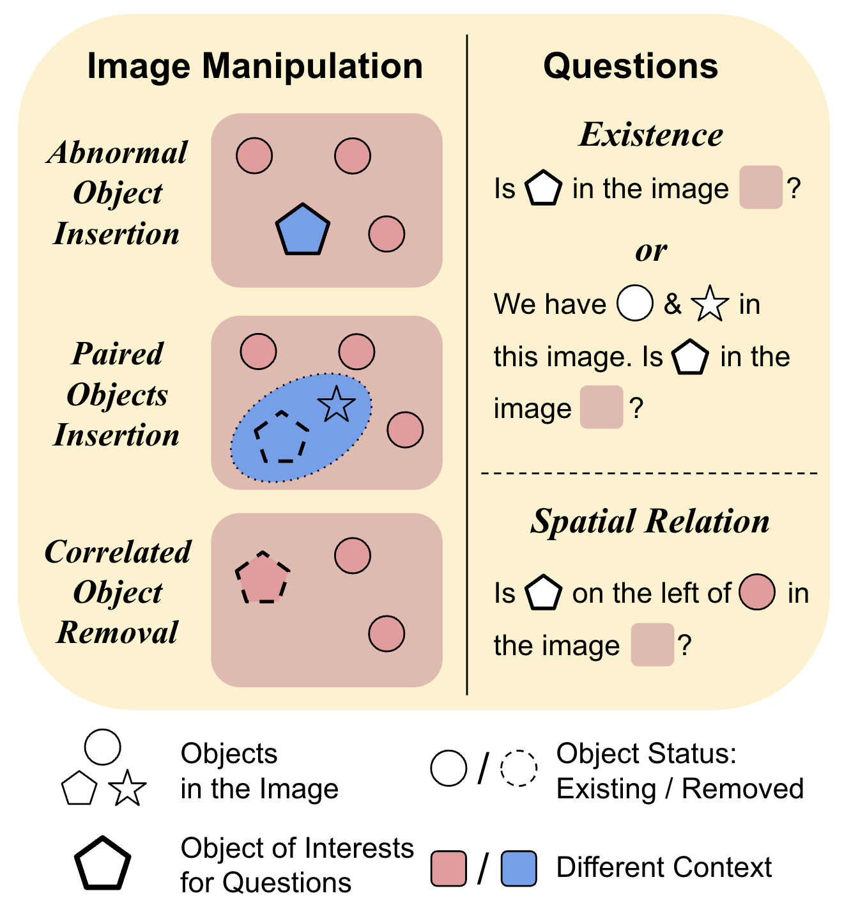
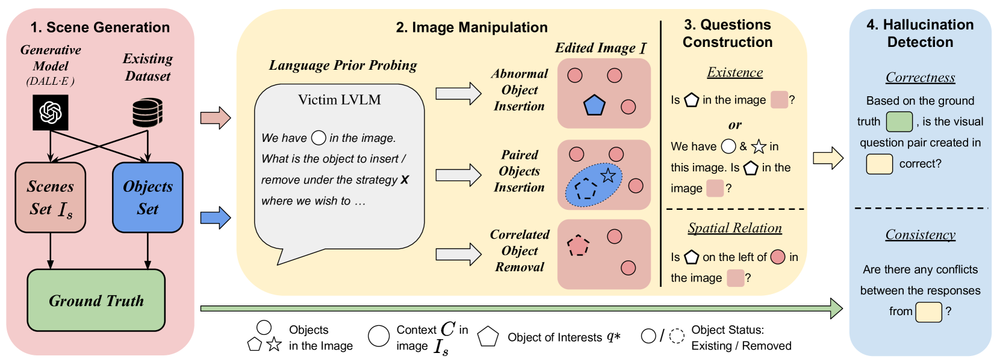
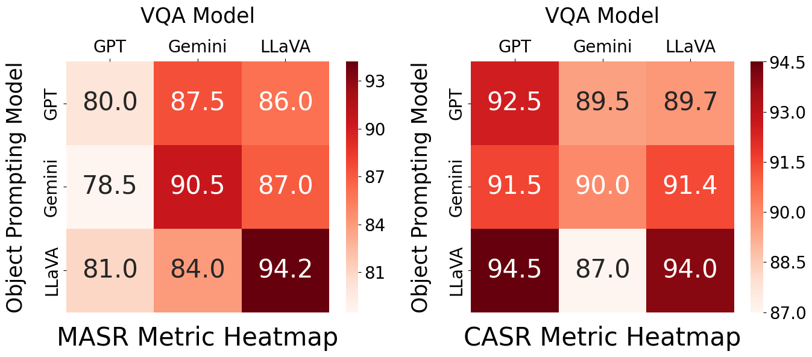

# 幻觉基准自动生成：AUTOHALLUSION 助力视觉-语言模型评估

发布时间：2024年06月16日

`LLM应用

这篇论文介绍了一种名为AUTOHALLUSION的方法，用于自动生成基准测试，以评估大型视觉-语言模型（LVLMs）在处理图像中特定线索时可能产生的幻觉问题。这种方法通过合成图像和生成相关问题来测试模型的性能，揭示了幻觉的常见失败模式和原因。由于这项工作专注于开发和应用一种新的方法来评估和改进LLM在特定任务上的表现，因此它属于LLM应用类别。` `人工智能` `图像处理`

> AUTOHALLUSION: Automatic Generation of Hallucination Benchmarks for Vision-Language Models

# 摘要

> 大型视觉-语言模型（LVLMs）有时会因图像中的特定线索而产生幻觉，导致对异常或假设对象的错误推理。尽管已有一些基准测试针对此问题，但它们多依赖于手工设计的特殊案例，这些案例的失败模式难以推广，且微调可能降低其有效性。为此，我们开发了AUTOHALLUSION，这是一种自动生成基准的方法，通过几种关键策略创造多样化的幻觉示例。该方法利用LVLMs中的语言模块对特定上下文线索的反应，通过添加异常对象、选择性保留或排除对象，以及移除关键对象来合成图像。随后，它生成与语言模块先验知识相悖的图像问题。模型需克服上下文偏差和干扰以找到正确答案，而错误答案则揭示了幻觉的存在。AUTOHALLUSION不仅以低成本创建了新基准，还揭示了幻觉的常见失败模式和原因，为检测和控制幻觉提供了重要线索。对GPT-4V(ision)、Gemini Pro Vision、Claude 3和LLaVA-1.5等顶级模型的评估表明，在AUTOHALLUSION的合成和真实数据集上，幻觉诱发的成功率高达97.7%和98.7%，为解决这一问题奠定了基础。

> Large vision-language models (LVLMs) hallucinate: certain context cues in an image may trigger the language module's overconfident and incorrect reasoning on abnormal or hypothetical objects. Though a few benchmarks have been developed to investigate LVLM hallucinations, they mainly rely on hand-crafted corner cases whose fail patterns may hardly generalize, and finetuning on them could undermine their validity. These motivate us to develop the first automatic benchmark generation approach, AUTOHALLUSION, that harnesses a few principal strategies to create diverse hallucination examples. It probes the language modules in LVLMs for context cues and uses them to synthesize images by: (1) adding objects abnormal to the context cues; (2) for two co-occurring objects, keeping one and excluding the other; or (3) removing objects closely tied to the context cues. It then generates image-based questions whose ground-truth answers contradict the language module's prior. A model has to overcome contextual biases and distractions to reach correct answers, while incorrect or inconsistent answers indicate hallucinations. AUTOHALLUSION enables us to create new benchmarks at the minimum cost and thus overcomes the fragility of hand-crafted benchmarks. It also reveals common failure patterns and reasons, providing key insights to detect, avoid, or control hallucinations. Comprehensive evaluations of top-tier LVLMs, e.g., GPT-4V(ision), Gemini Pro Vision, Claude 3, and LLaVA-1.5, show a 97.7% and 98.7% success rate of hallucination induction on synthetic and real-world datasets of AUTOHALLUSION, paving the way for a long battle against hallucinations.

[Arxiv](https://arxiv.org/abs/2406.10900)