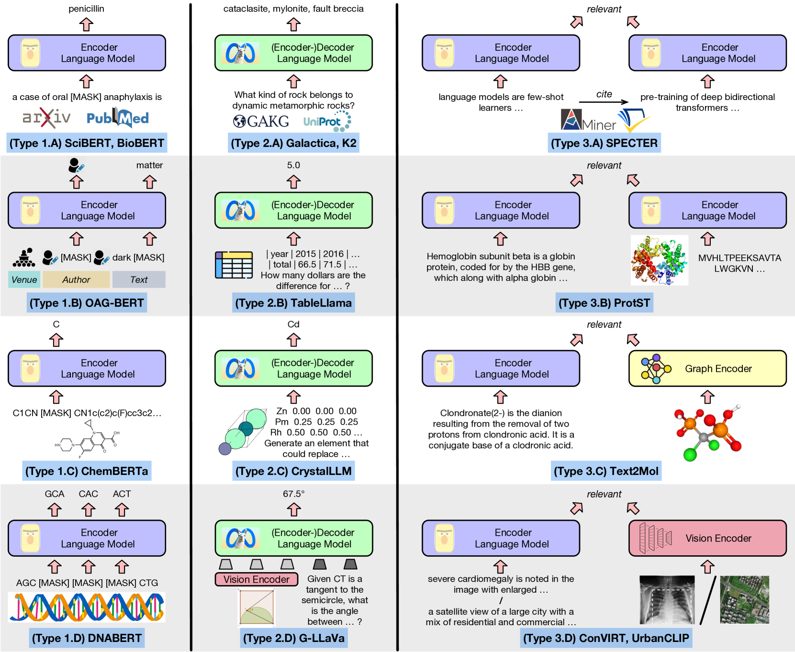

# 科学大型语言模型全面调查：探索其在科学发现中的应用

发布时间：2024年06月16日

`LLM应用

这篇论文摘要主要讨论了大型语言模型（LLMs）在科学领域的应用，包括它们如何处理不同类型的数据（如分子、蛋白质）以及在多个科学领域中的应用。文章通过分析超过250个科学LLMs，比较了它们的架构和预训练技术的共性与差异，并总结了预训练数据集及评估任务。此外，论文还探讨了LLMs在科学发现中的实际应用，并提供了相关资源的链接。因此，这篇论文更符合LLM应用分类，因为它专注于LLMs在科学领域的具体应用和实践。` `科学研究` `数据处理`

> A Comprehensive Survey of Scientific Large Language Models and Their Applications in Scientific Discovery

# 摘要

> 大型语言模型（LLMs）在众多科学领域中，不仅革新了处理文本及多种数据（如分子、蛋白质）的方式，更在多样的应用场景中展现了卓越性能，极大地推动了科学探索的进程。尽管如此，以往对科学LLMs的研究综述多局限于特定领域或单一数据模式。本文旨在通过深入探讨LLMs在不同科学领域间的架构与预训练技术的交叉联系，提供一个更为全面的科研视角。我们详细分析了超过250个科学LLMs，比较了它们的共性与差异，并针对各领域和模态，总结了预训练数据集及评估任务。此外，我们还探究了LLMs如何实际应用于科学发现，相关资源已公布于https://github.com/yuzhimanhua/Awesome-Scientific-Language-Models。

> In many scientific fields, large language models (LLMs) have revolutionized the way with which text and other modalities of data (e.g., molecules and proteins) are dealt, achieving superior performance in various applications and augmenting the scientific discovery process. Nevertheless, previous surveys on scientific LLMs often concentrate on one to two fields or a single modality. In this paper, we aim to provide a more holistic view of the research landscape by unveiling cross-field and cross-modal connections between scientific LLMs regarding their architectures and pre-training techniques. To this end, we comprehensively survey over 250 scientific LLMs, discuss their commonalities and differences, as well as summarize pre-training datasets and evaluation tasks for each field and modality. Moreover, we investigate how LLMs have been deployed to benefit scientific discovery. Resources related to this survey are available at https://github.com/yuzhimanhua/Awesome-Scientific-Language-Models.

[Arxiv](https://arxiv.org/abs/2406.10833)