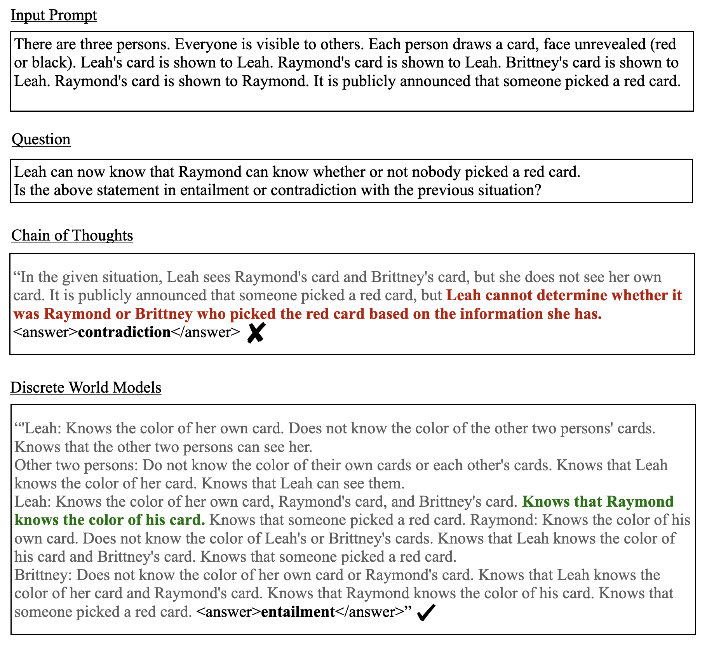

# 借助离散世界模型，探索心智理论的复杂性维度

发布时间：2024年06月16日

`Agent

这篇论文主要探讨了心智理论（ToM）在评估大型语言模型（LLMs）中的应用，并提出了一种新的框架来量化ToM任务的复杂性。此外，论文还介绍了一种名为离散世界模型（DWM）的提示技术，该技术通过描述代理交互导致的环境变化来提升模型在ToM任务上的表现。因此，这篇论文更偏向于Agent的分类，因为它涉及到了代理（Agent）在复杂社会推理场景中的行为和能力评估。` `社会推理` `人工智能`

> A Notion of Complexity for Theory of Mind via Discrete World Models

# 摘要

> 心智理论（ToM）是评估大型语言模型（LLMs）在社会推理复杂场景中能力的有效工具。虽然已有多种ToM基准被提出，但它们的难度和复杂性定义不一。本研究提出了一种新框架，通过量化解决问题所需的状态数量来衡量ToM任务的复杂性，同时考虑了设计来增加难度的虚假状态。我们评估了五个主流ToM基准的复杂性，并在此基础上开发了一种名为离散世界模型（DWM）的提示技术，该技术通过描述代理交互导致的环境变化，显著提升了模型在ToM任务上的表现。

> Theory of Mind (ToM) can be used to assess the capabilities of Large Language Models (LLMs) in complex scenarios where social reasoning is required. While the research community has proposed many ToM benchmarks, their hardness varies greatly, and their complexity is not well defined. This work proposes a framework to measure the complexity of ToM tasks. We quantify a problem's complexity as the number of states necessary to solve it correctly. Our complexity measure also accounts for spurious states of a ToM problem designed to make it apparently harder. We use our method to assess the complexity of five widely adopted ToM benchmarks. On top of this framework, we design a prompting technique that augments the information available to a model with a description of how the environment changes with the agents' interactions. We name this technique Discrete World Models (DWM) and show how it elicits superior performance on ToM tasks.

[Arxiv](https://arxiv.org/abs/2406.11911)