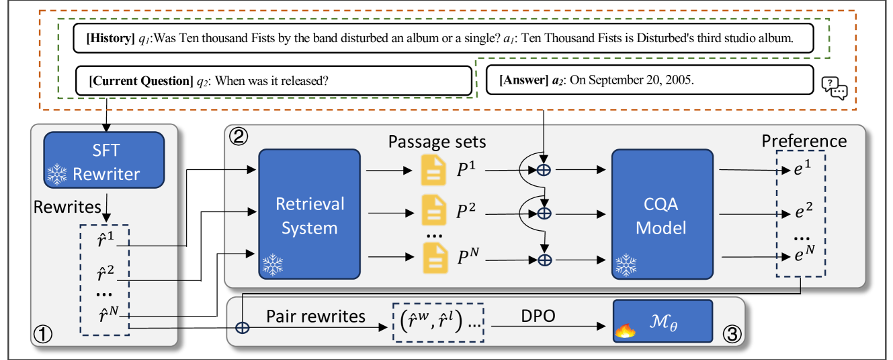

# 智能查询重塑：对话答案的边际概率引导重写器精准匹配

发布时间：2024年06月16日

`RAG

理由：这篇论文主要关注的是查询重写技术在对话式问答系统中的应用，特别是在段落检索中的作用。提出的AdaQR框架利用有限的注释数据来训练查询重写模型，优化检索器的性能，这与RAG（Retrieval-Augmented Generation）模型的目标相符，即通过检索增强生成过程，提高信息检索的准确性和效率。因此，这篇论文更适合归类于RAG。` `对话式问答` `信息检索`

> Adaptive Query Rewriting: Aligning Rewriters through Marginal Probability of Conversational Answers

# 摘要

> 查询重写技术在开放领域对话式问答（CQA）的段落检索中扮演着关键角色，它能将对话查询转化为独立的问题，便于现成检索器处理。尽管现有方法尝试在训练重写模型时考虑检索器的偏好，但它们往往依赖大量标注，如特定领域的重写和相关段落标签，这限制了模型的泛化与适应性。本文提出的AdaQR（自适应查询重写）框架，利用种子数据集中的有限重写注释，无需任何段落标签，训练查询重写模型。首先，我们使用种子数据集中约10%的重写注释微调大型语言模型，生成每个查询的重写候选。随后，通过评估检索器对这些候选的偏好，即答案在前K个段落中的条件概率，来优化重写器，这一过程采用直接偏好优化（DPO），无需额外注释。实验证明，AdaQR不仅在有限注释下提升了重写器的领域内性能，还能有效适应领域外数据集。

> Query rewriting is a crucial technique for passage retrieval in open-domain conversational question answering (CQA). It decontexualizes conversational queries into self-contained questions suitable for off-the-shelf retrievers. Existing methods attempt to incorporate retriever's preference during the training of rewriting models. However, these approaches typically rely on extensive annotations such as in-domain rewrites and/or relevant passage labels, limiting the models' generalization and adaptation capabilities. In this paper, we introduce AdaQR ($\textbf{Ada}$ptive $\textbf{Q}$uery $\textbf{R}$ewriting), a framework for training query rewriting models with limited rewrite annotations from seed datasets and completely no passage label. Our approach begins by fine-tuning compact large language models using only ~$10\%$ of rewrite annotations from the seed dataset training split. The models are then utilized to generate rewrite candidates for each query instance. A novel approach is then proposed to assess retriever's preference for these candidates by the probability of answers conditioned on the conversational query by marginalizing the Top-$K$ passages. This serves as the reward for optimizing the rewriter further using Direct Preference Optimization (DPO), a process free of rewrite and retrieval annotations. Experimental results on four open-domain CQA datasets demonstrate that AdaQR not only enhances the in-domain capabilities of the rewriter with limited annotation requirement, but also adapts effectively to out-of-domain datasets.

[Arxiv](https://arxiv.org/abs/2406.10991)