# 探究大型语言模型中的关键神经元

发布时间：2024年06月16日

`LLM理论

这篇论文主要探讨了大型语言模型（LLMs）中的知识定位与编辑方法，特别是关注了如何在现代自回归LLMs中有效定位相关神经元，以及长篇文本生成和知识局部化区域的问题。通过提出神经元归因-逆向聚类归因（NA-ICA）框架，研究了LLMs的关键神经元识别和其在知识编辑及预测中的应用。这些内容属于对LLMs理论层面的深入研究，因此归类为LLM理论。`

> Analyzing Key Neurons in Large Language Models

# 摘要

> 大型语言模型（LLMs）蕴含丰富知识，激发了对其知识定位与编辑方法的研究。以往研究多聚焦于小型模型中的填空任务和实体相关信息定位。但关键问题依旧悬而未决：(1) 如何在如LLaMA和Mistral等现代自回归LLMs中有效定位相关神经元？(2) 长篇文本生成难题如何解决？(3) LLMs中是否存在知识局部化区域？本研究提出神经元归因-逆向聚类归因（NA-ICA）框架，能识别LLMs关键神经元，并通过多选题回答任务分析长篇答案。我们创建了跨领域和语言的多选QA数据集，验证了NA-ICA的优越性，并揭示了神经元分布中的局部化区域。最后，展示了这些关键神经元在知识编辑和预测中的应用潜力。

> Large Language Models (LLMs) possess vast amounts of knowledge within their parameters, prompting research into methods for locating and editing this knowledge. Previous investigations have primarily focused on fill-in-the-blank tasks and locating entity-related usually single-token facts) information in relatively small-scale language models. However, several key questions remain unanswered: (1) How can we effectively locate query-relevant neurons in contemporary autoregressive LLMs, such as LLaMA and Mistral? (2) How can we address the challenge of long-form text generation? (3) Are there localized knowledge regions in LLMs? In this study, we introduce Neuron Attribution-Inverse Cluster Attribution (NA-ICA), a novel architecture-agnostic framework capable of identifying key neurons in LLMs. NA-ICA allows for the examination of long-form answers beyond single tokens by employing the proxy task of multi-choice question answering. To evaluate the effectiveness of our detected key neurons, we construct two multi-choice QA datasets spanning diverse domains and languages. Empirical evaluations demonstrate that NA-ICA outperforms baseline methods significantly. Moreover, analysis of neuron distributions reveals the presence of visible localized regions, particularly within different domains. Finally, we demonstrate the potential applications of our detected key neurons in knowledge editing and neuron-based prediction.

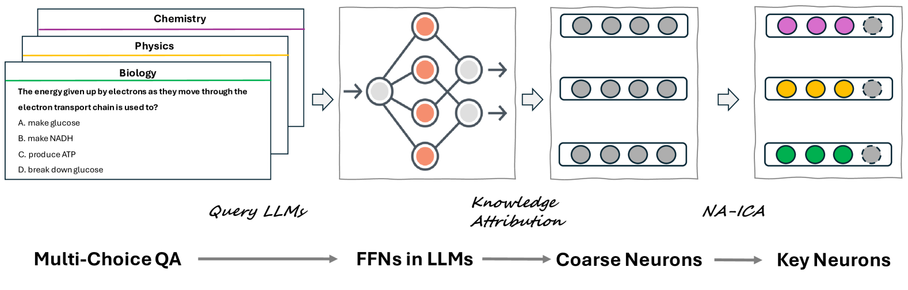

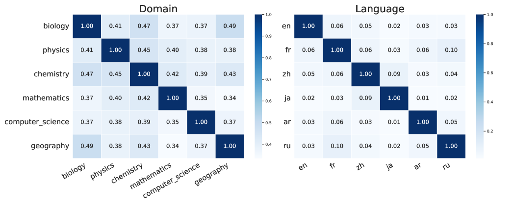

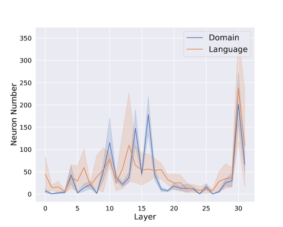

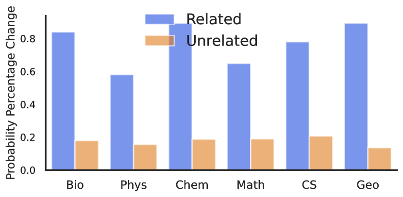

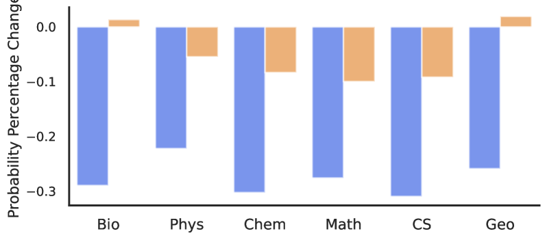

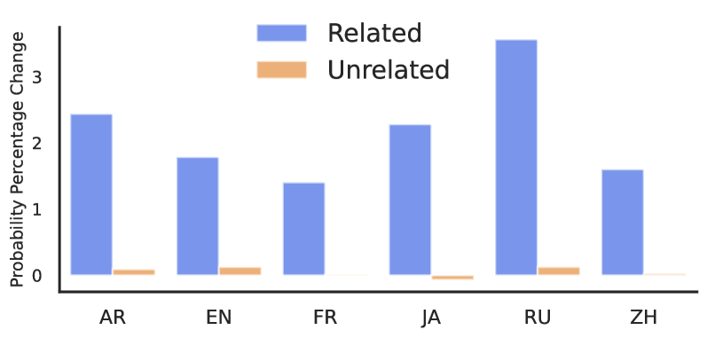

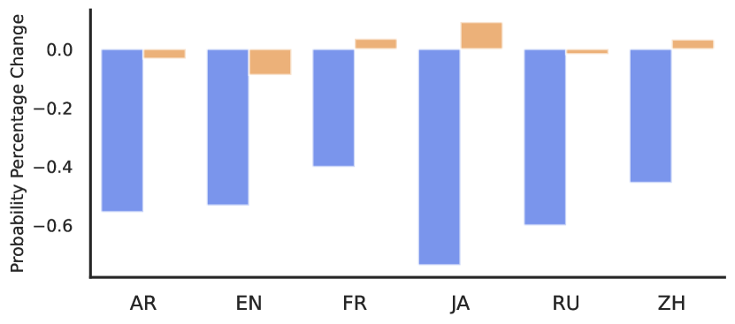

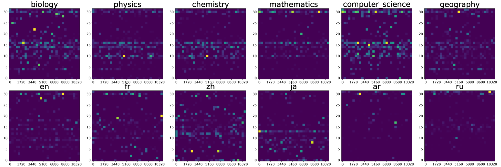

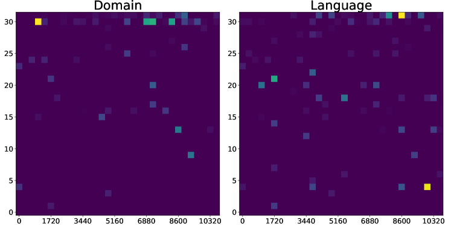

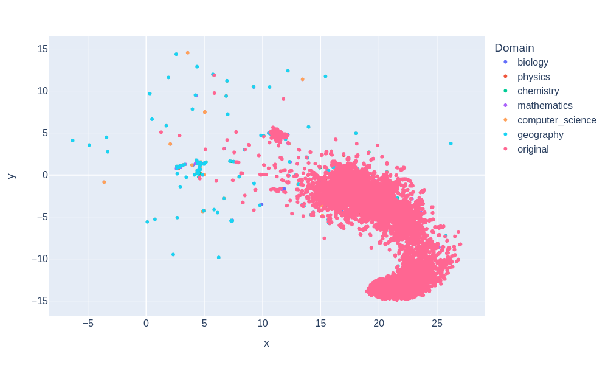

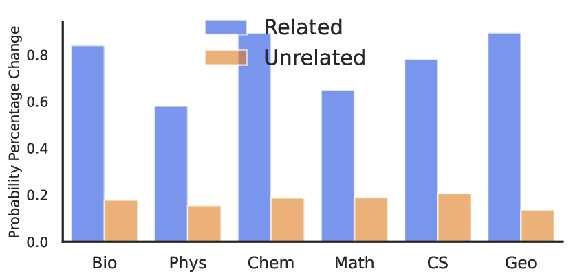

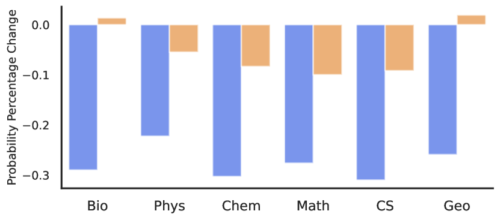

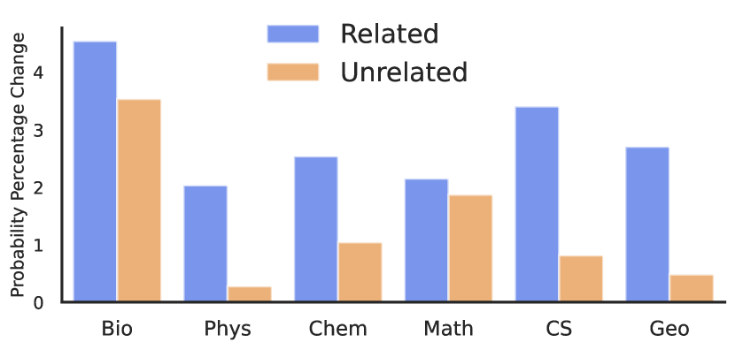

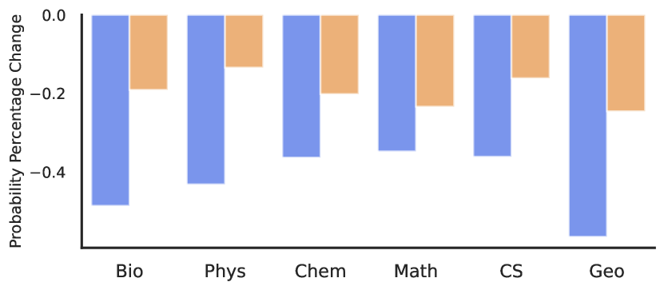

[Arxiv](https://arxiv.org/abs/2406.10868)