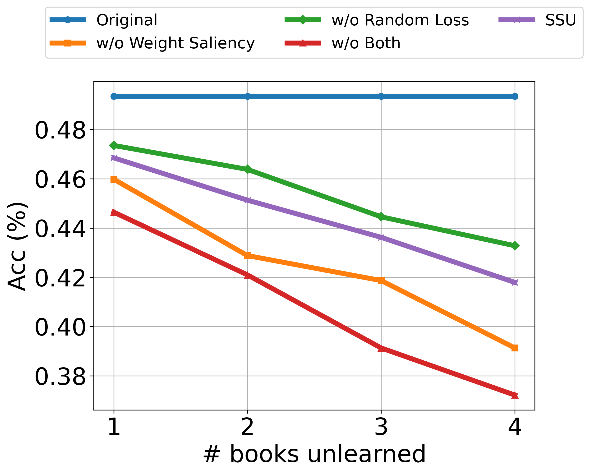

# 利用机器遗忘技术规避版权侵权风险

发布时间：2024年06月16日

`LLM应用

这篇论文探讨了大型语言模型（LLMs）在处理版权内容时的法律和伦理风险，并提出了一种新的机制——稳定顺序遗忘（SSU）框架，用于在不同时间点逐步移除版权内容。这一研究直接应用于LLMs的实际操作中，特别是在处理版权敏感内容时的应用，因此属于LLM应用分类。` `人工智能`

> Avoiding Copyright Infringement via Machine Unlearning

# 摘要

> 预训练的大型语言模型（LLMs）虽然能力出众，但因学习和生成版权材料而引发法律和伦理风险。为此，模型所有者需具备在不同时间点移除版权内容的能力。我们研究了顺序遗忘机制，即在多个时间点逐步移除版权内容，这一问题尚未得到充分探讨。为此，我们提出了稳定顺序遗忘（SSU）框架，旨在通过任务向量、结合随机标记损失和应用基于梯度的权重显著性映射，确保在不同时间点从LLMs中稳定移除版权内容。实验结果显示，SSU在遗忘效果与保持模型通用知识之间取得了平衡，优于现有方法。

> Pre-trained Large Language Models (LLMs) have demonstrated remarkable capabilities but also pose risks by learning and generating copyrighted material, leading to significant legal and ethical concerns. To address these issues, it is critical for model owners to be able to unlearn copyrighted content at various time steps. We explore the setting of sequential unlearning, where copyrighted content is removed over multiple time steps - a scenario that has not been rigorously addressed. To tackle this challenge, we propose Stable Sequential Unlearning (SSU), a novel unlearning framework for LLMs, designed to have a more stable process to remove copyrighted content from LLMs throughout different time steps using task vectors, by incorporating additional random labeling loss and applying gradient-based weight saliency mapping. Experiments demonstrate that SSU finds a good balance between unlearning efficacy and maintaining the model's general knowledge compared to existing baselines.

[Arxiv](https://arxiv.org/abs/2406.10952)