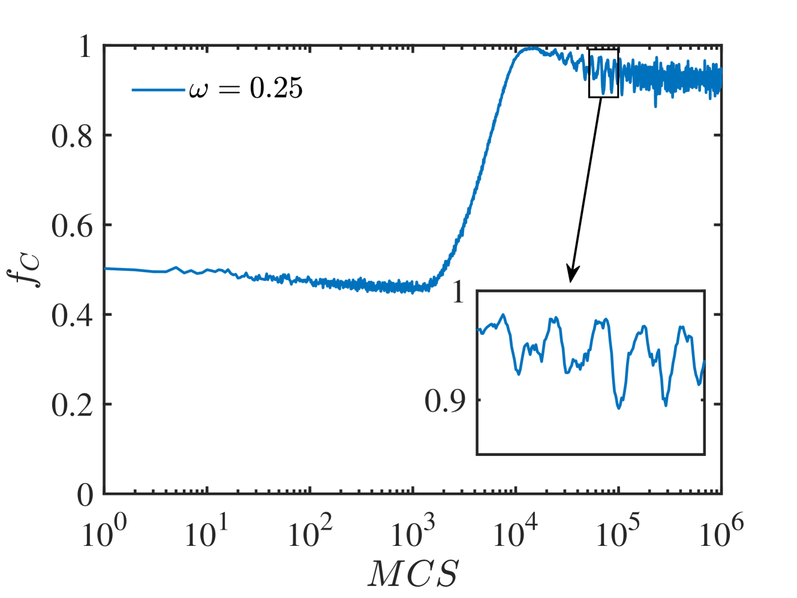

# 在行为呈现双峰分布的群体中，合作如何被催化演化

发布时间：2024年06月16日

`Agent

这篇论文探讨了在复杂环境中，人类如何通过灵活切换行为模式来适应环境，并特别关注了博弈论中多模态行为对合作演化的影响。研究通过引入Q学习和“以牙还牙”策略，在囚徒困境博弈中分析了模式混合对合作演化的影响。这种研究涉及到了智能体的学习策略和行为模式选择，因此属于Agent分类。` `博弈论` `社会科学`

> Catalytic evolution of cooperation in a population with behavioural bimodality

# 摘要

> 人类在复杂环境中的适应性表现为根据情境灵活切换行为模式。然而，博弈论研究多聚焦于单一行为模式，对多模态行为如何影响合作演化的理解尚浅。本研究探讨了在两种行为模式并存的群体中，合作如何发展。我们引入了Q学习和“以牙还牙”策略，通过囚徒困境博弈，分析了模式混合对合作演化的影响。在Q学习模式中，玩家追求收益最大化；而在TFT模式中，玩家则模仿邻居的行为。在结构化混合中，每个个体的策略固定，模式混合显著提升了合作水平。在概率性混合中，玩家随机选择策略，合作提升更为明显。当玩家能实时比较并选择模式时，合作提升依然稳健。Q学习模式的玩家如同催化剂，促使TFT玩家更趋合作，进而带动整个群体的合作水平。通过对Q表的分析，我们揭示了合作提升的心理机制。研究表明，行为模式的多样性对于理解现实世界中合作的形成至关重要。

> The remarkable adaptability of humans in response to complex environments is often demonstrated by the context-dependent adoption of different behavioral modes. However, the existing game-theoretic studies mostly focus on the single-mode assumption, and the impact of this behavioral multimodality on the evolution of cooperation remains largely unknown. Here, we study how cooperation evolves in a population with two behavioral modes. Specifically, we incorporate Q-learning and Tit-for-Tat (TFT) rules into our toy model, where prisoner's dilemma game is played and we investigate the impact of the mode mixture on the evolution of cooperation. While players in Q-learning mode aim to maximize their accumulated payoffs, players within TFT mode repeat what their neighbors have done to them. In a structured mixing implementation where the updating rule is fixed for each individual, we find that the mode mixture greatly promotes the overall cooperation prevalence. The promotion is even more significant in the probabilistic mixing, where players randomly select one of the two rules at each step. Finally, this promotion is robust when players are allowed to adaptively choose the two modes by real-time comparison. In all three scenarios, players within the Q-learning mode act as catalyzer that turns the TFT players to be more cooperative, and as a result drive the whole population to be highly cooperative. The analysis of Q-tables explains the underlying mechanism of cooperation promotion, which captures the ``psychologic evolution" in the players' mind. Our study indicates that the variety of behavioral modes is non-negligible, and could be crucial to clarify the emergence of cooperation in the real world.

[Arxiv](https://arxiv.org/abs/2406.11121)