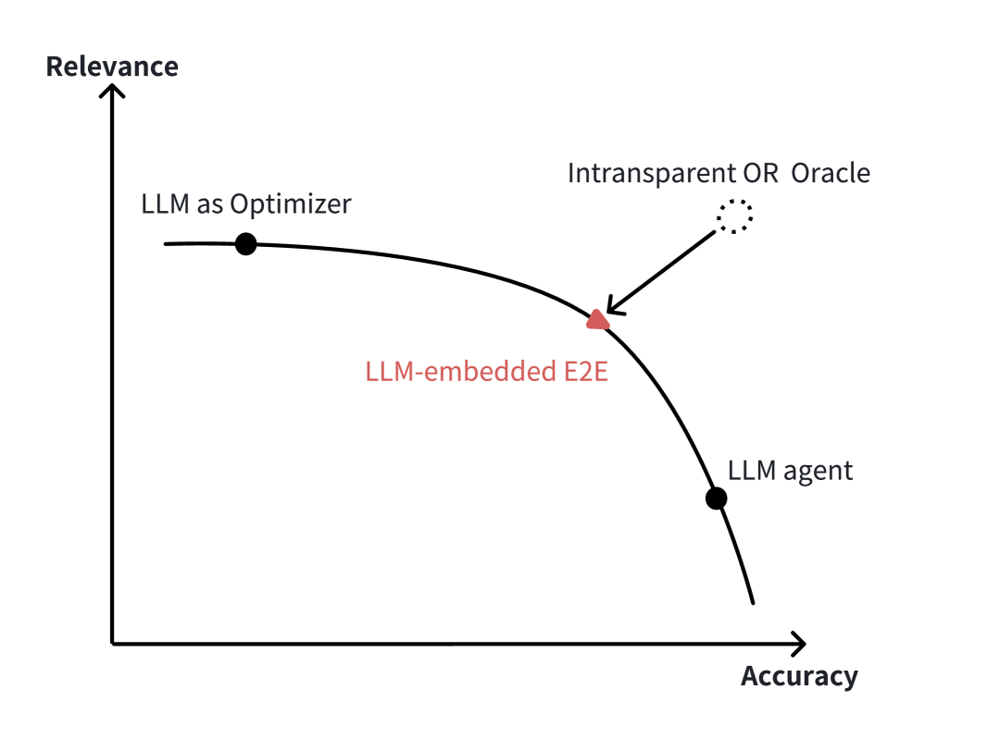

# City-LEO：借助端到端优化的 LLM，迈向透明城市管理的新篇章

发布时间：2024年06月16日

`Agent

理由：这篇论文介绍了一个基于大型语言模型（LLM）的智能代理“City-LEO”，该代理用于提升智慧城市运营的效率和透明度。它利用LLM的逻辑推理能力来处理复杂的运筹学问题，并通过对话交互来优化城市管理。这个代理的设计和应用主要集中在通过智能代理来改善城市运营，因此属于Agent分类。` `智慧城市` `运筹学`

> City-LEO: Toward Transparent City Management Using LLM with End-to-End Optimization

# 摘要

> 在智慧城市运营中，现有的运筹学模型和工具虽不可或缺，但受限于复杂的建模和优化能力的不足。为此，我们开发了基于大型语言模型的智能代理“City-LEO”，通过对话交互提升城市管理的效率与透明度。City-LEO利用LLM的逻辑推理能力，有效缩小大规模优化问题的范围，同时结合端到端模型，增强预测与优化的协同效应，应对环境变化，提升决策的透明度和可解释性。在电动自行车共享系统的运营管理案例中，City-LEO展现了卓越性能，不仅计算时间缩短，还提供了更符合用户需求的解决方案，同时保持了较低的全球次优性。这一创新代理为开发智慧城市运营管理的LLM嵌入式OR工具提供了新的可能。

> Existing operations research (OR) models and tools play indispensable roles in smart-city operations, yet their practical implementation is limited by the complexity of modeling and deficiencies in optimization proficiency. To generate more relevant and accurate solutions to users' requirements, we propose a large language model (LLM)-based agent ("City-LEO") that enhances the efficiency and transparency of city management through conversational interactions. Specifically, to accommodate diverse users' requirements and enhance computational tractability, City-LEO leverages LLM's logical reasoning capabilities on prior knowledge to scope down large-scale optimization problems efficiently. In the human-like decision process, City-LEO also incorporates End-to-end (E2E) model to synergize the prediction and optimization. The E2E framework be conducive to coping with environmental uncertainties and involving more query-relevant features, and then facilitates transparent and interpretable decision-making process. In case study, we employ City-LEO in the operations management of e-bike sharing (EBS) system. The numerical results demonstrate that City-LEO has superior performance when benchmarks against the full-scale optimization problem. With less computational time, City-LEO generates more satisfactory and relevant solutions to the users' requirements, and achieves lower global suboptimality without significantly compromising accuracy. In a broader sense, our proposed agent offers promise to develop LLM-embedded OR tools for smart-city operations management.

[Arxiv](https://arxiv.org/abs/2406.10958)