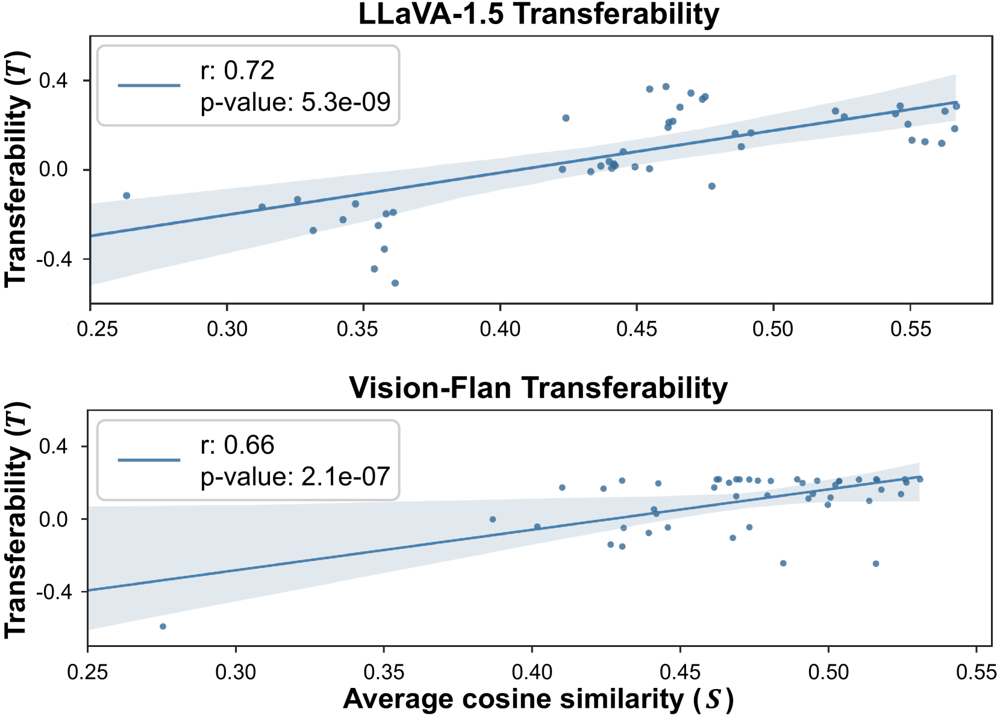
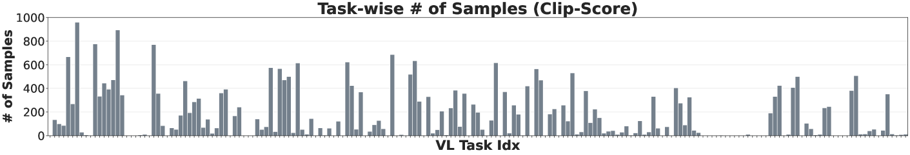
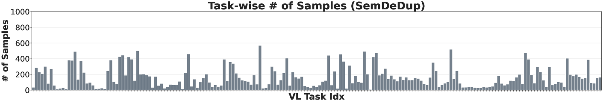

# 大型视觉-语言模型中，基于概念技能转移性的数据筛选策略

发布时间：2024年06月16日

`LLM应用

这篇论文主要讨论了一种名为COINCIDE的数据选择技术，该技术旨在优化大型视觉-语言模型（LVLMs）的微调过程，通过利用小模型作为参考来提升数据的多样性和可转移性。这种方法特别关注于提高模型的泛化能力，并在实验中展示了其在减少数据使用量和运行时间的同时，仍能保持或提升模型性能的效果。因此，这项工作属于大型语言模型（LLM）的应用范畴，具体涉及模型微调和数据选择策略的优化。` `计算机视觉`

> Concept-skill Transferability-based Data Selection for Large Vision-Language Models

# 摘要

> 指令调整对于大型视觉-语言模型（LVLMs）在多种视觉-语言任务中实现良好泛化至关重要，但大规模VL数据集的训练成本可能过高。为此，我们提出了COINCIDE，一种利用小模型作为参考的高效数据选择技术，专注于提升数据的多样性和可转移性，以优化目标LVLM的微调。我们通过小模型的内部激活对训练数据进行聚类，识别出LVLM所需的关键视觉-语言概念-技能组合，并根据这些组合的密度和转移能力进行数据采样。这种方法确保了组合的多样性，对LVLM的泛化能力至关重要。实验结果显示，COINCIDE在LLaVA-1.5和Vision-Flan两个数据集上均优于8个强基线，仅用20%的LLaVA-1.5数据集就能达到与全数据集微调相当的性能，同时运行时间减少了70%。在Vision-Flan数据集上，我们的方法仅用16.7%的训练数据就取得了显著成果。

> Instruction tuning, or supervised finetuning on extensive task-specific data, is necessary for Large Vision-Language Models (LVLMs) to generalize well across a broad range of vision-language (VL) tasks. However, training on large VL datasets can become prohibitively expensive. In this work, we introduce COINCIDE, an effective and scalable data selection technique that uses a small model as a reference model to select visual instruction tuning data for efficient finetuning of a target LVLM, focusing on diversity and transferability. Specifically, we cluster the training data using internal activations from a small model, which identifies VL concept-skill compositions needed by a target LVLM. We then sample data from these diverse clusters by considering their density and transferability, or the ability to transfer well to other concept-skill compositions. This approach ensures the diversity of these compositions, which is vital for LVLM generalization. Extensive experiments demonstrate that COINCIDE achieves superior performance and data selection efficiency against 8 strong baselines on two distinct datasets: LLaVA-1.5 and Vision-Flan. Using only 20% of the LLaVA-1.5 dataset, COINCIDE achieves performance comparable to the LVLM finetuned on the whole dataset, with 70% reduction of the wall-clock running time. On the Vision-Flan dataset, our method achieves superior results with only 16.7% of the training data.

[Arxiv](https://arxiv.org/abs/2406.10995)