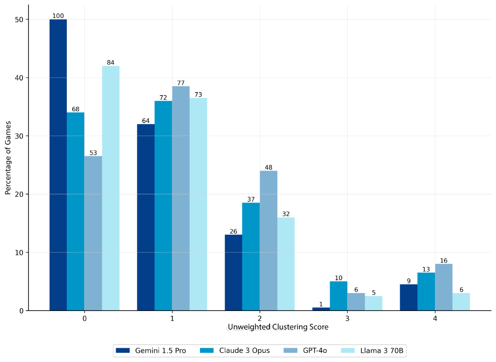
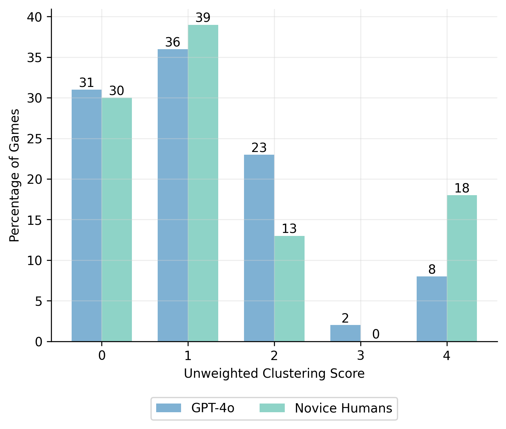

# 探索思维之网：通过《纽约时报》连接词游戏，我们评估了大型语言模型在抽象推理上的能力。

发布时间：2024年06月16日

`LLM应用

这篇论文主要探讨了大型语言模型（LLMs）在解决纽约时报的Connections游戏中的表现，并与人类玩家进行了比较。研究结果显示，尽管LLMs如GPT-4o在某些方面表现出色，但在解决这类游戏时仍不及人类专家玩家。论文通过构建知识分类体系来分析LLMs在特定知识类型上的不足，从而评估其在抽象推理能力方面的表现。因此，这篇论文属于LLM应用类别，因为它关注的是LLMs在实际应用场景中的性能和局限性。` `文字游戏` `人工智能`

> Connecting the Dots: Evaluating Abstract Reasoning Capabilities of LLMs Using the New York Times Connections Word Game

# 摘要

> 纽约时报的Connections游戏在文字谜题爱好者中掀起了一股热潮。我们收集了200个此类游戏，旨在检验顶尖大型语言模型（LLMs）与人类专家及新手玩家的表现。结果表明，即便是最出色的LLM——GPT-4o，在众多测试中展现了卓越的推理能力，也仅能完全解开8%的游戏。相较之下，人类玩家，尤其是专家级玩家，表现更为出色，远超GPT-4o。为了深入探究，我们构建了一个知识分类体系，揭示了在Connections游戏中成功分类单词所需的知识类型，发现LLMs在关联、百科和语言知识方面存在短板。这一发现使得纽约时报的Connections游戏成为评估人类与AI抽象推理能力的严峻考验。

> The New York Times Connections game has emerged as a popular and challenging pursuit for word puzzle enthusiasts. We collect 200 Connections games to evaluate the performance of state-of-the-art large language models (LLMs) against expert and novice human players. Our results show that even the best-performing LLM, GPT-4o, which has otherwise shown impressive reasoning abilities on a wide variety of benchmarks, can only fully solve 8% of the games. Compared to GPT-4o, novice and expert players perform better, with expert human players significantly outperforming GPT-4o. To deepen our understanding we create a taxonomy of the knowledge types required to successfully categorize words in the Connections game, revealing that LLMs struggle with associative, encyclopedic, and linguistic knowledge. Our findings establish the New York Times Connections game as a challenging benchmark for evaluating abstract reasoning capabilities in humans and AI systems.

[Arxiv](https://arxiv.org/abs/2406.11012)