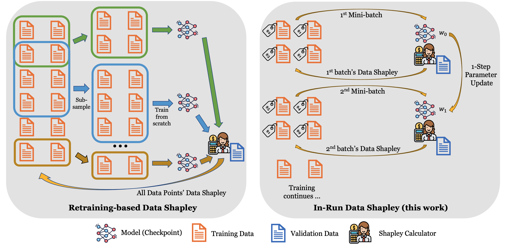

# 单次训练即获数据 Shapley 值

发布时间：2024年06月16日

`LLM应用

理由：这篇论文主要探讨了生成式AI系统在内容生成过程中对训练数据贡献者的版权问题，并提出了一种基于贡献度的补偿框架。这个框架利用了生成式AI的概率特性和合作博弈论技术来量化贡献度，旨在公平地补偿版权所有者。这一研究直接应用于大型语言模型（LLM）的实际应用场景中，特别是在处理版权和数据贡献的问题上，因此属于LLM应用类别。` `版权保护` `人工智能`

> Data Shapley in One Training Run

# 摘要

> 生成式AI系统通过大量数据训练，创造出新的文本、图像、视频等媒体，但这也引发了对其可能侵犯训练数据贡献者版权的担忧。为此，我们提出了一种补偿框架，根据版权所有者对AI内容生成的贡献进行比例补偿。我们利用现代生成式AI的概率特性和合作博弈论技术，量化了贡献度。这一框架不仅让AI开发者受益于高质量数据，提升模型性能，也让版权所有者得到应有的回报，激励他们持续提供数据。实验证明，该框架能公正识别艺术创作中最关键的数据源，确保版权所有者间的收益分配既公平又透明。

> Generative artificial intelligence (AI) systems are trained on large data corpora to generate new pieces of text, images, videos, and other media. There is growing concern that such systems may infringe on the copyright interests of training data contributors. To address the copyright challenges of generative AI, we propose a framework that compensates copyright owners proportionally to their contributions to the creation of AI-generated content. The metric for contributions is quantitatively determined by leveraging the probabilistic nature of modern generative AI models and using techniques from cooperative game theory in economics. This framework enables a platform where AI developers benefit from access to high-quality training data, thus improving model performance. Meanwhile, copyright owners receive fair compensation, driving the continued provision of relevant data for generative model training. Experiments demonstrate that our framework successfully identifies the most relevant data sources used in artwork generation, ensuring a fair and interpretable distribution of revenues among copyright owners.

[Arxiv](https://arxiv.org/abs/2406.11011)