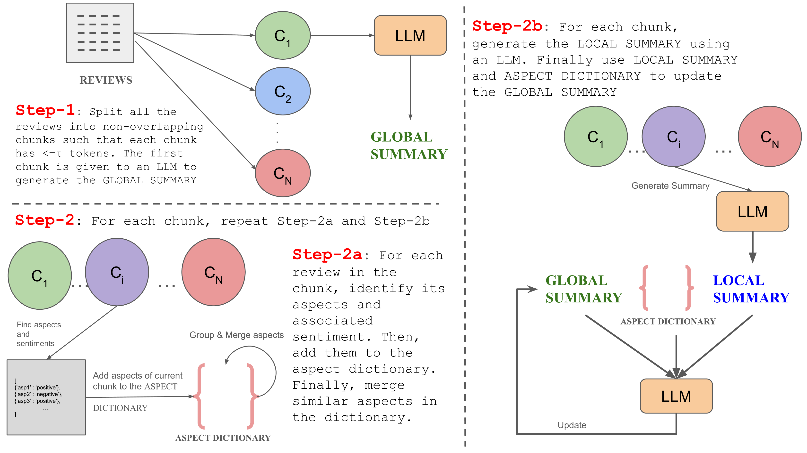

# 利用XL-OPSUMM技术，我们实现了对大规模意见的增量式摘要，高效提炼出关键观点。

发布时间：2024年06月16日

`LLM应用

理由：这篇论文主要讨论了在电子商务领域中，如何利用大型语言模型（LLMs）来处理和总结大量用户的产品评论。论文中提到了一个名为Xl-OpSumm的可扩展框架，该框架能够逐步生成总结，并且通过实验验证了其在处理大量评论时的效率和性能提升。这表明论文关注的是LLM在实际应用中的性能和效率，特别是在处理大量数据时的应用，因此属于LLM应用分类。` `电子商务` `文本摘要`

> Distilling Opinions at Scale: Incremental Opinion Summarization using XL-OPSUMM

# 摘要

> 在电子商务领域，意见总结旨在提炼众多用户基于产品评论的集体观点。一个产品在平台上通常拥有数千条简短评论（约10-15字）。尽管大型语言模型（LLMs）在总结任务上表现出色，但面对大量评论时，因上下文限制而力不从心。为此，我们开发了可扩展框架Xl-OpSumm，它能逐步生成总结。然而，现有测试集AMASUM每个产品平均仅包含560条评论。为填补这一空白，我们创建了新测试集Xl-Flipkart，通过Flipkart网站数据和GPT-4生成总结。通过自动评估和详尽分析，我们在AMASUM和Xl-Flipkart两大数据集上验证了Xl-OpSumm的效率。实验表明，由Llama-3-8B-8k驱动的Xl-OpSumm在ROUGE-1 F1得分上提升了4.38%，在ROUGE-L F1得分上提升了3.70%，超越了其他模型。

> Opinion summarization in e-commerce encapsulates the collective views of numerous users about a product based on their reviews. Typically, a product on an e-commerce platform has thousands of reviews, each review comprising around 10-15 words. While Large Language Models (LLMs) have shown proficiency in summarization tasks, they struggle to handle such a large volume of reviews due to context limitations. To mitigate, we propose a scalable framework called Xl-OpSumm that generates summaries incrementally. However, the existing test set, AMASUM has only 560 reviews per product on average. Due to the lack of a test set with thousands of reviews, we created a new test set called Xl-Flipkart by gathering data from the Flipkart website and generating summaries using GPT-4. Through various automatic evaluations and extensive analysis, we evaluated the framework's efficiency on two datasets, AMASUM and Xl-Flipkart. Experimental results show that our framework, Xl-OpSumm powered by Llama-3-8B-8k, achieves an average ROUGE-1 F1 gain of 4.38% and a ROUGE-L F1 gain of 3.70% over the next best-performing model.

[Arxiv](https://arxiv.org/abs/2406.10886)