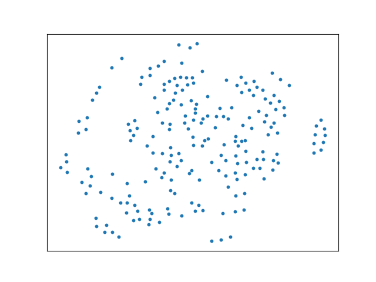
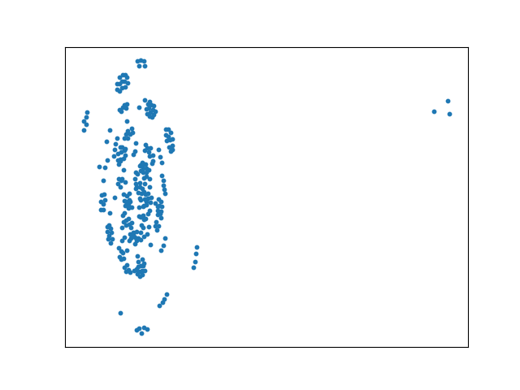
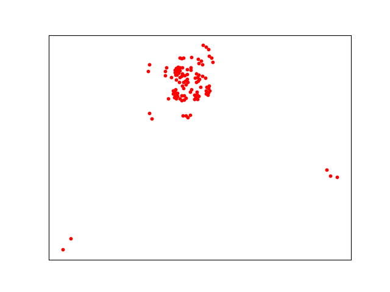
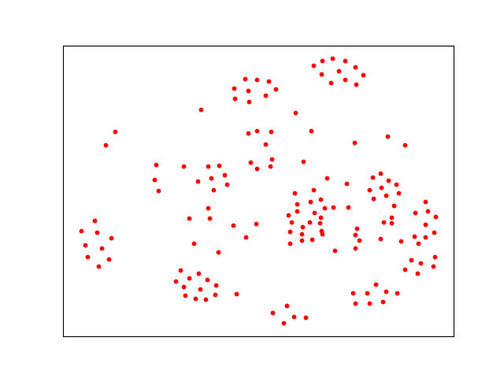
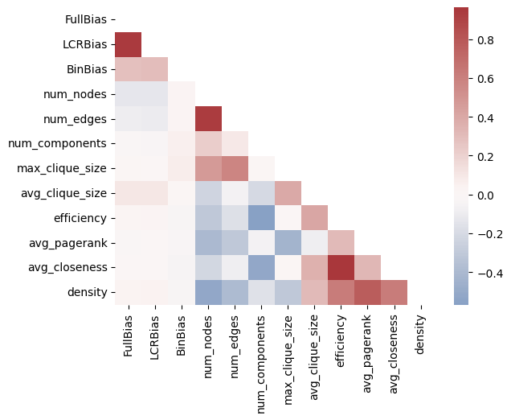
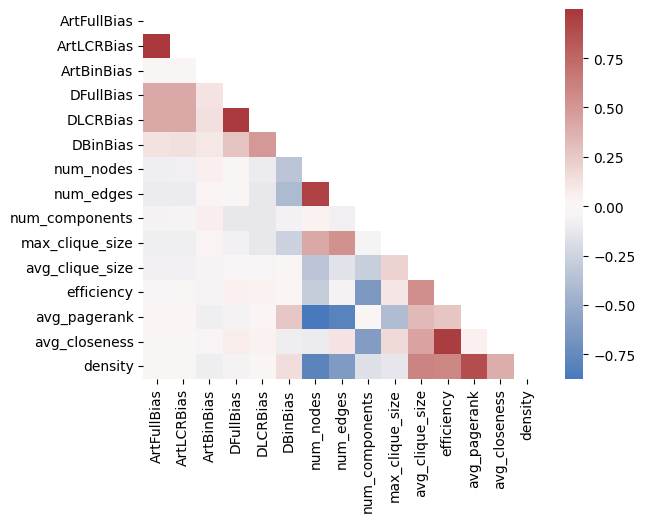

# DocNet：揭示归纳偏差检测模型中的语义结构奥秘

发布时间：2024年06月16日

`RAG

理由：这篇论文主要关注的是新闻文章的语义结构及其在偏见检测中的应用，通过开发的DocNet模型来实现这一目标。虽然涉及到了语言模型，但其核心贡献在于通过归纳学习在偏见检测上超越了大型语言模型，并且关注的是新闻文章的语义结构这一特定领域。因此，这篇论文更适合归类为RAG（检索增强生成），因为它涉及到了通过特定模型（DocNet）来增强对新闻文章语义结构的理解和应用，这与RAG的概念相符，即通过检索和增强特定信息来改善生成模型的性能。` `新闻媒体` `社交媒体`

> DocNet: Semantic Structure in Inductive Bias Detection Models

# 摘要

> 人们的观点导致新闻不可避免地带有偏见。随着社交媒体成为获取新闻的首选渠道，党派分歧日益扩大，识别新闻偏见对明智的公民而言变得尤为关键。了解新闻偏见的方式有助于人们避免陷入极端化的信息泡沫。本文聚焦于一个常被忽视的偏见检测领域：新闻文章的语义结构。我们开发的DocNet模型，不仅资源消耗低，而且通过归纳学习，在偏见检测上超越了大型语言模型。研究还发现，不同党派的新闻文章在语义结构上存在显著相似性，这一发现为低资源环境下的偏见检测提供了新思路。相关代码和数据已发布于https://github.com/nlpresearchanon。

> News will have biases so long as people have opinions. However, as social media becomes the primary entry point for news and partisan gaps increase, it is increasingly important for informed citizens to be able to identify bias. People will be able to take action to avoid polarizing echo chambers if they know how the news they are consuming is biased. In this paper, we explore an often overlooked aspect of bias detection in documents: the semantic structure of news articles. We present DocNet, a novel, inductive, and low-resource document embedding and bias detection model that outperforms large language models. We also demonstrate that the semantic structure of news articles from opposing partisan sides, as represented in document-level graph embeddings, have significant similarities. These results can be used to advance bias detection in low-resource environments. Our code and data are made available at https://github.com/nlpresearchanon.

[Arxiv](https://arxiv.org/abs/2406.10965)