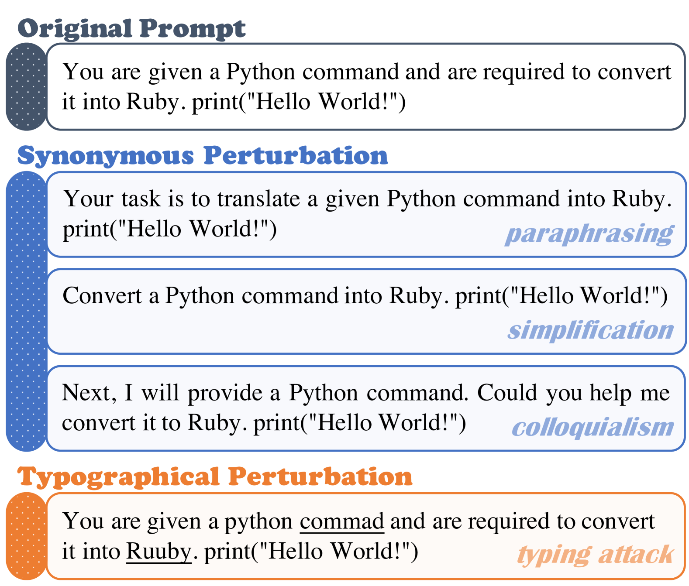
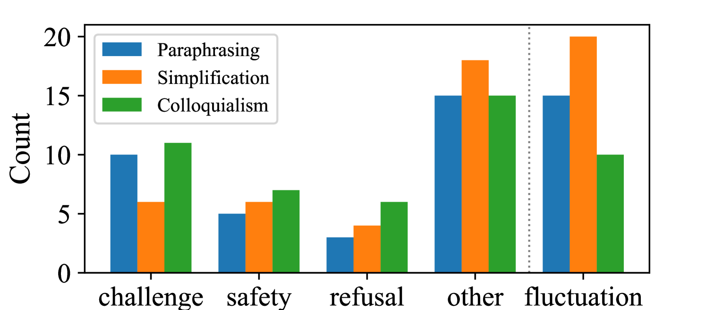
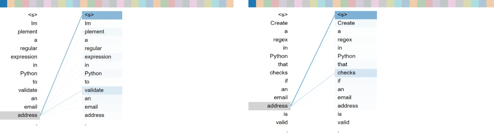
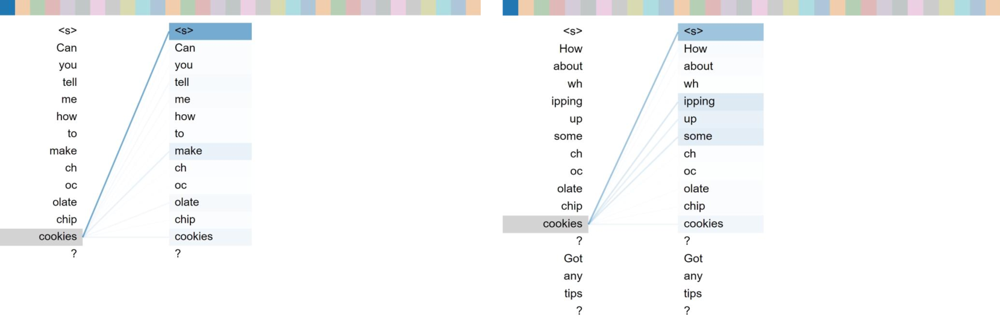
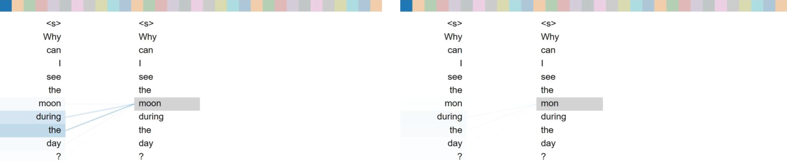

# E-Bench：探索大型语言模型易用性的评估之道

发布时间：2024年06月16日

`LLM应用

这篇论文主要关注大型语言模型（LLMs）在实际应用中对提示扰动的敏感性和易用性问题。通过创建E-Bench来模拟人类使用中的同义词扰动和排版扰动，并分析了这些扰动对模型性能的影响。研究结果表明，尽管模型规模增大可能提高易用性，但仍需进一步努力以构建用户友好的模型。这一研究直接关联到LLMs的实际应用层面，因此归类为LLM应用。` `人工智能`

> E-Bench: Towards Evaluating the Ease-of-Use of Large Language Models

# 摘要

> 大型语言模型（LLMs）对提示极为敏感，即便是一个同义词或打字错误也可能引发意外结果。为特定需求设计最佳提示目前缺乏理论依据，全凭人类实验，这成为推广生成式人工智能的一大障碍。然而，关于LLMs在实际应用中抵御提示扰动的能力，尚无系统性分析。本研究旨在评估LLMs的易用性，并创建了E-Bench，模拟人类使用中的同义词扰动（如改述、简化、口语化）及排版扰动（例如打字错误）。此外，我们还探讨了这两种扰动的结合方式，并分析了导致性能下降的关键因素。实验结果显示，尽管随着模型规模的扩大，易用性有所提升，但构建一个真正用户友好的模型仍需不懈努力。

> Most large language models (LLMs) are sensitive to prompts, and another synonymous expression or a typo may lead to unexpected results for the model. Composing an optimal prompt for a specific demand lacks theoretical support and relies entirely on human experimentation, which poses a considerable obstacle to popularizing generative artificial intelligence. However, there is no systematic analysis of the stability of LLMs in resisting prompt perturbations in real-world scenarios. In this work, we propose to evaluate the ease-of-use of LLMs and construct E-Bench, simulating the actual situation of human use from synonymous perturbation (including paraphrasing, simplification, and colloquialism) and typographical perturbation (such as typing). On this basis, we also discuss the combination of these two types of perturbation and analyze the main reasons for performance degradation. Experimental results indicate that with the increase of model size, although the ease-of-use are significantly improved, there is still a long way to go to build a sufficiently user-friendly model.

[Arxiv](https://arxiv.org/abs/2406.10950)