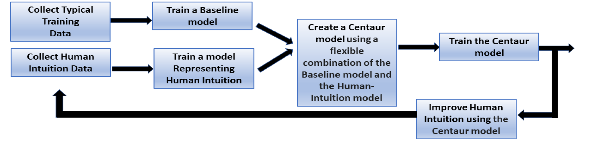
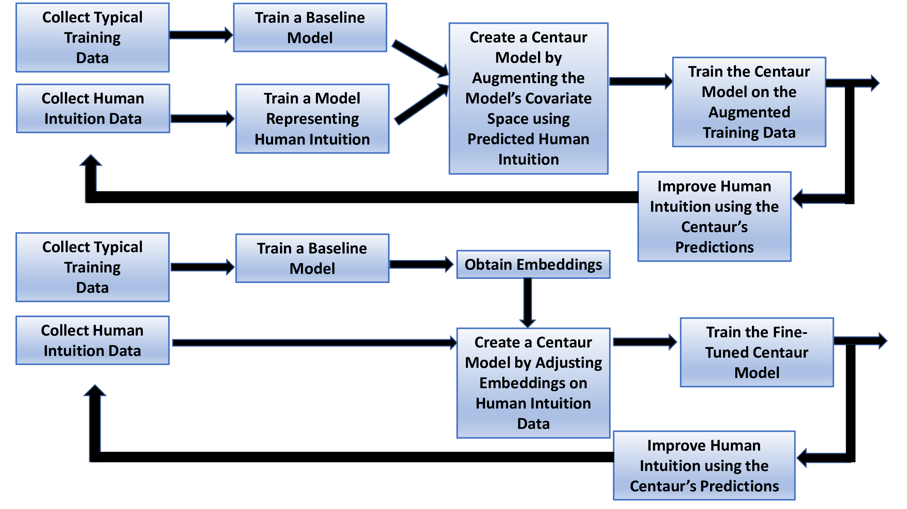

# 高效生成AI：人机算法共生体

发布时间：2024年06月16日

`Agent

这篇论文探讨了结合人工智能与人类智能的混合AI模型“半人马”，并讨论了其在决策过程中的应用和优化。这种模型可以被视为一种智能代理（Agent），因为它结合了机器的计算能力和人类的直觉，以优化决策过程。因此，这篇论文更适合归类在Agent分类中，因为它关注的是如何构建和应用这种混合智能代理，以及它在AI发展中的作用。` `人工智能` `决策支持`

> Effective Generative AI: The Human-Algorithm Centaur

# 摘要

> 高级分析科学方法已融合人工智能与人类智能，打造出“半人马”——一种结合形式分析与人类直觉的混合AI模型，以共生方式优化决策过程。我们认为，AI的未来发展应聚焦于半人马而非传统模式。这一转变引发了一系列问题：半人马与传统的人在环方法有何区别？如何高效构建半人马？何时选择半人马，何时又应依赖传统AI？将有时可能误导的人类直觉融入半人马的决策，是否会降低其性能？本文将探讨这些问题，以生成AI和大型语言模型（LLMs）的最新进展为例，阐述半人马在未来AI发展中的核心地位。

> Advanced analytics science methods have enabled combining the power of artificial and human intelligence, creating \textit{centaurs} that allow superior decision-making. Centaurs are hybrid human-algorithm AI models that combine both formal analytics and human intuition in a symbiotic manner within their learning and reasoning process. We argue that the future of AI development and use in many domains needs to focus on centaurs as opposed to traditional AI approaches. This paradigm shift from traditional AI methods to centaur-based AI methods raises some fundamental questions: How are centaurs different from traditional human-in-the-loop methods? What are the most effective methods for creating centaurs? When should centaurs be used, and when should the lead be given to traditional AI models? Doesn't the incorporation of human intuition -- which at times can be misleading -- in centaurs' decision-making process degrade its performance compared to traditional AI methods? This work aims to address these fundamental questions, focusing on recent advancements in generative AI, and especially in Large Language Models (LLMs), as a main case study to illustrate centaurs' critical essentiality to future AI endeavors.

[Arxiv](https://arxiv.org/abs/2406.10942)