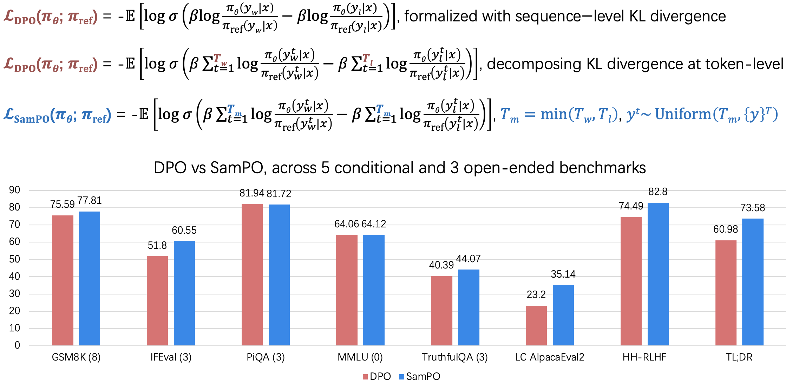
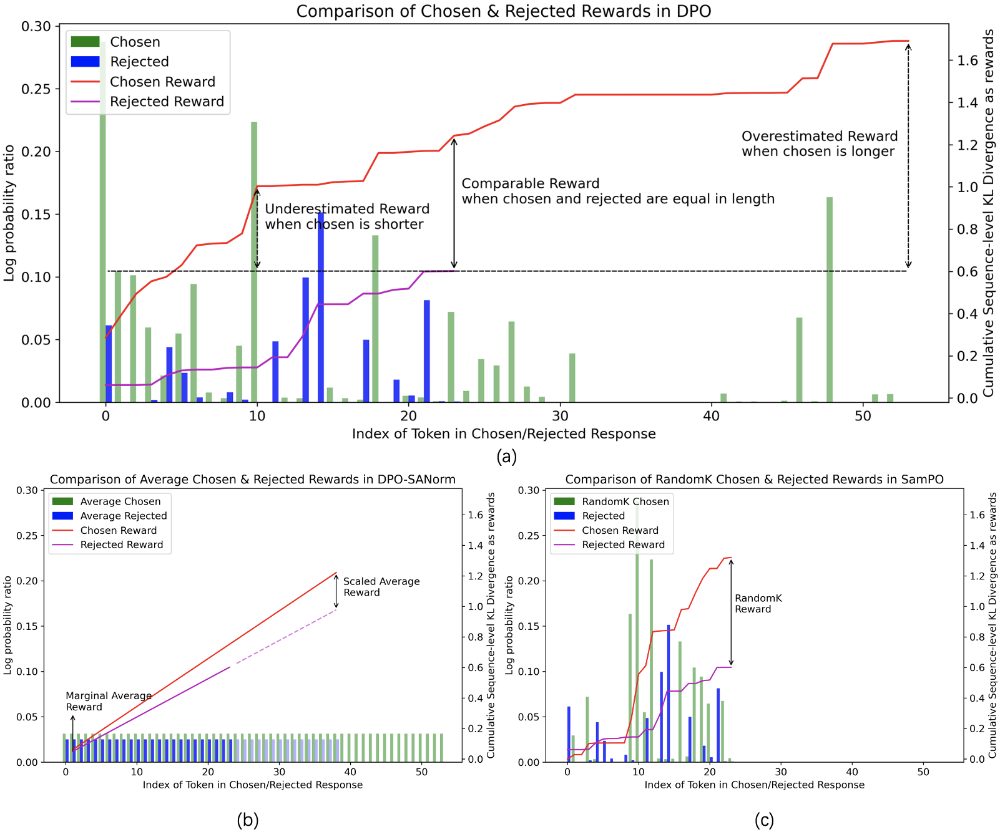
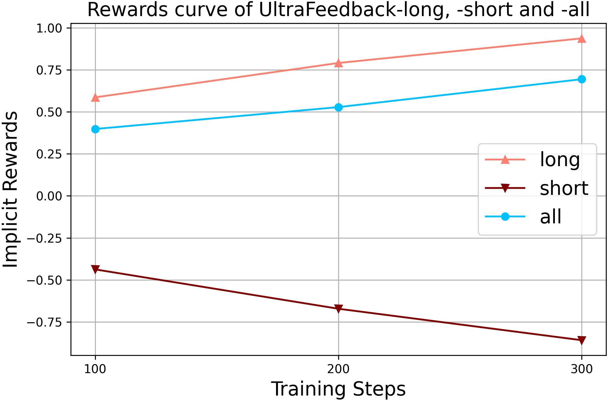
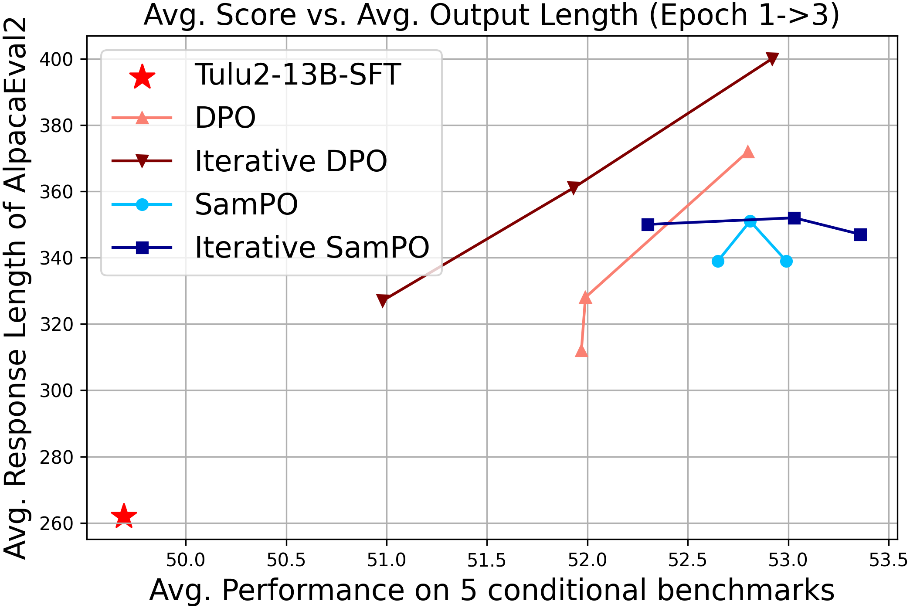
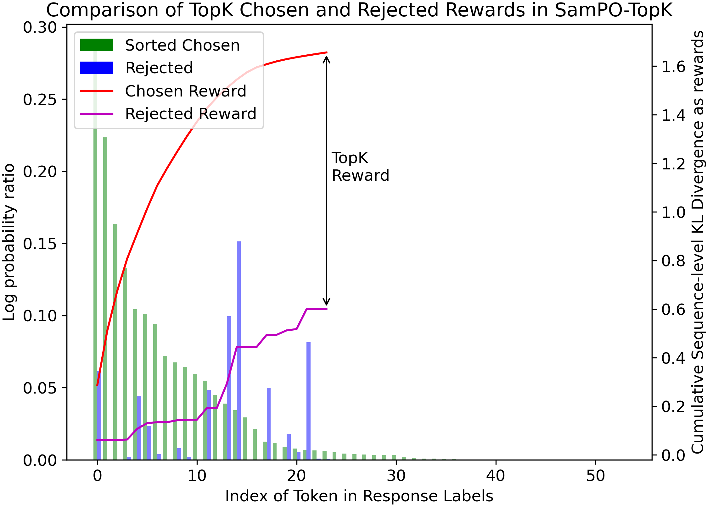
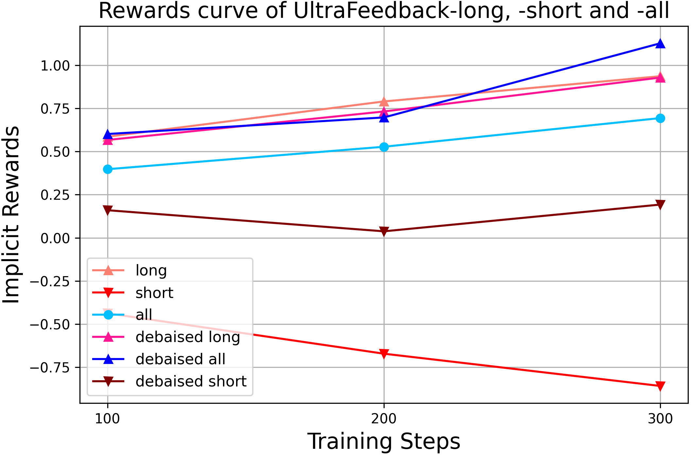
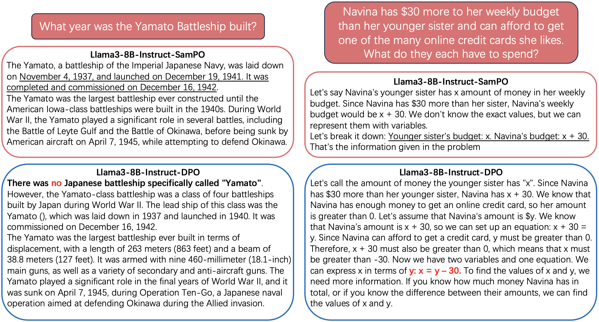

# 借助下采样KL散度，我们得以消除直接偏好优化中对偏置长度的依赖，从而提升了算法的公正性与效率。

发布时间：2024年06月16日

`LLM理论

理由：这篇论文主要探讨了直接偏好优化（DPO）算法在大型语言模型（LLMs）中的应用问题，特别是关于“冗长”现象的成因和解决方案。论文通过分析DPO算法中的序列级Kullback-Leibler（KL）散度差异对序列长度的依赖性，提出了一种新的下采样方法SamPO来解决这一问题。这涉及到对LLM算法的理论分析和改进，因此属于LLM理论分类。` `人工智能` `语言模型`

> Eliminating Biased Length Reliance of Direct Preference Optimization via Down-Sampled KL Divergence

# 摘要

> 直接偏好优化（DPO）作为一种直接且稳健的算法，已成为将大型语言模型（LLMs）与人类偏好对齐的重要工具，相较于复杂的人类反馈强化学习（RLHF），它提供了一种更直接的解决方案。然而，DPO存在一个显著问题——“冗长”，这是一种在RLHF中也常见的过度优化现象。我们不仅认同先前研究中将冗长归咎于数据偏差标签的观点，还进一步指出，DPO算法本身对序列长度的依赖也是问题的根源。具体而言，DPO中使用的序列级Kullback-Leibler（KL）散度差异，因令牌长度不一，导致奖励评估出现偏差。我们通过不同标签长度的数据集验证了这一偏差，并提出了一种名为SamPO的有效下采样方法，以消除长度依赖。在多个LLMs和一系列条件性与开放式基准上的实验表明，SamPO显著减轻了冗长问题，通过去偏差奖励实现了比DPO提升5%至12%的性能改进。我们的代码已公开，详情请访问：https://github.com/LuJunru/SamPO/。

> Direct Preference Optimization (DPO) has emerged as a prominent algorithm for the direct and robust alignment of Large Language Models (LLMs) with human preferences, offering a more straightforward alternative to the complex Reinforcement Learning from Human Feedback (RLHF). Despite its promising efficacy, DPO faces a notable drawback: "verbosity", a common over-optimization phenomenon also observed in RLHF. While previous studies mainly attributed verbosity to biased labels within the data, we propose that the issue also stems from an inherent algorithmic length reliance in DPO. Specifically, we suggest that the discrepancy between sequence-level Kullback-Leibler (KL) divergences between chosen and rejected sequences, used in DPO, results in overestimated or underestimated rewards due to varying token lengths. Empirically, we utilize datasets with different label lengths to demonstrate the presence of biased rewards. We then introduce an effective downsampling approach, named SamPO, to eliminate potential length reliance. Our experimental evaluations, conducted across three LLMs of varying scales and a diverse array of conditional and open-ended benchmarks, highlight the efficacy of SamPO in mitigating verbosity, achieving improvements of 5% to 12% over DPO through debaised rewards. Our codes can be accessed at: https://github.com/LuJunru/SamPO/.

[Arxiv](https://arxiv.org/abs/2406.10957)