# 情感之光：Emotion-LLaMA——指令调优下的多模态情感识别与推理之旅

发布时间：2024年06月16日

`LLM应用

这篇论文介绍了Emotion-LLaMA模型，这是一个多模态大型语言模型，专门设计用于情感识别和推理。它通过整合音频、视觉和文本信息，并使用特定的情感编码器来提高情感感知的准确性。论文中还提到了新推出的MERR数据集，该数据集用于训练和评估模型。Emotion-LLaMA模型在多个情感识别任务中展示了优越的性能，这表明该模型在实际应用中具有潜力，特别是在人机交互、教育和咨询等领域。因此，这篇论文属于LLM应用分类。` `人机交互` `情感识别`

> Emotion-LLaMA: Multimodal Emotion Recognition and Reasoning with Instruction Tuning

# 摘要

> 在人机交互、教育和咨询等领域，准确感知情感至关重要。然而，传统单一模态方法难以捕捉现实世界中复杂多变的情感表达。现有的多模态大型语言模型（MLLMs）在整合音频和识别细微面部表情方面亦显不足。为此，我们推出了MERR数据集，包含28,618个粗粒度和4,487个细粒度样本，覆盖广泛情感类别，助力模型在多样情境中学习并应用于现实世界。同时，我们提出了Emotion-LLaMA模型，它通过特定情感编码器巧妙融合音频、视觉和文本信息。通过特征对齐和指令调优的LLaMA模型，Emotion-LLaMA在情感识别和推理上大放异彩。评估结果表明，Emotion-LLaMA在多个指标上超越其他MLLMs，在EMER上取得最佳成绩，并在MER2023挑战和DFEW数据集的零-shot评估中展现了卓越性能。

> Accurate emotion perception is crucial for various applications, including human-computer interaction, education, and counseling. However, traditional single-modality approaches often fail to capture the complexity of real-world emotional expressions, which are inherently multimodal. Moreover, existing Multimodal Large Language Models (MLLMs) face challenges in integrating audio and recognizing subtle facial micro-expressions. To address this, we introduce the MERR dataset, containing 28,618 coarse-grained and 4,487 fine-grained annotated samples across diverse emotional categories. This dataset enables models to learn from varied scenarios and generalize to real-world applications. Furthermore, we propose Emotion-LLaMA, a model that seamlessly integrates audio, visual, and textual inputs through emotion-specific encoders. By aligning features into a shared space and employing a modified LLaMA model with instruction tuning, Emotion-LLaMA significantly enhances both emotional recognition and reasoning capabilities. Extensive evaluations show Emotion-LLaMA outperforms other MLLMs, achieving top scores in Clue Overlap (7.83) and Label Overlap (6.25) on EMER, an F1 score of 0.9036 on MER2023 challenge, and the highest UAR (45.59) and WAR (59.37) in zero-shot evaluations on DFEW dataset.

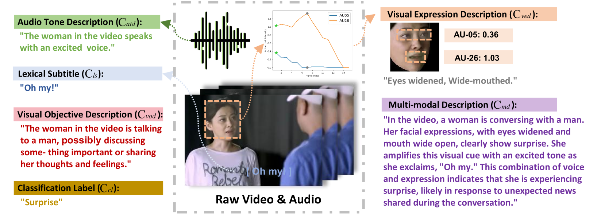

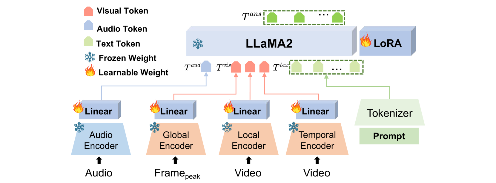

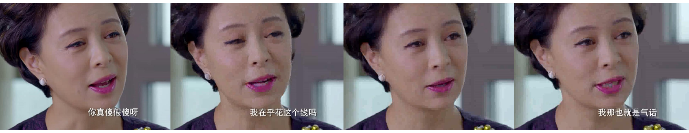

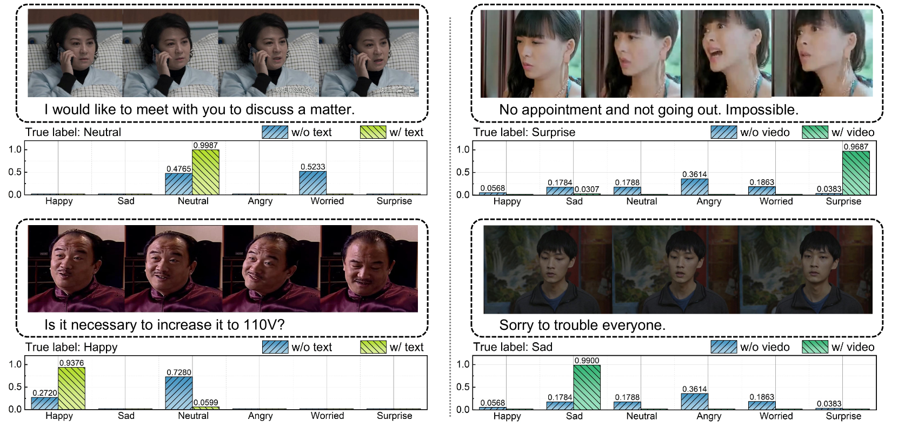

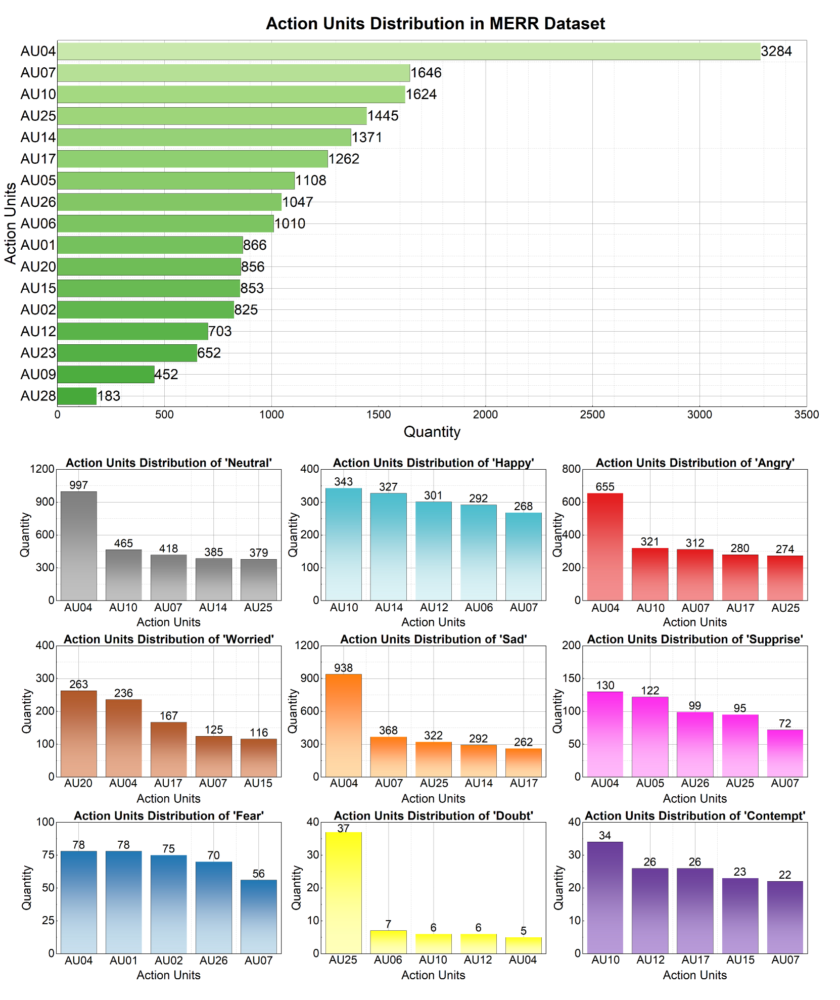

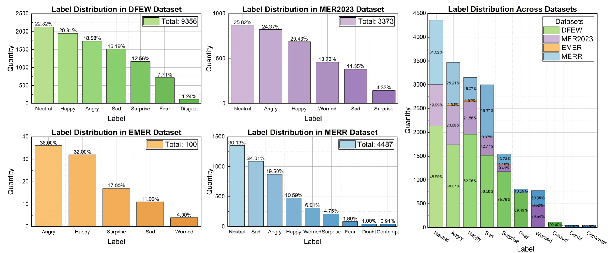

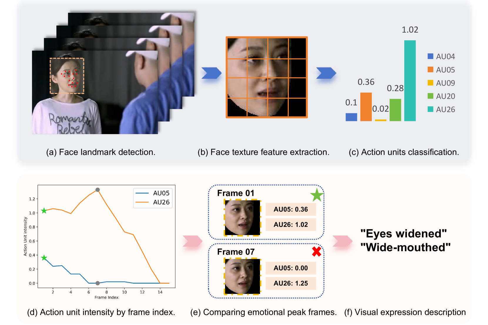

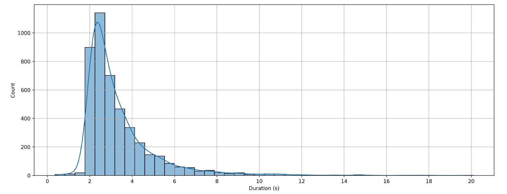

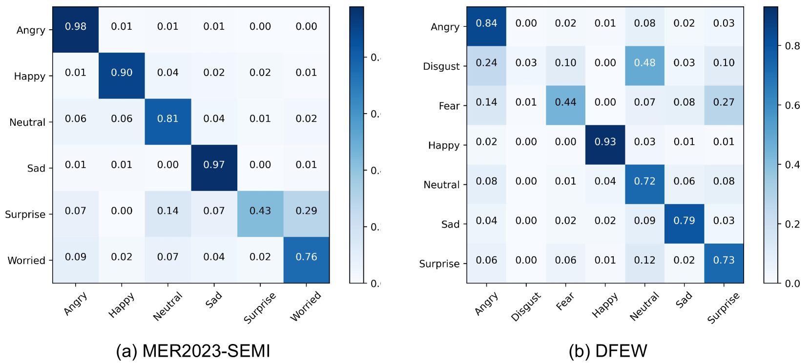

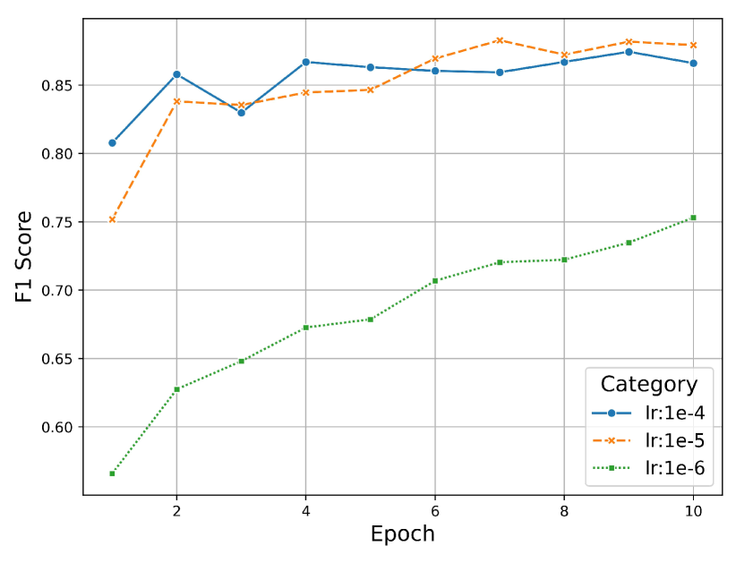

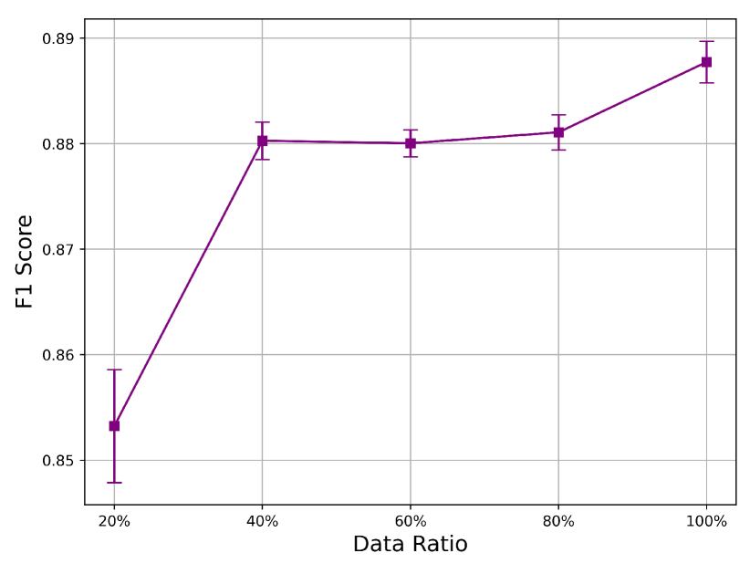

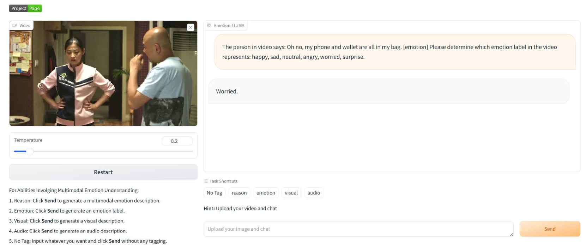

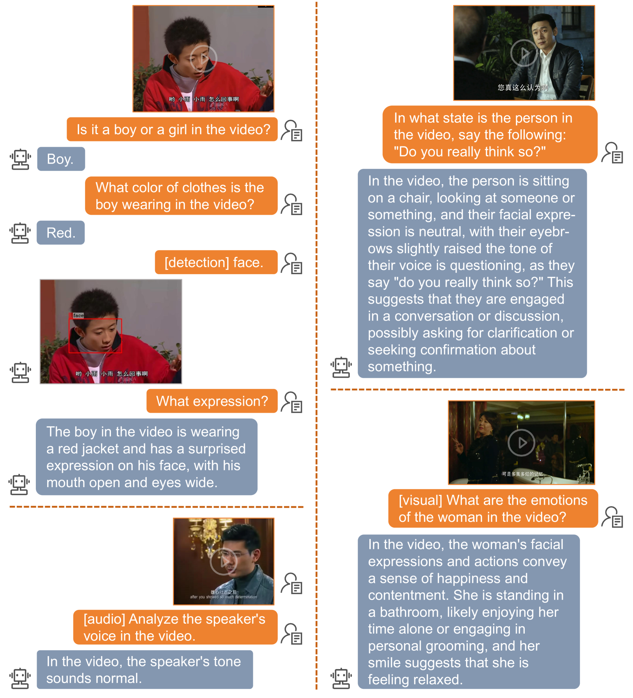

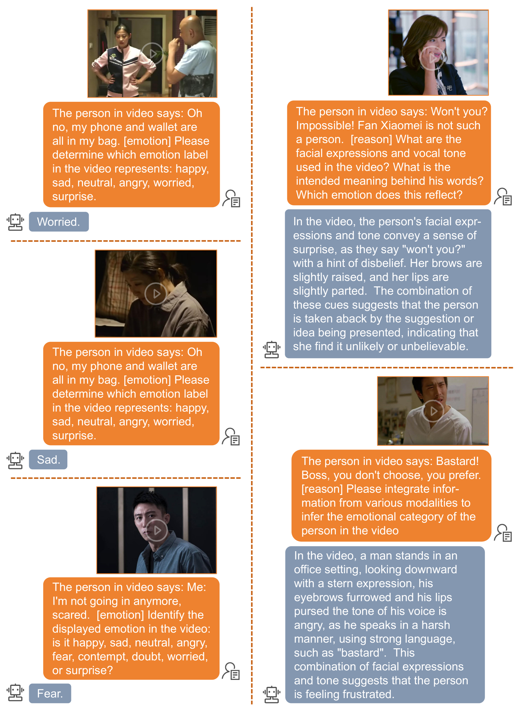

[Arxiv](https://arxiv.org/abs/2406.11161)