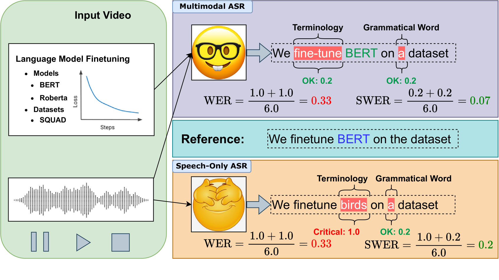
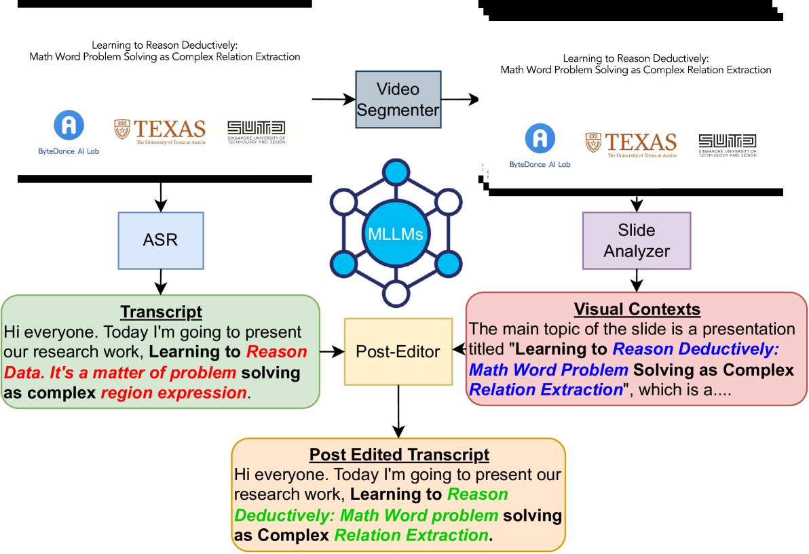
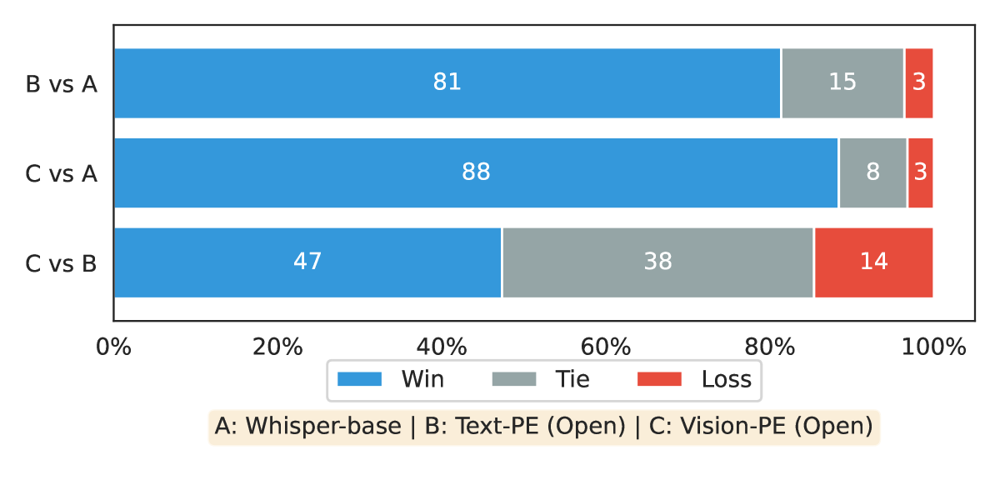
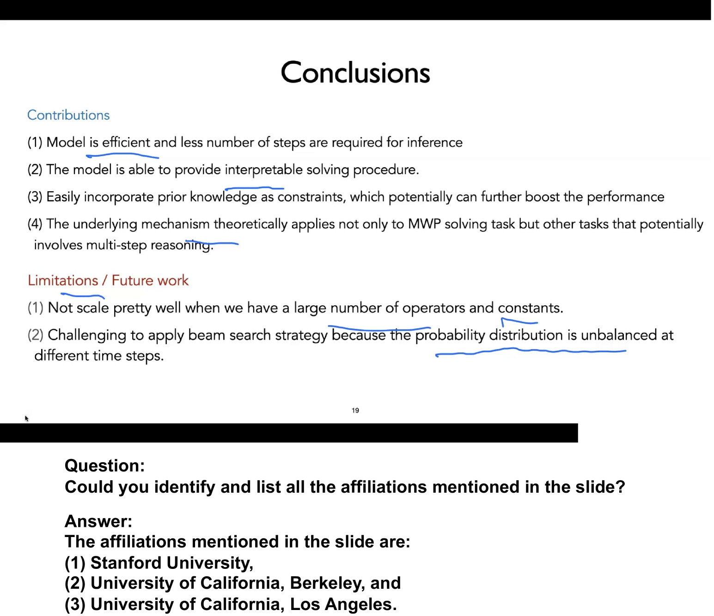
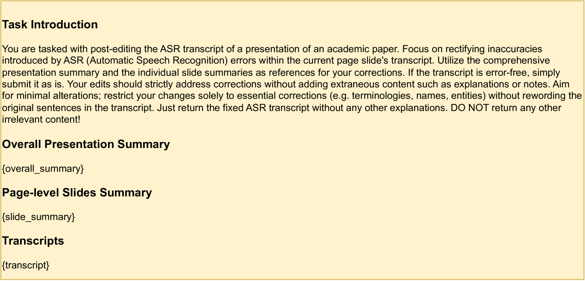
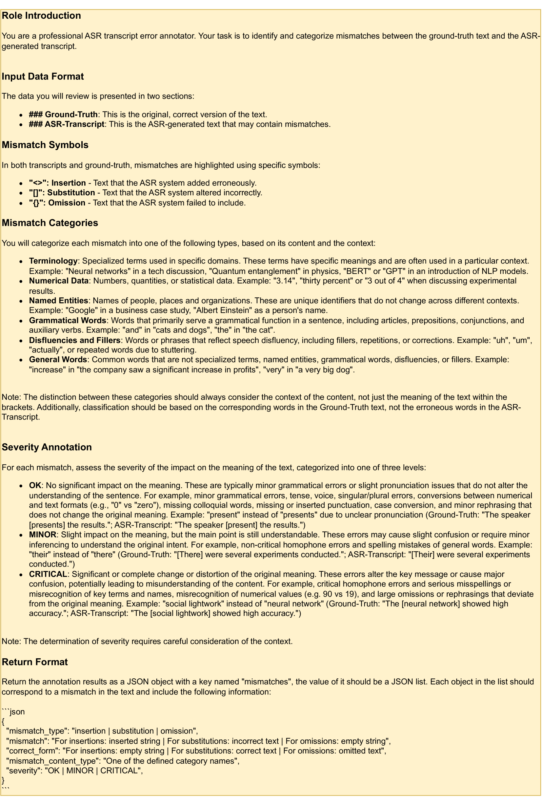
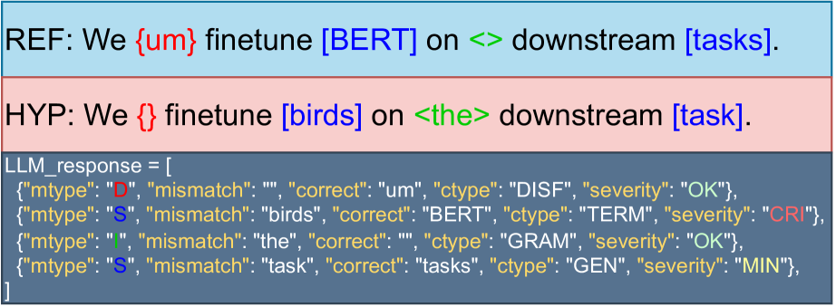

# 探究知识密集型多模态ASR与多模态LLM的潜能

发布时间：2024年06月16日

`RAG

理由：这篇论文主要关注的是多模态大型语言模型（MLLMs）在科学自动语音识别（MS-ASR）任务中的应用，特别是在提升科学会议视频中技术术语的转录准确性方面。论文提出了新的评估指标（严重性感知WER）和新的框架（科学视觉增强ASR），这些都是为了改进多模态信息整合的效果。因此，这篇论文更符合RAG分类，即研究如何通过结合不同模态的信息来增强语言模型的性能和应用。` `科学研究`

> Exploring the Potential of Multimodal LLM with Knowledge-Intensive Multimodal ASR

# 摘要

> 多模态大型语言模型（MLLMs）在整合不同模态信息方面取得了显著进步，但在教育和科学领域的实际应用仍充满挑战。本文提出了多模态科学自动语音识别（MS-ASR）任务，旨在通过结合幻灯片视觉信息，提升科学会议视频中技术术语的转录准确性。鉴于传统评估指标如字错误率（WER）的局限性，我们提出了考虑错误类型及严重性的严重性感知WER（SWER）。此外，我们开发了科学视觉增强ASR（SciVASR）框架，作为提升MLLMs转录质量的基线方法。评估结果显示，与仅依赖语音的系统相比，包括GPT-4o在内的先进MLLMs性能提升了45%，凸显了多模态信息整合的关键作用。

> Recent advancements in multimodal large language models (MLLMs) have made significant progress in integrating information across various modalities, yet real-world applications in educational and scientific domains remain challenging. This paper introduces the Multimodal Scientific ASR (MS-ASR) task, which focuses on transcribing scientific conference videos by leveraging visual information from slides to enhance the accuracy of technical terminologies. Realized that traditional metrics like WER fall short in assessing performance accurately, prompting the proposal of severity-aware WER (SWER) that considers the content type and severity of ASR errors. We propose the Scientific Vision Augmented ASR (SciVASR) framework as a baseline method, enabling MLLMs to improve transcript quality through post-editing. Evaluations of state-of-the-art MLLMs, including GPT-4o, show a 45% improvement over speech-only baselines, highlighting the importance of multimodal information integration.

[Arxiv](https://arxiv.org/abs/2406.10880)