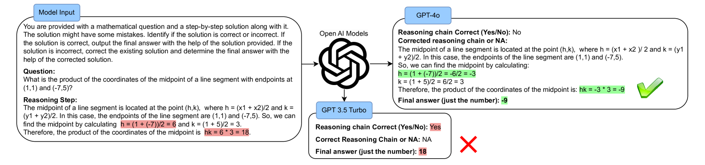
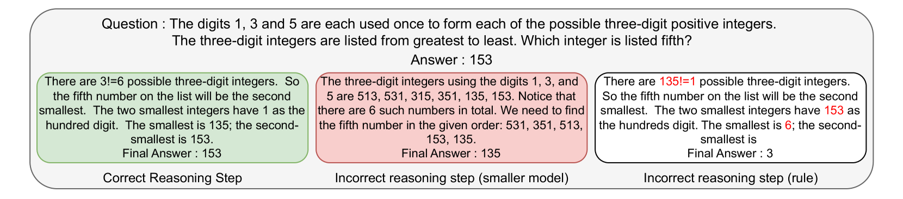
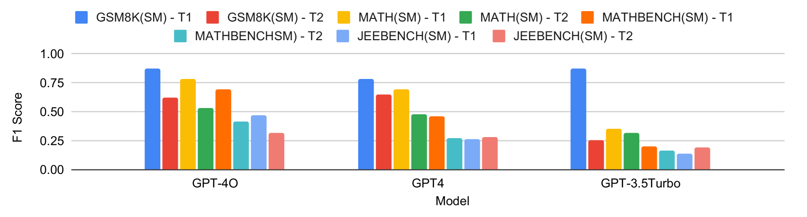
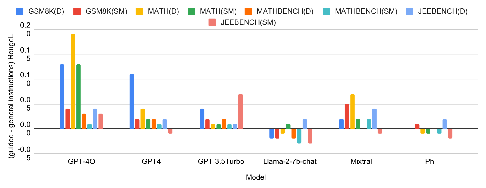

# 揭示大型语言模型的弱点：探究其在数学推理中应对错误的能力

发布时间：2024年06月16日

`LLM应用

这篇论文主要探讨了大型语言模型（LLMs）在解决数学文字问题（MWPs）时的推理能力，并提出了一个新的数据集MWP-MISTAKE来评估这些模型。研究特别关注了模型识别和纠正推理错误的能力，并对多个模型进行了测试，揭示了它们的优势和不足。此外，论文还指出了数据污染和记忆问题对模型可靠性的影响，并强调了评估推理过程的重要性。这些内容主要集中在LLMs的应用层面，特别是在教育领域的应用，因此将其归类为LLM应用。` `人工智能`

> Exposing the Achilles' Heel: Evaluating LLMs Ability to Handle Mistakes in Mathematical Reasoning

# 摘要

> 大型语言模型（LLMs）在解决数学文字问题（MWPs）方面展现了革命性的影响，改变了这些复杂问题在教育等多个领域的解决方式。然而，评估这些模型时往往只看重最终准确性，忽略了推理能力的重要性。本研究专注于LLMs识别和纠正推理错误的能力，并推出了一个名为MWP-MISTAKE的新数据集，该数据集包含了通过规则方法和小型语言模型生成的正确与错误推理步骤的MWPs。我们的全面测试揭示了包括GPT-4o、GPT-4、GPT-3.5Turbo在内的顶级模型的优势与不足，特别指出GPT-4o在错误识别与修正上的卓越表现，以及小型模型所面临的挑战。同时，我们也发现了数据污染和记忆问题，这些问题影响了LLMs在实际应用中的可靠性。我们的研究强调了严格评估推理过程的必要性，并为提升LLMs在数学问题解决中的泛化能力和鲁棒性指明了未来研究方向。

> Large Language Models (LLMs) have been applied to Math Word Problems (MWPs) with transformative impacts, revolutionizing how these complex problems are approached and solved in various domains including educational settings. However, the evaluation of these models often prioritizes final accuracy, overlooking the crucial aspect of reasoning capabilities. This work addresses this gap by focusing on the ability of LLMs to detect and correct reasoning mistakes. We introduce a novel dataset MWP-MISTAKE, incorporating MWPs with both correct and incorrect reasoning steps generated through rule-based methods and smaller language models. Our comprehensive benchmarking reveals significant insights into the strengths and weaknesses of state-of-the-art models, such as GPT-4o, GPT-4, GPT-3.5Turbo, and others. We highlight GPT-$o's superior performance in mistake detection and rectification and the persistent challenges faced by smaller models. Additionally, we identify issues related to data contamination and memorization, impacting the reliability of LLMs in real-world applications. Our findings emphasize the importance of rigorous evaluation of reasoning processes and propose future directions to enhance the generalization and robustness of LLMs in mathematical problem-solving.

[Arxiv](https://arxiv.org/abs/2406.10834)