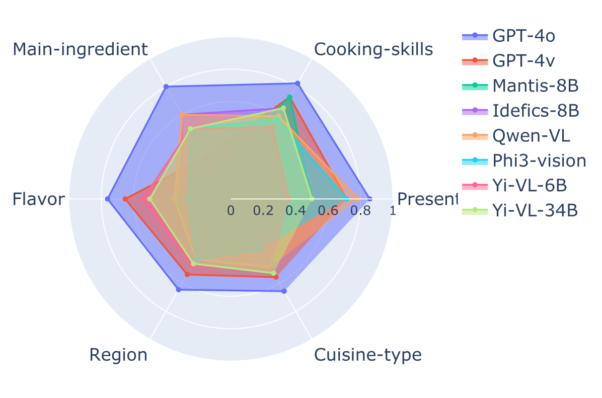

# FoodieQA：探索中国饮食文化之精髓的多模态数据集

发布时间：2024年06月16日

`LLM应用

理由：这篇论文主要介绍了FoodieQA数据集，并测试了视觉语言模型和大型语言模型在食物图像上的表现。它关注的是大型语言模型在特定应用场景（食物文化问答）中的性能和挑战，因此属于LLM应用类别。论文中虽然涉及了模型的测试和评估，但核心关注点是模型的实际应用而非理论研究或模型本身的机制。` `食品文化` `问答系统`

> FoodieQA: A Multimodal Dataset for Fine-Grained Understanding of Chinese Food Culture

# 摘要

> 食物作为文化遗产的重要组成部分，其地区多样性常被忽视。为此，我们推出了FoodieQA数据集，它细致地记录了中国各地的食物文化。我们测试了视觉语言模型和大型语言模型在新的食物图像上的表现。FoodieQA设置了三个问答任务，要求模型根据图像或文本描述回答问题。尽管大型语言模型在文本问答上超越了人类，但开源的视觉语言模型在图像问答任务上仍有显著差距。这表明，深入理解食物及其文化意义仍是一个待探索的挑战。

> Food is a rich and varied dimension of cultural heritage, crucial to both individuals and social groups. To bridge the gap in the literature on the often-overlooked regional diversity in this domain, we introduce FoodieQA, a manually curated, fine-grained image-text dataset capturing the intricate features of food cultures across various regions in China. We evaluate vision-language Models (VLMs) and large language models (LLMs) on newly collected, unseen food images and corresponding questions. FoodieQA comprises three multiple-choice question-answering tasks where models need to answer questions based on multiple images, a single image, and text-only descriptions, respectively. While LLMs excel at text-based question answering, surpassing human accuracy, the open-sourced VLMs still fall short by 41\% on multi-image and 21\% on single-image VQA tasks, although closed-weights models perform closer to human levels (within 10\%). Our findings highlight that understanding food and its cultural implications remains a challenging and under-explored direction.

[Arxiv](https://arxiv.org/abs/2406.11030)