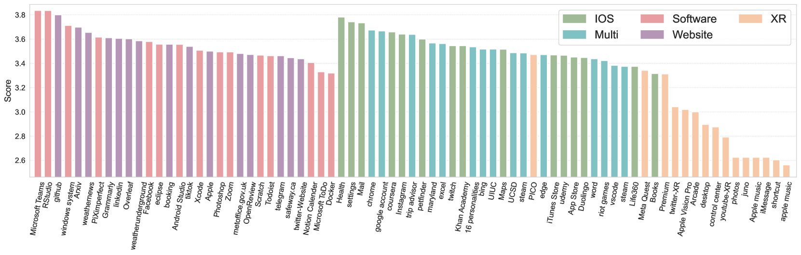
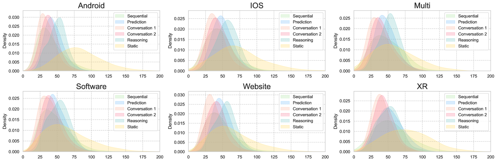

# GUI-WORLD：专为多模态LLM代理设计的图形用户界面数据集。

发布时间：2024年06月16日

`Agent

这篇论文主要探讨了多模态大型语言模型（MLLMs）作为代理在图形用户界面（GUI）上的应用，特别是在感知和理解动态GUI内容方面的能力。论文通过引入新的数据集GUI-World，并评估了不同类型的MLLMs（如ImageLLMs和VideoLLMs）在处理GUI相关任务中的表现，强调了使用MLLMs作为GUI代理的潜力和挑战。因此，这篇论文更符合Agent分类，因为它专注于模型作为代理的应用和性能评估。` `人机交互` `数据集`

> GUI-WORLD: A Dataset for GUI-oriented Multimodal LLM-based Agents

# 摘要

> 多模态大型语言模型（MLLMs）近期被用作代理，通过直接感知图形用户界面（GUI）并生成代码来操控键盘和鼠标。尽管这些代理在静态环境中理解能力出众，但它们主要应用于网页或移动界面等简单领域。我们认为，一个强大的GUI代理应能感知GUI上的时间信息，如动态网页内容和多步骤任务，并对桌面软件和多窗口交互等GUI场景有深入理解。为此，我们推出了名为GUI-World的新数据集，该数据集包含精心制作的人-MLLM注释，涵盖六种GUI场景和八种GUI导向问题，共三种格式。我们评估了包括ImageLLMs和VideoLLMs在内的顶级MLLMs在理解动态和顺序GUI内容方面的能力。结果显示，ImageLLMs在缺乏手动标注关键帧或操作历史的情况下，难以应对动态GUI内容；而VideoLLMs则因GUI视频数据集的稀疏性，在所有GUI导向任务中表现不佳。基于GUI-World，我们首次尝试使用微调的VideoLLM作为GUI代理，其在各种GUI任务中的理解能力有所提升。然而，鉴于基础LLMs的性能限制，使用VideoLLMs作为GUI代理仍面临挑战。我们相信，我们的研究为动态GUI内容理解的未来研究提供了宝贵见解。代码和数据集已公开发布于我们的项目主页：https://gui-world.github.io/。

> Recently, Multimodal Large Language Models (MLLMs) have been used as agents to control keyboard and mouse inputs by directly perceiving the Graphical User Interface (GUI) and generating corresponding code. However, current agents primarily exhibit excellent understanding capabilities in static environments and are predominantly applied in relatively simple domains, such as Web or mobile interfaces. We argue that a robust GUI agent should be capable of perceiving temporal information on the GUI, including dynamic Web content and multi-step tasks. Additionally, it should possess a comprehensive understanding of various GUI scenarios, including desktop software and multi-window interactions. To this end, this paper introduces a new dataset, termed GUI-World, which features meticulously crafted Human-MLLM annotations, extensively covering six GUI scenarios and eight types of GUI-oriented questions in three formats. We evaluate the capabilities of current state-of-the-art MLLMs, including ImageLLMs and VideoLLMs, in understanding various types of GUI content, especially dynamic and sequential content. Our findings reveal that ImageLLMs struggle with dynamic GUI content without manually annotated keyframes or operation history. On the other hand, VideoLLMs fall short in all GUI-oriented tasks given the sparse GUI video dataset. Based on GUI-World, we take the initial step of leveraging a fine-tuned VideoLLM as a GUI agent, demonstrating an improved understanding of various GUI tasks. However, due to the limitations in the performance of base LLMs, we conclude that using VideoLLMs as GUI agents remains a significant challenge. We believe our work provides valuable insights for future research in dynamic GUI content understanding. The code and dataset are publicly available at our project homepage: https://gui-world.github.io/.

[Arxiv](https://arxiv.org/abs/2406.10819)