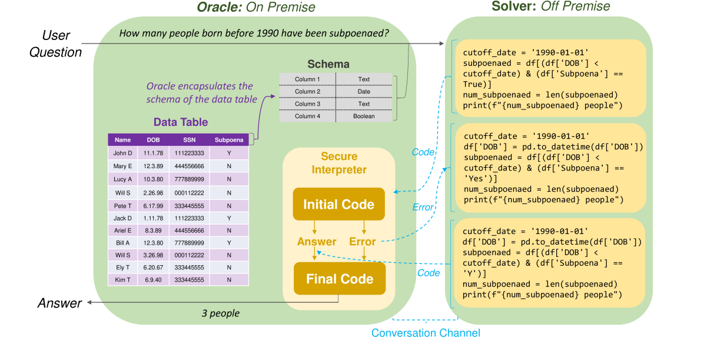
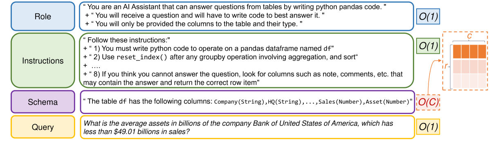

# HiddenTables 与 PyQTax：一款专为TableQA设计的合作游戏及数据集，旨在跨越多样的分类体系，同时保障数据规模与隐私安全。

发布时间：2024年06月16日

`LLM应用

这篇论文摘要描述了一个名为“HiddenTables”的合作游戏，它旨在解决大型语言模型（LLMs）在处理表格问答任务时遇到的难题，如上下文窗口限制、标记化与单元格边界的差异，以及数据保密限制。通过这个游戏，研究者们展示了LLMs在应对复杂查询、处理组合依赖及将自然语言与编程命令对齐方面的局限，并创建了一个新的数据集“PyQTax”来进一步研究这些问题。这个工作直接应用于LLMs的实际问题解决，因此属于LLM应用分类。` `数据安全` `问答系统`

> HiddenTables & PyQTax: A Cooperative Game and Dataset For TableQA to Ensure Scale and Data Privacy Across a Myriad of Taxonomies

# 摘要

> 众多大型语言模型（LLMs）在处理表格问答任务时遭遇共同难题，这些难题包括大型表格的上下文窗口限制、标记化与单元格边界间的差异，以及使用外部模型时的数据保密限制。为此，我们设计了一款名为“HiddenTables”的合作游戏，旨在解决这些难题。游戏中，代码生成LLM“Solver”与评估LLM解决表格问答能力的“Oracle”相互协作，基于自然语言模式，确保数据安全。通过在多样表格上的实验，我们揭示了LLMs在应对复杂查询、处理组合依赖及将自然语言与编程命令对齐方面的局限。与传统编码器模型不同，“HiddenTables”突破了行数限制，提高了提示与完成标记的效率。此外，我们创建的新数据集“PyQTax”包含116,671个问题-表格-答案组合，并提供了针对不同问题类型的详细分类。这一创新不仅揭示了LLMs在表格问答任务中的不足，也展示了LLMs如何在确保数据安全和降低成本的前提下，有效处理大规模数据集。

> A myriad of different Large Language Models (LLMs) face a common challenge in contextually analyzing table question-answering tasks. These challenges are engendered from (1) finite context windows for large tables, (2) multi-faceted discrepancies amongst tokenization patterns against cell boundaries, and (3) various limitations stemming from data confidentiality in the process of using external models such as gpt-3.5-turbo. We propose a cooperative game dubbed "HiddenTables" as a potential resolution to this challenge. In essence, "HiddenTables" is played between the code-generating LLM "Solver" and the "Oracle" which evaluates the ability of the LLM agents to solve Table QA tasks. This game is based on natural language schemas and importantly, ensures the security of the underlying data. We provide evidential experiments on a diverse set of tables that demonstrate an LLM's collective inability to generalize and perform on complex queries, handle compositional dependencies, and align natural language to programmatic commands when concrete table schemas are provided. Unlike encoder-based models, we have pushed the boundaries of "HiddenTables" to not be limited by the number of rows - therefore we exhibit improved efficiency in prompt and completion tokens. Our infrastructure has spawned a new dataset "PyQTax" that spans across 116,671 question-table-answer triplets and provides additional fine-grained breakdowns & labels for varying question taxonomies. Therefore, in tandem with our academic contributions regarding LLMs' deficiency in TableQA tasks, "HiddenTables" is a tactile manifestation of how LLMs can interact with massive datasets while ensuring data security and minimizing generation costs.

[Arxiv](https://arxiv.org/abs/2406.10803)