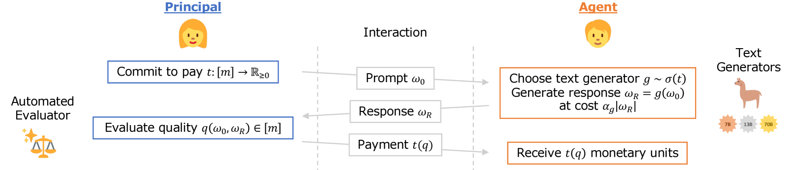
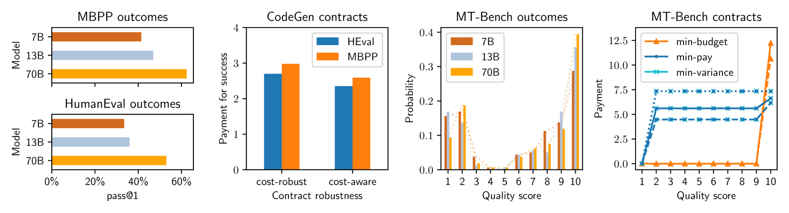

# 利用统计合同促进文本生成质量提升

发布时间：2024年06月16日

`Agent

这篇论文主要探讨了大型语言模型（LLMs）在文本生成中的经济激励问题，并提出了一种基于性能付费的合同制框架来解决这一问题。论文中涉及的委托-代理模型和成本鲁棒合同的设计，以及对代理行为的激励机制分析，都与Agent（代理）的行为和决策紧密相关。因此，这篇论文更适合归类于Agent分类。` `经济学` `文本生成`

> Incentivizing Quality Text Generation via Statistical Contracts

# 摘要

> 大型语言模型（LLMs）的成功推动了对机器生成文本的需求，但现行的按字符付费模式导致了经济学上的道德风险，即激励机制的错位：文本生成代理倾向于选择成本较低的模型而非最尖端的模型以降低成本，且这种选择在内部推理过程中不易被察觉。本研究从经济视角出发，提出了一种基于性能付费的合同制框架，旨在激励文本质量的提升。我们探讨了一个委托-代理模型，其中代理通过高成本的推理生成文本，而合同则根据自动化的质量评估来决定委托人的支付。鉴于标准合同理论在内部推理成本未知时失效，我们引入了成本鲁棒合同。我们的理论贡献在于，通过与统计学中的最优复合假设检验直接对应，我们刻画了最优成本鲁棒合同，并扩展了Saig等人（NeurIPS'23）的研究成果。通过为一系列目标和LLM评估基准设计合同，我们实证评估了这一框架，并发现成本鲁棒合同在目标价值上仅略逊于成本意识合同。

> While the success of large language models (LLMs) increases demand for machine-generated text, current pay-per-token pricing schemes create a misalignment of incentives known in economics as moral hazard: Text-generating agents have strong incentive to cut costs by preferring a cheaper model over the cutting-edge one, and this can be done "behind the scenes" since the agent performs inference internally. In this work, we approach this issue from an economic perspective, by proposing a pay-for-performance, contract-based framework for incentivizing quality. We study a principal-agent game where the agent generates text using costly inference, and the contract determines the principal's payment for the text according to an automated quality evaluation. Since standard contract theory is inapplicable when internal inference costs are unknown, we introduce cost-robust contracts. As our main theoretical contribution, we characterize optimal cost-robust contracts through a direct correspondence to optimal composite hypothesis tests from statistics, generalizing a result of Saig et al. (NeurIPS'23). We evaluate our framework empirically by deriving contracts for a range of objectives and LLM evaluation benchmarks, and find that cost-robust contracts sacrifice only a marginal increase in objective value compared to their cost-aware counterparts.

[Arxiv](https://arxiv.org/abs/2406.11118)