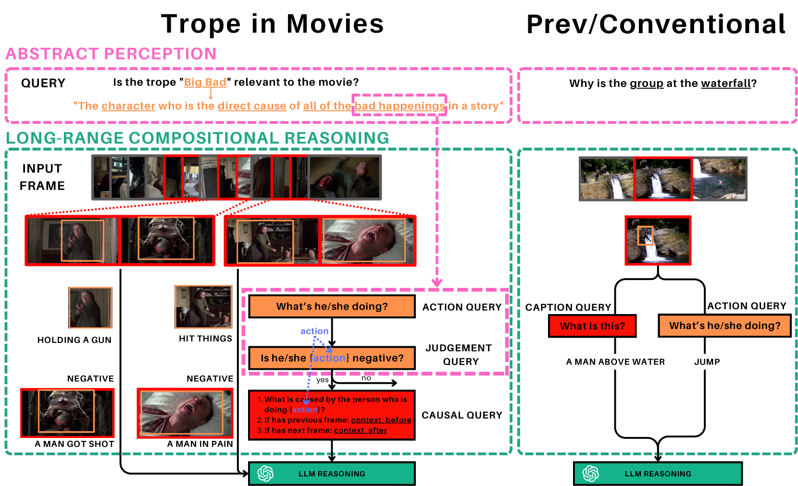
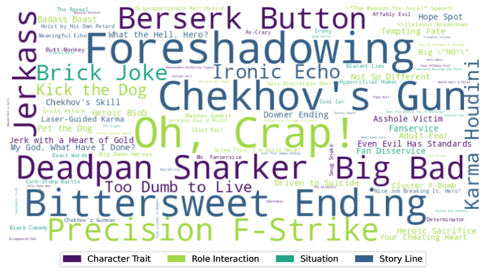

# 探究大型语言模型如何解析电影桥段中的视频推理能力

发布时间：2024年06月16日

`LLM应用

这篇论文主要探讨了大型语言模型（LLMs）在视频推理领域的应用，特别是通过“电影中的修辞”（TiM）数据集来评估和提升LLMs在抽象感知和长距离组合推理方面的能力。论文中提出的方法和实验结果展示了LLMs在特定任务上的应用和改进，因此属于LLM应用类别。` `视频分析` `电影制作`

> Investigating Video Reasoning Capability of Large Language Models with Tropes in Movies

# 摘要

> 大型语言模型（LLMs）在视频推理领域同样表现卓越。本文推出的“电影中的修辞”（TiM）数据集，专为探索视频推理中两个关键但常被忽视的技能而设计：一是抽象感知，即理解和标记视频中的抽象概念；二是长距离组合推理，涉及为理解多帧长视频规划并整合推理步骤。通过电影叙事中的修辞，TiM测试了基于LLM的最新方法的推理能力。实验结果显示，尽管现有方法如Captioner-Reasoner、大型多模态模型微调及视觉编程在抽象感知和长距离组合推理上略胜随机基准，但提升有限。为此，我们提出了角色交互增强的Viper（FEVoRI）和上下文查询简化（ConQueR），通过增强角色交互意识和逐步优化推理过程中的电影上下文及修辞查询，显著提升了15个F1分数。尽管如此，性能仍不及人类水平（40 vs. 65 F1）。此外，我们通过分析视觉编程代码的抽象语法树（AST），引入了一种新协议来评估抽象感知和长距离组合推理在任务解决中的必要性，证实了TiM的复杂性。数据集和代码已公开：https://ander1119.github.io/TiM。

> Large Language Models (LLMs) have demonstrated effectiveness not only in language tasks but also in video reasoning. This paper introduces a novel dataset, Tropes in Movies (TiM), designed as a testbed for exploring two critical yet previously overlooked video reasoning skills: (1) Abstract Perception: understanding and tokenizing abstract concepts in videos, and (2) Long-range Compositional Reasoning: planning and integrating intermediate reasoning steps for understanding long-range videos with numerous frames. Utilizing tropes from movie storytelling, TiM evaluates the reasoning capabilities of state-of-the-art LLM-based approaches. Our experiments show that current methods, including Captioner-Reasoner, Large Multimodal Model Instruction Fine-tuning, and Visual Programming, only marginally outperform a random baseline when tackling the challenges of Abstract Perception and Long-range Compositional Reasoning. To address these deficiencies, we propose Face-Enhanced Viper of Role Interactions (FEVoRI) and Context Query Reduction (ConQueR), which enhance Visual Programming by fostering role interaction awareness and progressively refining movie contexts and trope queries during reasoning processes, significantly improving performance by 15 F1 points. However, this performance still lags behind human levels (40 vs. 65 F1). Additionally, we introduce a new protocol to evaluate the necessity of Abstract Perception and Long-range Compositional Reasoning for task resolution. This is done by analyzing the code generated through Visual Programming using an Abstract Syntax Tree (AST), thereby confirming the increased complexity of TiM. The dataset and code are available at: https://ander1119.github.io/TiM

[Arxiv](https://arxiv.org/abs/2406.10923)