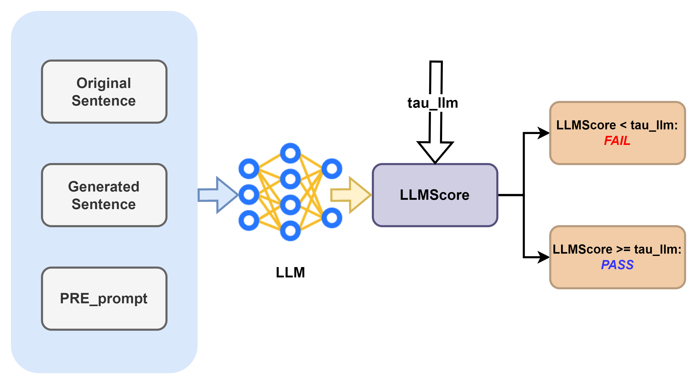

# KGPA：利用跨领域知识图谱评估大型语言模型的鲁棒性

发布时间：2024年06月16日

`LLM理论

理由：这篇论文探讨了大型语言模型（LLMs）的鲁棒性评估方法，并提出了一种基于知识图谱的新框架来系统地检验这些模型在对抗攻击下的表现。这种研究更偏向于理论分析和方法论的探讨，而不是直接的应用开发或Agent行为研究。因此，它属于LLM理论分类。` `知识图谱` `语言模型评估`

> KGPA: Robustness Evaluation for Large Language Models via Cross-Domain Knowledge Graphs

# 摘要

> 当前评估大型语言模型鲁棒性的方法过于依赖特定基准，不仅成本高昂，还因数据集限制而难以衡量其在专业领域的性能。本文提出一种新框架，利用知识图谱系统地检验LLMs在对抗攻击下的鲁棒性。该框架从知识图谱的三元组中生成原始提示，并通过毒化手段制造对抗性提示，以此评估LLMs的鲁棒性。实验结果显示，ChatGPT系列模型的对抗鲁棒性排名为GPT-4-turbo > GPT-4o > GPT-3.5-turbo，且大型语言模型的鲁棒性受其应用的专业领域影响显著。

> Existing frameworks for assessing robustness of large language models (LLMs) overly depend on specific benchmarks, increasing costs and failing to evaluate performance of LLMs in professional domains due to dataset limitations. This paper proposes a framework that systematically evaluates the robustness of LLMs under adversarial attack scenarios by leveraging knowledge graphs (KGs). Our framework generates original prompts from the triplets of knowledge graphs and creates adversarial prompts by poisoning, assessing the robustness of LLMs through the results of these adversarial attacks. We systematically evaluate the effectiveness of this framework and its modules. Experiments show that adversarial robustness of the ChatGPT family ranks as GPT-4-turbo > GPT-4o > GPT-3.5-turbo, and the robustness of large language models is influenced by the professional domains in which they operate.

[Arxiv](https://arxiv.org/abs/2406.10802)