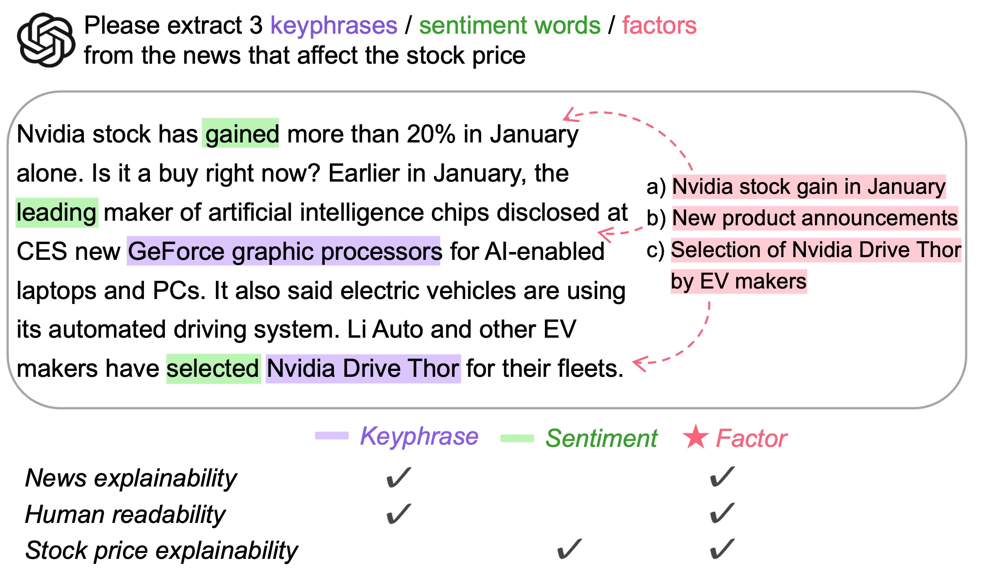
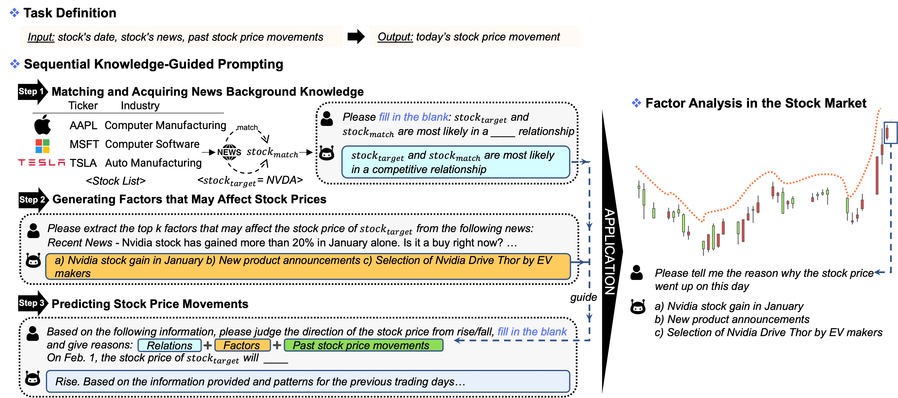
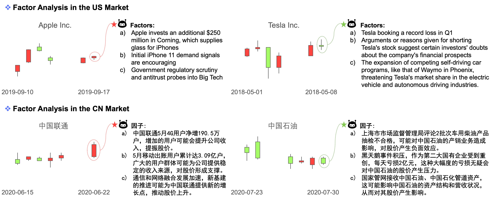

# LLMFactor：利用提示提取盈利因子，以实现对股票价格变动预测的可解释性

发布时间：2024年06月16日

`LLM应用

这篇论文介绍了一种名为LLMFactor的创新框架，该框架利用大型语言模型（LLMs）在金融领域进行时间序列数据的复杂预测任务。它通过序列知识引导提示（SKGP）技术，直接识别影响股市动态的关键因素，并使用这些信息和历史股价数据来预测市场动向。这种方法在美中股市的四个基准数据集上进行了测试，并显示出优于现有技术的性能。因此，这篇论文属于LLM应用类别，因为它展示了LLMs在特定领域（金融预测）的应用。` `股市预测`

> LLMFactor: Extracting Profitable Factors through Prompts for Explainable Stock Movement Prediction

# 摘要

> 近期，大型语言模型（LLMs）因其出色的文本分析能力而备受瞩目。但在金融领域，由于其对时间序列数据的依赖，进行复杂预测任务时面临特殊挑战。本研究推出了一种创新框架——LLMFactor，它通过序列知识引导提示（SKGP）技术，利用LLMs直接识别影响股市动态的关键因素，而非依赖传统的关键词或情感分析。该框架通过填空策略构建背景知识，并从新闻中提取可能影响股价的因素，进而利用这些信息和历史股价数据预测市场动向。在美中股市的四个基准数据集上的测试显示，LLMFactor不仅超越了现有技术，而且在金融时间序列预测方面表现出色。

> Recently, Large Language Models (LLMs) have attracted significant attention for their exceptional performance across a broad range of tasks, particularly in text analysis. However, the finance sector presents a distinct challenge due to its dependence on time-series data for complex forecasting tasks. In this study, we introduce a novel framework called LLMFactor, which employs Sequential Knowledge-Guided Prompting (SKGP) to identify factors that influence stock movements using LLMs. Unlike previous methods that relied on keyphrases or sentiment analysis, this approach focuses on extracting factors more directly related to stock market dynamics, providing clear explanations for complex temporal changes. Our framework directs the LLMs to create background knowledge through a fill-in-the-blank strategy and then discerns potential factors affecting stock prices from related news. Guided by background knowledge and identified factors, we leverage historical stock prices in textual format to predict stock movement. An extensive evaluation of the LLMFactor framework across four benchmark datasets from both the U.S. and Chinese stock markets demonstrates its superiority over existing state-of-the-art methods and its effectiveness in financial time-series forecasting.

[Arxiv](https://arxiv.org/abs/2406.10811)