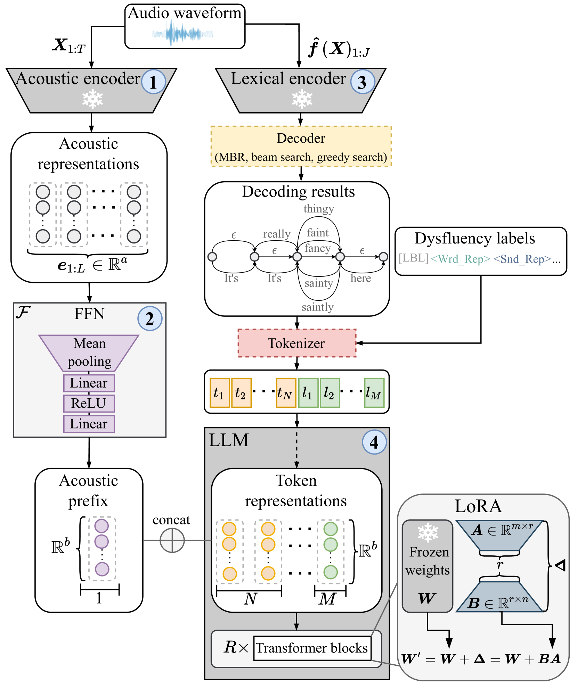

# 大型语言模型助力口吃言语中的不流畅性检测

发布时间：2024年06月16日

`LLM应用

这篇论文摘要描述了如何利用大型语言模型（LLMs）来处理非词汇输入，如音频和视频，并将其应用于多标签不流畅性检测，这是一个语言建模问题。通过输入自动语音识别系统生成的候选假设及音频编码器模型提取的声学特征，并进行微调，该系统在口吃检测任务上取得了优异成绩。这表明了LLM在实际应用中的效能，特别是在语音和语言处理技术中的应用，因此将其归类为LLM应用。` `语音识别` `语言处理`

> Large Language Models for Dysfluency Detection in Stuttered Speech

# 摘要

> 准确识别口语中的不流畅性，有助于提升自动语音与语言处理技术的性能，并推动更包容的语音与语言技术的发展。借鉴大型语言模型（LLMs）处理非词汇输入（如音频和视频）的趋势，我们将多标签不流畅性检测视为语言建模问题。我们向LLM输入自动语音识别系统生成的候选假设及音频编码器模型提取的声学特征，通过微调，使其在包含英语和德语口吃样本的三个数据集上预测不流畅性标签。实验证明，我们的系统巧妙融合声学与词汇信息，在口吃检测任务上取得了优异成绩。

> Accurately detecting dysfluencies in spoken language can help to improve the performance of automatic speech and language processing components and support the development of more inclusive speech and language technologies. Inspired by the recent trend towards the deployment of large language models (LLMs) as universal learners and processors of non-lexical inputs, such as audio and video, we approach the task of multi-label dysfluency detection as a language modeling problem. We present hypotheses candidates generated with an automatic speech recognition system and acoustic representations extracted from an audio encoder model to an LLM, and finetune the system to predict dysfluency labels on three datasets containing English and German stuttered speech. The experimental results show that our system effectively combines acoustic and lexical information and achieves competitive results on the multi-label stuttering detection task.

[Arxiv](https://arxiv.org/abs/2406.11025)