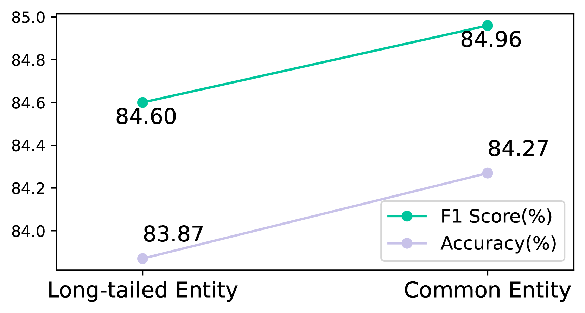

# 照亮暗角：借助概念引导的视觉-语言模型，提升长尾实体的精准定位能力

发布时间：2024年06月16日

`RAG

理由：这篇论文主要讨论了多模态知识图谱（MMKGs）的扩展问题，并提出了一种新的框架（COG）来解决图像与实体匹配的问题，特别是在长尾实体的情况下。这个框架涉及视觉-语言模型的增强，通过概念引导来识别和验证图像-文本对。这与RAG（Retrieval-Augmented Generation）的概念相符，因为它涉及通过检索增强来改进模型的性能，特别是在处理多模态数据和知识图谱时。因此，这篇论文更适合归类为RAG。` `知识图谱` `人工智能`

> Light Up the Shadows: Enhance Long-Tailed Entity Grounding with Concept-Guided Vision-Language Models

# 摘要

> 多模态知识图谱（MMKGs）在多个应用场景中展现出其价值，但扩展这些图谱面临挑战，主要是因为在构建大规模MMKGs时，常常会引入不匹配的图像（即噪声）。知识图谱中的大多数实体属于长尾分布，这意味着在线可用的相关图像寥寥无几。这种稀缺性使得判断图像与实体是否匹配变得困难。为此，我们借鉴参照三角理论，提出通过概念引导来增强视觉-语言模型。我们开发的COG框架分为两个阶段：首先是概念整合模块，它能有效识别长尾实体的图像-文本对；其次是证据融合模块，它不仅提供了解释性，还允许人类进行验证。为了验证COG的效果，我们构建了一个包含2.5万长尾实体图像-文本对的数据集。实验结果显示，COG不仅在识别长尾图像-文本对的准确性上超越了基线方法，还提供了灵活性和解释性。

> Multi-Modal Knowledge Graphs (MMKGs) have proven valuable for various downstream tasks. However, scaling them up is challenging because building large-scale MMKGs often introduces mismatched images (i.e., noise). Most entities in KGs belong to the long tail, meaning there are few images of them available online. This scarcity makes it difficult to determine whether a found image matches the entity. To address this, we draw on the Triangle of Reference Theory and suggest enhancing vision-language models with concept guidance. Specifically, we introduce COG, a two-stage framework with COncept-Guided vision-language models. The framework comprises a Concept Integration module, which effectively identifies image-text pairs of long-tailed entities, and an Evidence Fusion module, which offers explainability and enables human verification. To demonstrate the effectiveness of COG, we create a dataset of 25k image-text pairs of long-tailed entities. Our comprehensive experiments show that COG not only improves the accuracy of recognizing long-tailed image-text pairs compared to baselines but also offers flexibility and explainability.

[Arxiv](https://arxiv.org/abs/2406.10902)