# MICL：借助演示中的多标签词，提升情境学习效果

发布时间：2024年06月16日

`LLM应用

这篇论文主要关注于大型语言模型（LLM）在样本-标签学习（ICL）中的应用，特别是在标签词选择对性能影响的研究。论文提出了一种新的方法，即使用多个标签词来优化样本-标签对，以提高ICL的性能。这种方法涉及精心挑选和排序标签词，以优化演示效果。论文通过在七个分类数据集上的测试，验证了这种方法的有效性。因此，这篇论文更偏向于LLM在特定任务（即样本-标签学习）中的应用，而不是理论研究或Agent、RAG相关的研究。` `机器学习`

> MICL: Improving In-Context Learning through Multiple-Label Words in Demonstration

# 摘要

> ICL 让 LLMs 通过样本-标签对的演示来掌握新任务，但演示的差异会导致性能大相径庭。现有研究多聚焦于样本选择，默认类别名作为标签词。然而，标签词的选择对 ICL 至关重要。我们发现，单一类别名可能并非最佳选择。因此，本文提出在样本-标签对中使用多个标签词以提升 ICL 性能，并根据 LLM 输出分布精心挑选和排序这些对，以期从样本和标签两方面优化演示。对七个分类数据集的测试表明，通过巧妙组织标签词的选择、顺序和数量，利用多样化的标签信息，ICL 性能得以显著提升。

> In-context learning (ICL) enables large language models (LLMs) to perform new tasks by using sample-label pairs as demonstrations. However, variations in demonstrations can lead to significantly different performances. Current research mainly focuses on selecting demonstration samples, preassuming the class name to be the label word when creating sample-label pairs. However, the choice of label words is crucial for ICL performance. In addition, we observe that using a single class name in demonstration may not yield optimal results. In this paper, we propose to use multiple label words in one sample-label pair to enhance ICL performance. Further, we select and order sample-label pairs based on LLM's output distribution, aiming to optimize the demonstration examples from both the samples' and labels' perspectives. Evaluation results on seven classification datasets show that the use of multiple label words, strategically organized by their selection, order and quantity, improves ICL performance through diverse label information.

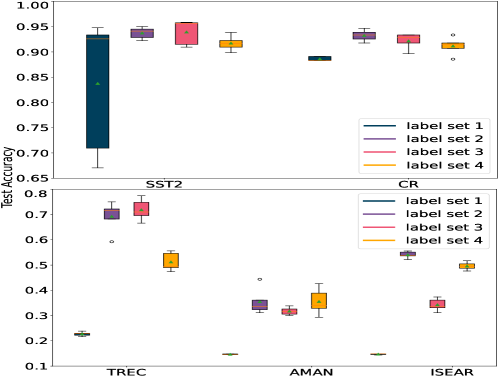

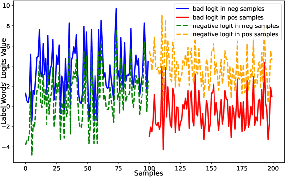

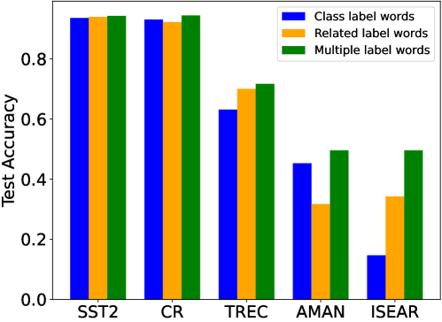

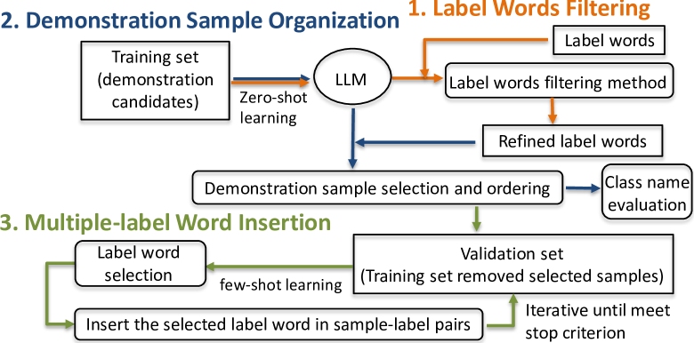

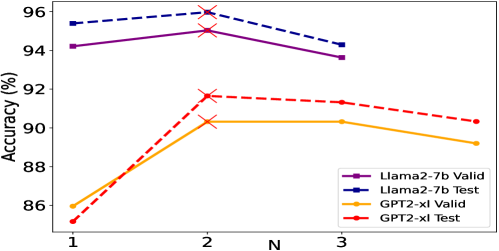

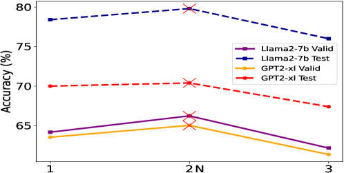

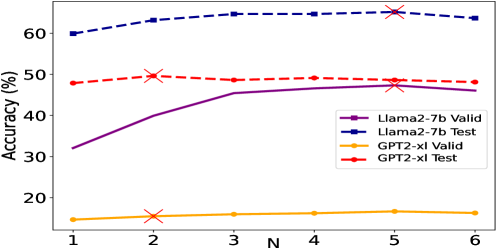

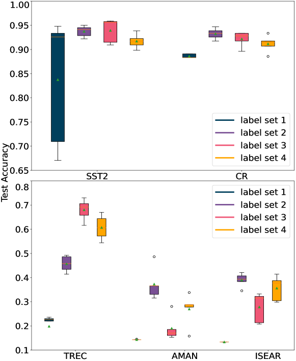

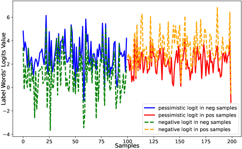

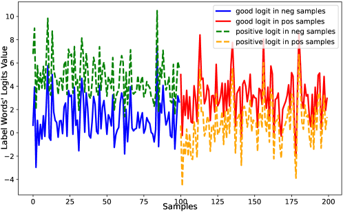

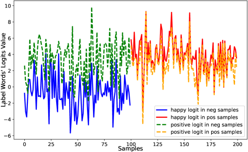

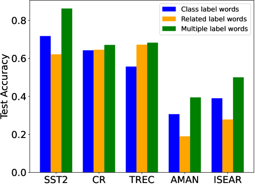

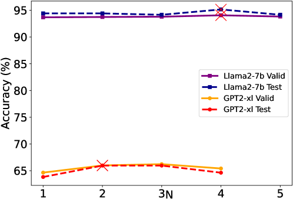

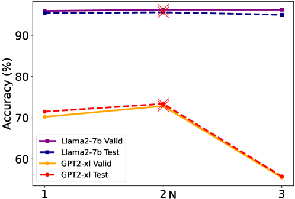

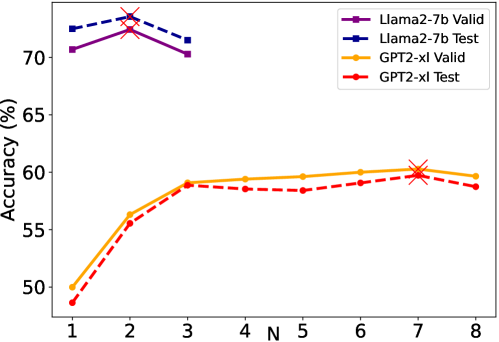

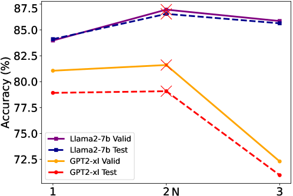

[Arxiv](https://arxiv.org/abs/2406.10908)