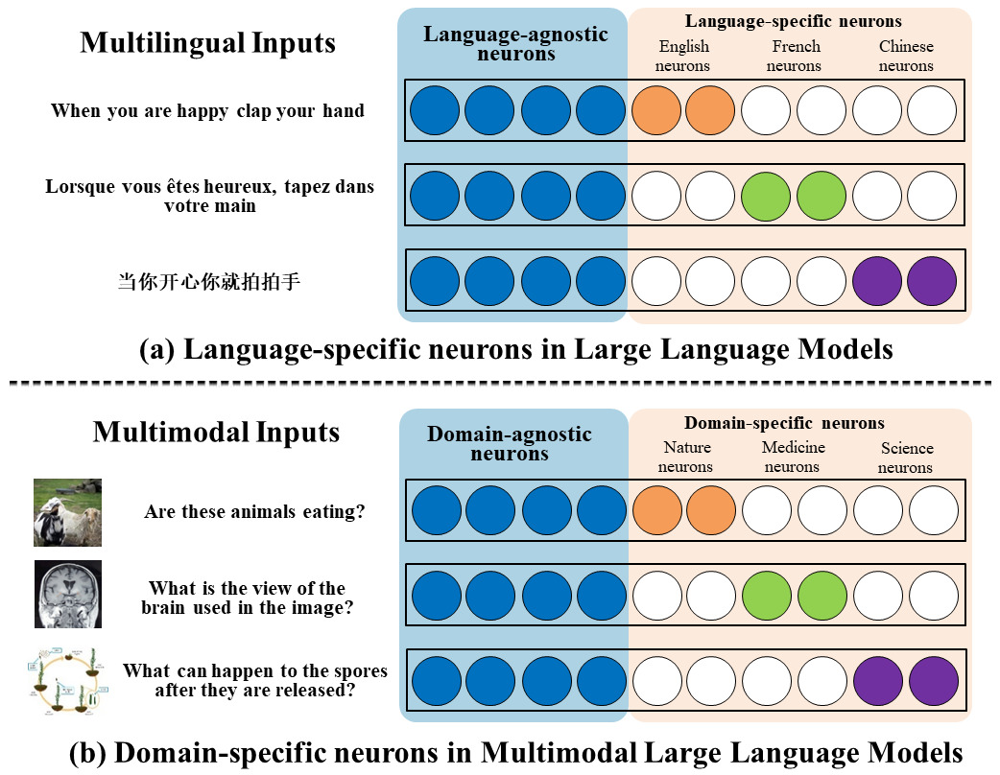

# MMNeuron：揭示多模态大型语言模型中神经元级别的领域特异性解读

发布时间：2024年06月16日

`LLM理论

这篇论文探讨了多模态大型语言模型（MLLMs）中视觉特征与词嵌入空间的融合机制，特别是关注了领域特化神经元的分布和作用。论文提出了一个三阶段框架来指导MLLMs处理图像特征，并通过实验验证了这一理论的有效性。这些研究内容属于对LLM内部工作机制的理论探讨，因此归类为LLM理论。` `多模态学习` `视觉问答`

> MMNeuron: Discovering Neuron-Level Domain-Specific Interpretation in Multimodal Large Language Model

# 摘要

> 将视觉特征融入词嵌入空间是多模态大型语言模型（MLLMs）的关键策略，但其内在运作机制仍是个谜。借鉴多语言研究，我们发现了MLLMs中的领域特化神经元，并探究了它们的分布及MLLMs处理多领域特征的方式。我们进一步提出了一个三阶段框架，指导MLLMs在处理映射图像特征时的语言模型模块，并通过logit透镜验证了这一理论。实验显示，尽管MLLMs在视觉问答（VQA）上表现出色，但对领域特化信息的利用尚不充分。合理调整这些神经元，最多可提升10%的准确率，预示着未来跨领域、全能型MLLMs的发展方向。我们的代码将在论文发布后公开。

> Projecting visual features into word embedding space has become a significant fusion strategy adopted by Multimodal Large Language Models (MLLMs). However, its internal mechanisms have yet to be explored. Inspired by multilingual research, we identify domain-specific neurons in multimodal large language models. Specifically, we investigate the distribution of domain-specific neurons and the mechanism of how MLLMs process features from diverse domains. Furthermore, we propose a three-stage framework for language model modules in MLLMs when handling projected image features, and verify this hypothesis using logit lens. Extensive experiments indicate that while current MLLMs exhibit Visual Question Answering (VQA) capability, they may not fully utilize domain-specific information. Manipulating domain-specific neurons properly will result in a 10\% change of accuracy at most, shedding light on the development of cross-domain, all-encompassing MLLMs in the future. Our code will be released upon paper notification.

[Arxiv](https://arxiv.org/abs/2406.11193)