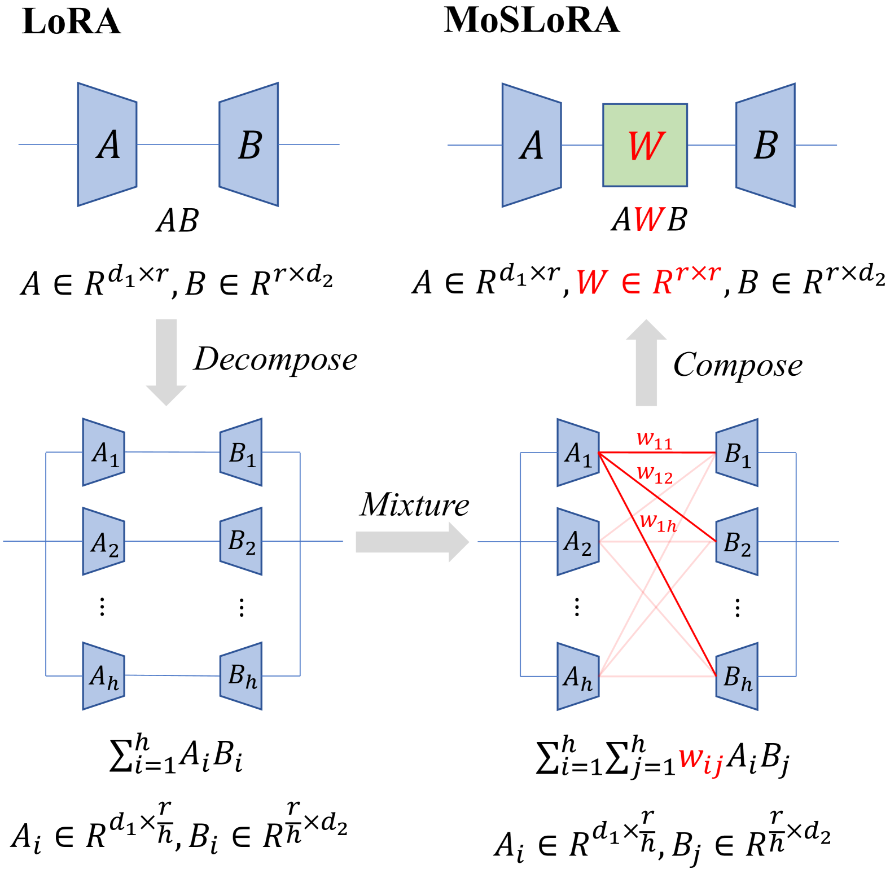
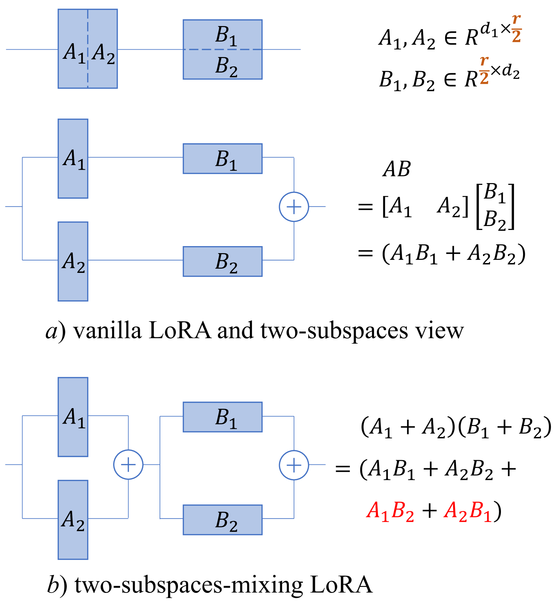
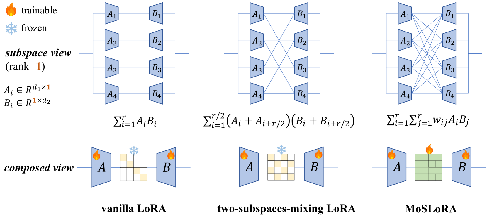
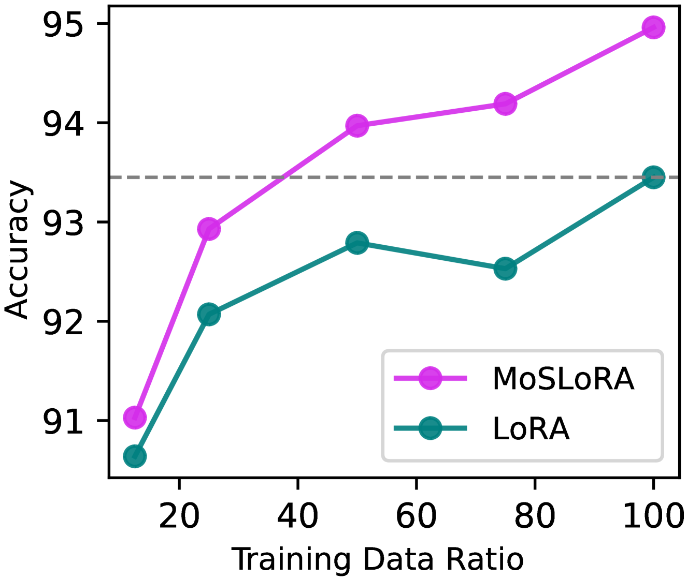
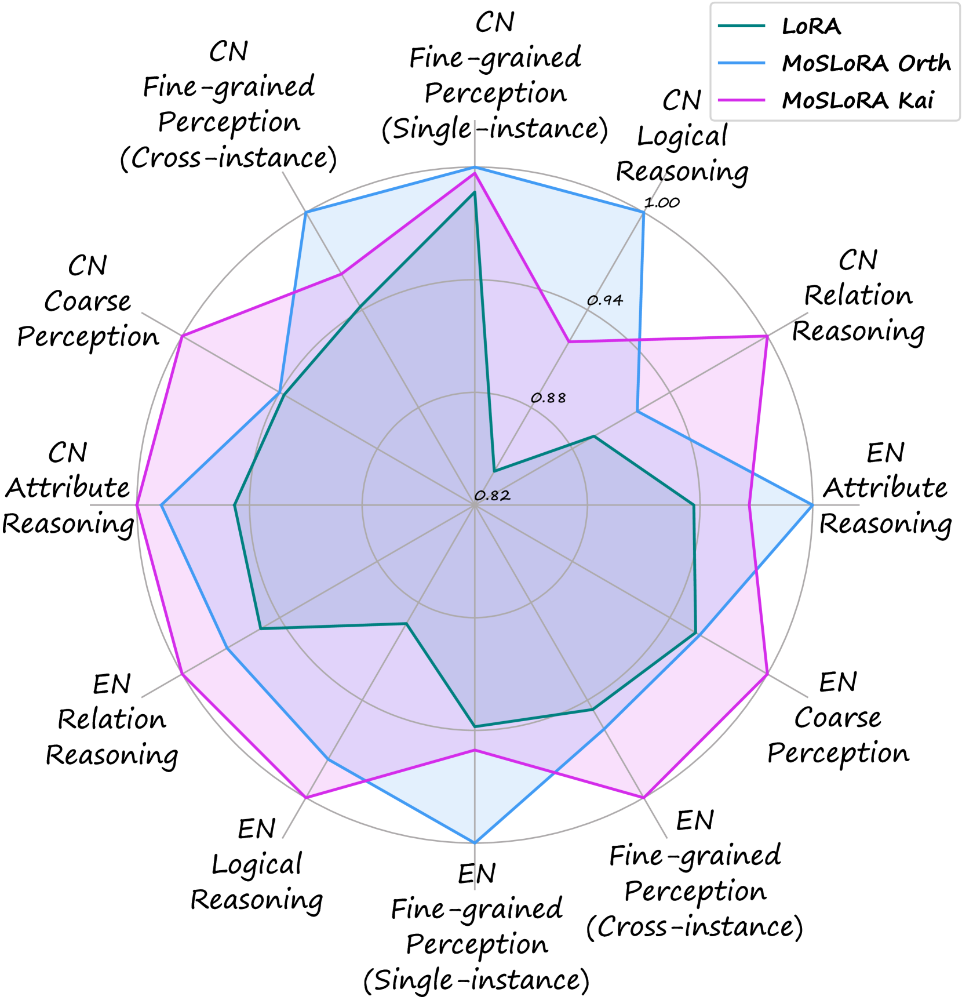
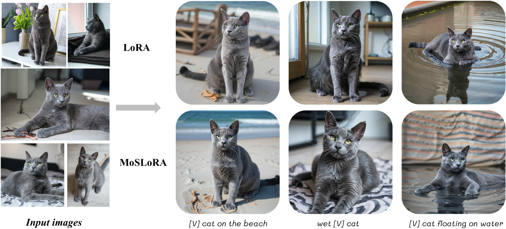

# 低秩适应中的子空间混合策略

发布时间：2024年06月16日

`LLM理论

这篇论文主要探讨了大型语言模型（LLM）的一种改进方法——低秩适应（LoRA），并通过子空间理论对其进行了深入分析和优化。论文中提出的子空间混合LoRA（MoSLoRA）方法，通过联合优化混合器与原始LoRA权重，提高了模型在多种任务上的性能。这一研究更多地关注于LLM的理论改进和性能提升，因此应归类于LLM理论。` `人工智能` `多模态学习`

> Mixture-of-Subspaces in Low-Rank Adaptation

# 摘要

> 本文提出了一种高效的低秩适应（LoRA）方法，灵感源自子空间理论，适用于大型语言、多模态及扩散模型。我们首先将LoRA权重分解为两个子空间，并发现通过简单混合即可提升性能。通过细致的子空间分析，我们揭示了这种混合实质上等同于使用固定混合器融合子空间。为了增强灵活性，我们联合优化了混合器与原始LoRA权重，命名为子空间混合LoRA（MoSLoRA）。MoSLoRA在多种任务中，如常识推理、视觉指令调优和主题驱动的文本到图像生成，均超越了LoRA，证明了其有效性与鲁棒性。相关代码已公开于 \href{https://github.com/wutaiqiang/MoSLoRA}{github}。

> In this paper, we introduce a subspace-inspired Low-Rank Adaptation (LoRA) method, which is computationally efficient, easy to implement, and readily applicable to large language, multimodal, and diffusion models. Initially, we equivalently decompose the weights of LoRA into two subspaces, and find that simply mixing them can enhance performance. To study such a phenomenon, we revisit it through a fine-grained subspace lens, showing that such modification is equivalent to employing a fixed mixer to fuse the subspaces. To be more flexible, we jointly learn the mixer with the original LoRA weights, and term the method Mixture-of-Subspaces LoRA (MoSLoRA). MoSLoRA consistently outperforms LoRA on tasks in different modalities, including commonsense reasoning, visual instruction tuning, and subject-driven text-to-image generation, demonstrating its effectiveness and robustness. Codes are available at \href{https://github.com/wutaiqiang/MoSLoRA}{github}.

[Arxiv](https://arxiv.org/abs/2406.11909)