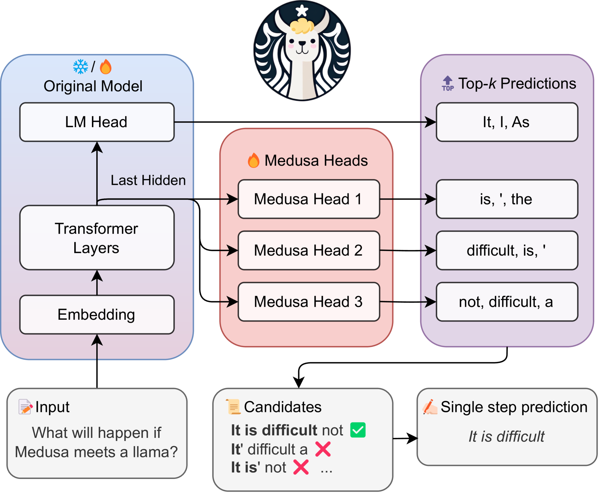
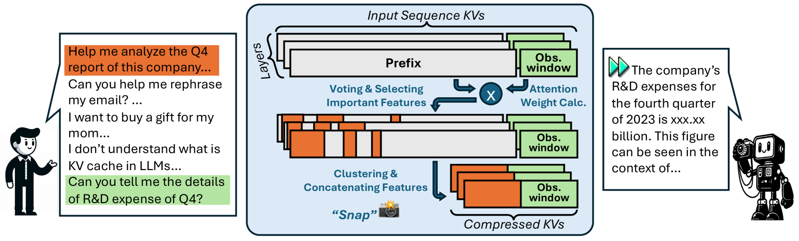
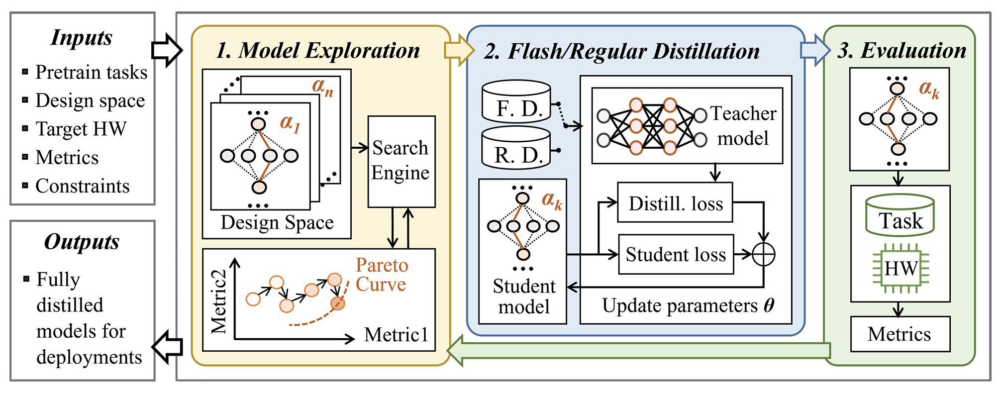
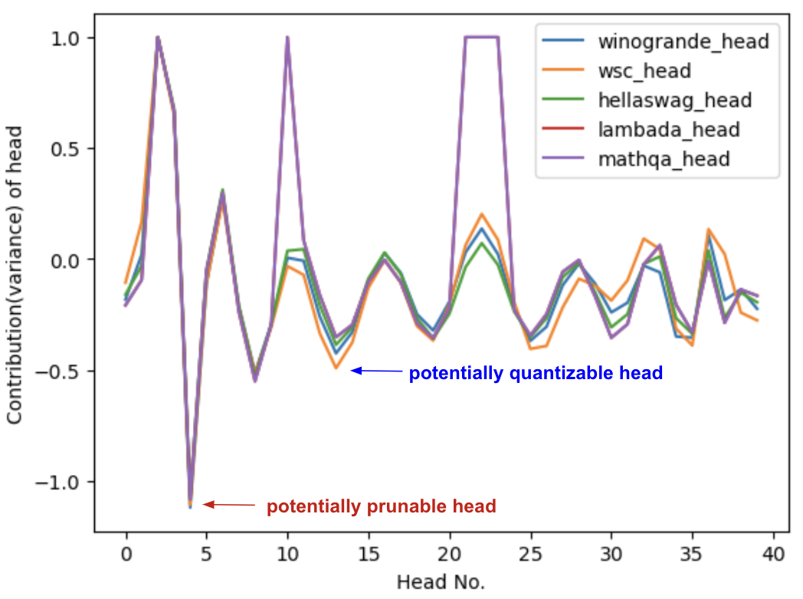
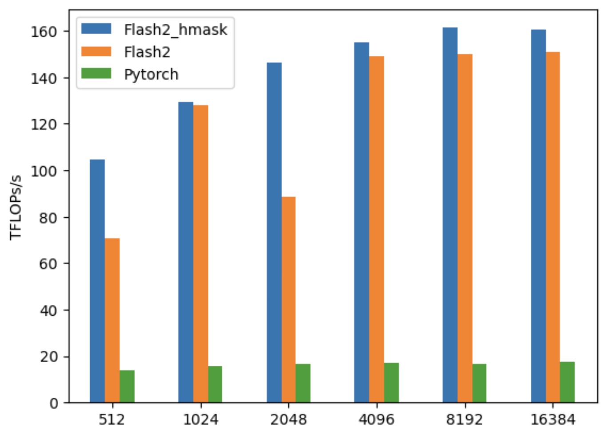
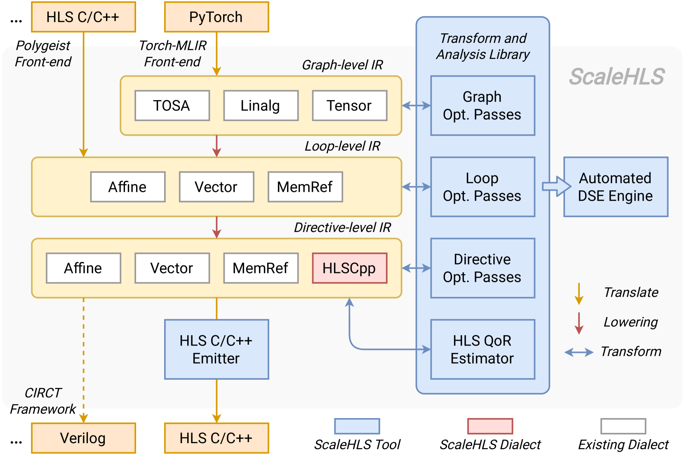
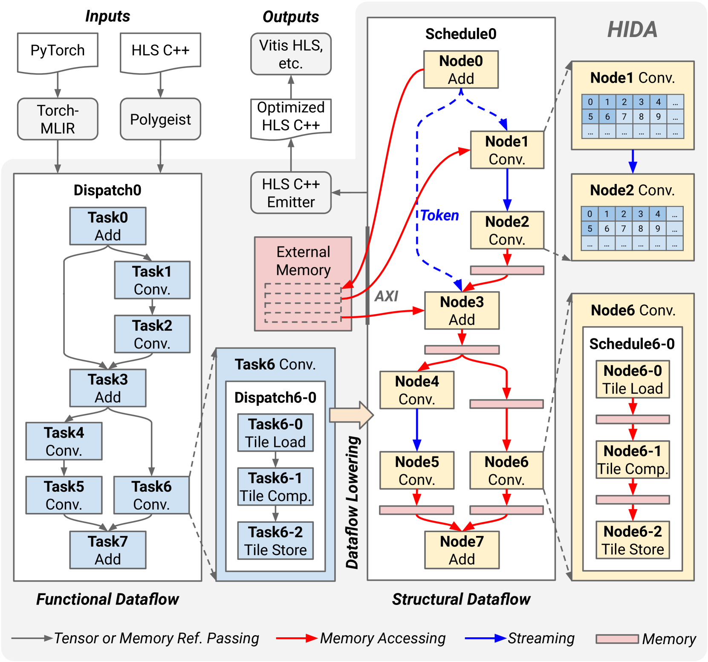
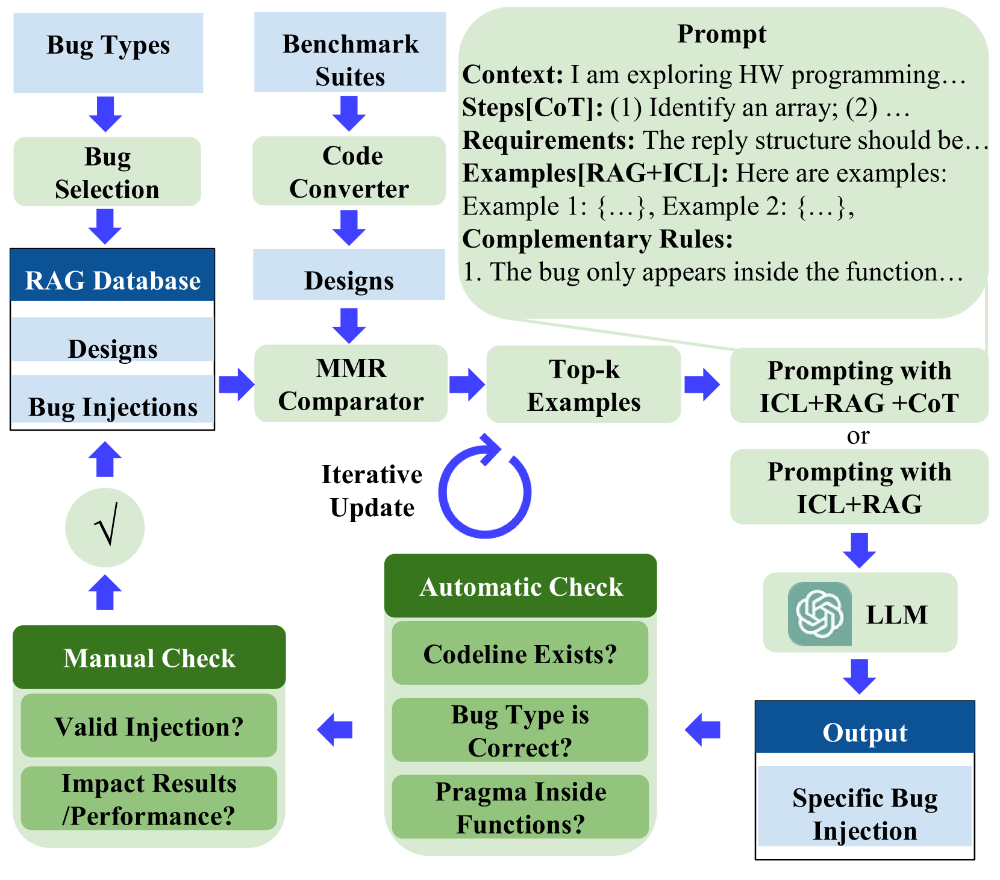
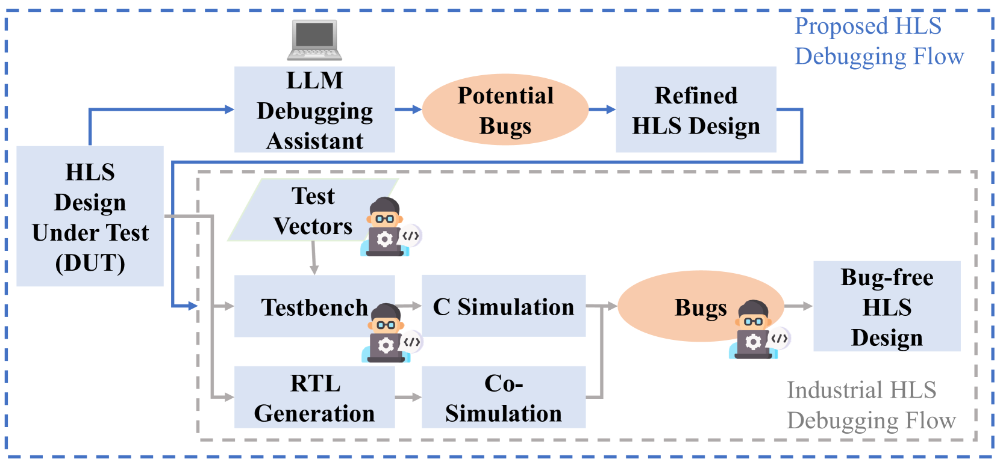

# 大型语言模型加速优化与应用的新策略

发布时间：2024年06月16日

`LLM应用

这篇论文主要关注大型语言模型（LLMs）的效率问题，包括训练和部署过程中的成本和能源消耗。论文综述了提升LLM系统效率的最新技术和研究方向，涉及算法级加速技术、LLM与硬件的协同设计以及LLM到加速器的编译方法。此外，论文还通过一个案例研究探讨了LLMs在电路设计中的应用，特别是在高级综合（HLS）功能验证方面。这些内容主要集中在LLM的实际应用和优化上，因此归类为LLM应用。` `电路设计` `高级综合`

> New Solutions on LLM Acceleration, Optimization, and Application

# 摘要

> 大型语言模型（LLMs）已成为理解和生成类人文本的强大工具，广泛应用于多个领域。然而，随着模型规模和复杂性的增长，训练和部署LLMs面临重大挑战，导致成本和能源消耗增加。本文综述了针对这些问题的最新技术和研究方向，旨在提升LLM系统的效率。我们首先探讨了算法级加速技术，专注于提高LLM的推理速度和资源利用率。接着，我们讨论了LLM与硬件的协同设计，通过定制硬件架构以优化系统性能。此外，我们还研究了LLM到加速器的编译方法，确保LLM的高效部署。作为案例研究，我们探讨了LLMs在电路设计中的应用，特别是在高级综合（HLS）功能验证方面，通过构建一个包含大量代码的数据集，训练LLMs进行精确的验证和调试。对于每一项技术，我们首先进行深入的背景分析，然后介绍针对具体挑战的创新解决方案，并展望未来的研究方向。我们的目标是推动LLMs在多领域应用中的高效和可扩展部署。

> Large Language Models (LLMs) have become extremely potent instruments with exceptional capacities for comprehending and producing human-like text in a wide range of applications. However, the increasing size and complexity of LLMs present significant challenges in both training and deployment, leading to substantial computational and storage costs as well as heightened energy consumption. In this paper, we provide a review of recent advancements and research directions aimed at addressing these challenges and enhancing the efficiency of LLM-based systems. We begin by discussing algorithm-level acceleration techniques focused on optimizing LLM inference speed and resource utilization. We also explore LLM-hardware co-design strategies with a vision to improve system efficiency by tailoring hardware architectures to LLM requirements. Further, we delve into LLM-to-accelerator compilation approaches, which involve customizing hardware accelerators for efficient LLM deployment. Finally, as a case study to leverage LLMs for assisting circuit design, we examine LLM-aided design methodologies for an important task: High-Level Synthesis (HLS) functional verification, by creating a new dataset that contains a large number of buggy and bug-free codes, which can be essential for training LLMs to specialize on HLS verification and debugging. For each aspect mentioned above, we begin with a detailed background study, followed by the presentation of several novel solutions proposed to overcome specific challenges. We then outline future research directions to drive further advancements. Through these efforts, we aim to pave the way for more efficient and scalable deployment of LLMs across a diverse range of applications.

[Arxiv](https://arxiv.org/abs/2406.10903)