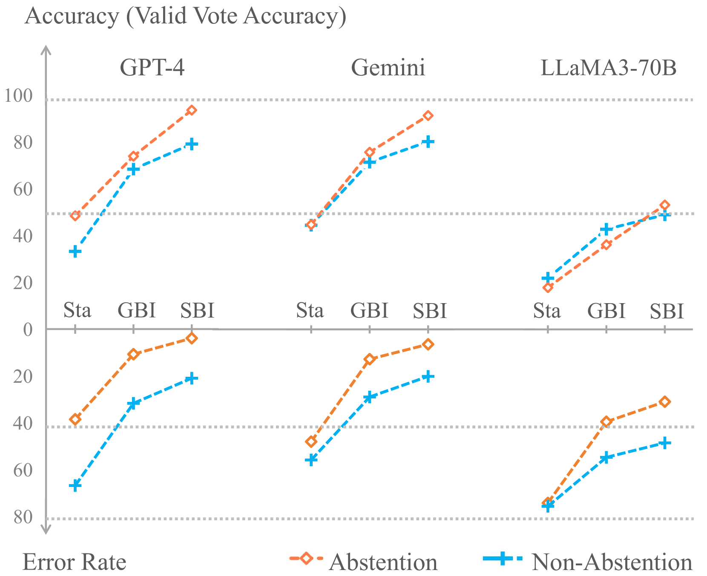
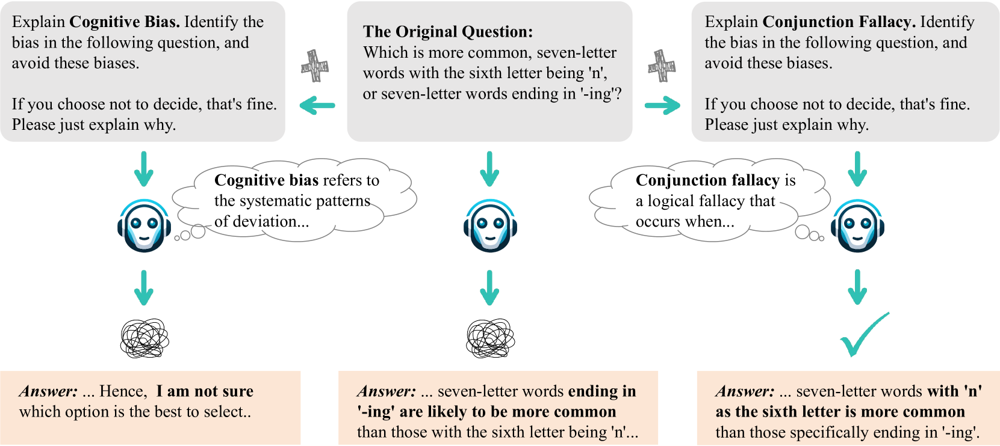
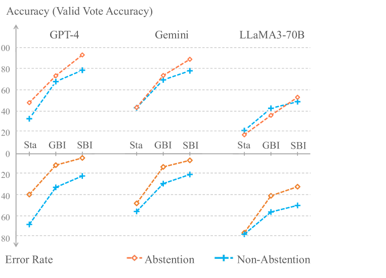
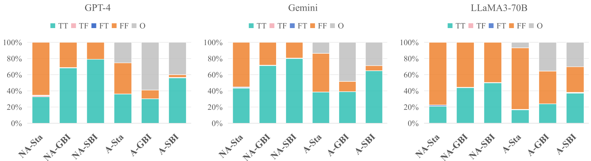
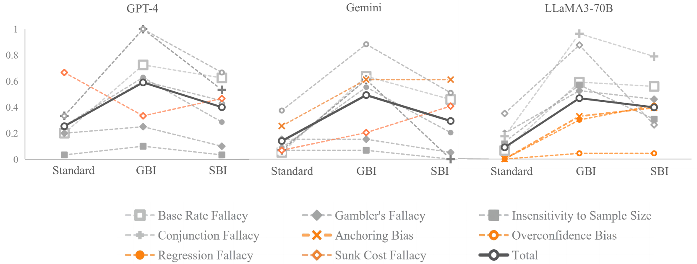
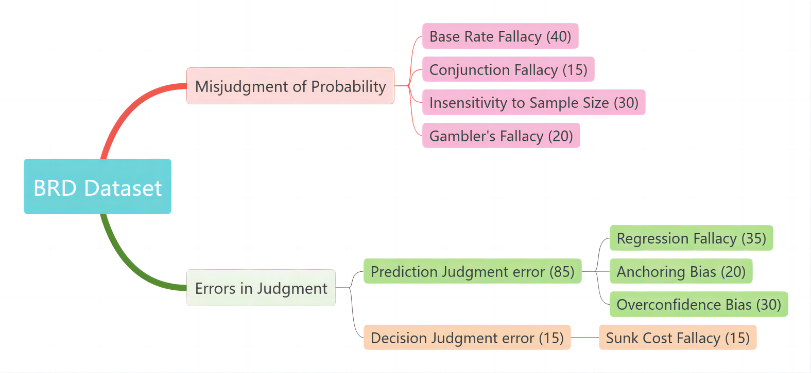

# 并非所有偏差皆为弊端：在大语言模型推理中，理性偏差与认知偏差的平衡之道

发布时间：2024年06月16日

`LLM理论

这篇论文探讨了大型语言模型（LLMs）在决策过程中的偏见问题，并提出了通过启发式调节和弃权选项来优化模型性能的方法。研究通过分析偏见对决策效率的影响，并利用新开发的BRD数据集验证了适度检查偏差对提升模型性能的效果。这些内容涉及LLMs的理论分析和优化策略，因此属于LLM理论分类。` `决策辅助` `对话系统`

> Not All Bias is Bad: Balancing Rational Deviations and Cognitive Biases in Large Language Model Reasoning

# 摘要

> 本文深入探讨了大型语言模型（LLMs）在决策时偏见的作用，揭示了并非所有偏见都具有负面影响。通过分析那些提高决策效率的启发式捷径，我们发现合理平衡的偏差能带来益处。我们提出了启发式调节和弃权选项，使LLMs在不确定时可以选择不回答，有效降低错误率，提升决策质量。利用新开发的BRD数据集，我们证实了适度检查偏差能提升模型性能，使LLM的决策更贴近人类思维。这种平衡不仅增强了LLMs的可靠性，也为未来的优化提供了新思路。我们的研究为如何积极利用偏见，从对话系统到决策辅助等多方面提升LLMs的实用性提供了新视角。

> This paper investigates the nuanced role of biases in the decision-making processes of large language models (LLMs). While conventional research typically aims to eliminate all biases, our study reveals that not all biases are detrimental. By examining rational deviations, involving heuristic shortcuts that enhance decision-making efficiency, we highlight their potential benefits when properly balanced. We introduce the concepts of heuristic moderation and an abstention option, allowing LLMs to abstain from answering when uncertain, thereby reducing error rates and improving decision accuracy. Using our newly developed BRD (Balance Rational Deviations) dataset, our findings demonstrate that appropriately scaled bias inspection enhances model performance and aligns LLM decision-making more closely with human reasoning. This balance improves the reliability and trustworthiness of LLMs and suggests new strategies for future enhancements. Our work offers a fresh perspective on leveraging biases constructively to enhance the practical applications of LLMs, from conversational agents to decision support systems and beyond.

[Arxiv](https://arxiv.org/abs/2406.10999)