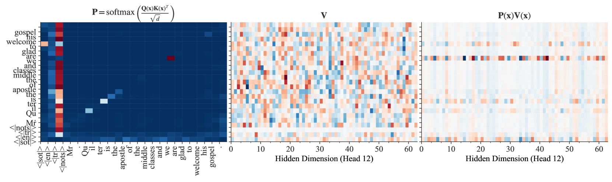
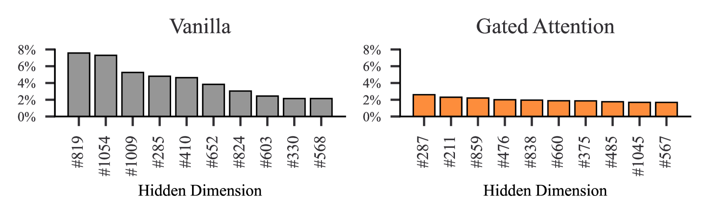

# 利用门控注意力机制减少异常值，优化大规模序列到序列语音模型的后训练量化过程。

发布时间：2024年06月16日

`LLM应用

理由：这篇论文关注的是Whisper语音基础模型在知识蒸馏后的性能提升，特别是在后训练量化（PTQ）过程中的优化。这涉及到具体的模型应用和优化技术，而不是理论研究或Agent的设计与行为，也不是RAG（Retrieval-Augmented Generation）框架的研究。因此，它更符合LLM应用这一分类。` `语音识别` `模型优化`

> Outlier Reduction with Gated Attention for Improved Post-training Quantization in Large Sequence-to-sequence Speech Foundation Models

# 摘要

> 本文深入研究了Whisper语音基础模型在知识蒸馏后如何通过后训练量化（PTQ）实现性能提升。我们针对权重和激活张量中的异常值问题提出了解决方案，这些问题在基于transformer的语言和视觉模型中常影响量化质量。在Whisper模型中，我们发现这些异常值同样存在于训练用于自动语音识别的transformer模型中，因此必须采取措施以优化PTQ效果。通过引入学生模型注意力块中的新型门控机制，我们成功减少了异常值，实现了高效的8位量化，并显著降低了单词错误率，相较于未采用门控机制的模型。

> This paper explores the improvement of post-training quantization (PTQ) after knowledge distillation in the Whisper speech foundation model family. We address the challenge of outliers in weights and activation tensors, known to impede quantization quality in transformer-based language and vision models. Extending this observation to Whisper, we demonstrate that these outliers are also present when transformer-based models are trained to perform automatic speech recognition, necessitating mitigation strategies for PTQ. We show that outliers can be reduced by a recently proposed gating mechanism in the attention blocks of the student model, enabling effective 8-bit quantization, and lower word error rates compared to student models without the gating mechanism in place.

[Arxiv](https://arxiv.org/abs/2406.11022)