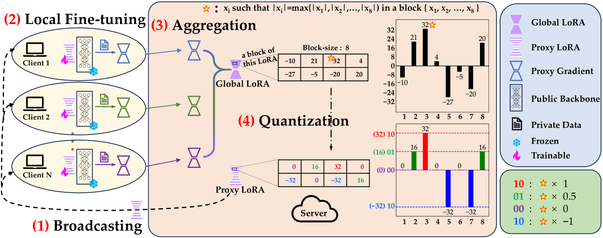
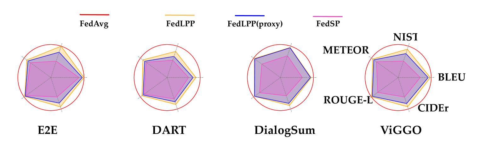

# 量化LoRA：提升联邦学习中数据与模型隐私的新途径

发布时间：2024年06月16日

`Agent

理由：这篇论文主要关注的是在联邦学习中保护大型语言模型（LLMs）的隐私和安全，通过提出一种新方法来分发模型参数的量化版，并结合LoRA技术减少通信开销。这种方法涉及到模型的分发和更新策略，更偏向于Agent的自主行为和决策，而不是直接应用于LLM的理论研究或应用开发。因此，将其归类为Agent更为合适。` `联邦学习` `隐私保护`

> Promoting Data and Model Privacy in Federated Learning through Quantized LoRA

# 摘要

> 传统联邦学习侧重于保护分布式边缘设备上的数据隐私，通过将全局模型分发至各设备进行参数更新。然而，大型语言模型（LLMs）因其所需的海量数据和计算资源，成为开发者与所有者的宝贵资产。为此，我们提出了一种新方法，在联邦学习中仅分发模型参数的量化版，既保障了梯度更新的准确性，又防止了客户端接触到与中心模型性能相当的模型。结合LoRA这一高效微调技术，我们的方法大幅削减了通信开销。这一名为\textsc{FedLPP}的框架，不仅在联邦学习中守护了数据与模型的隐私，还培育出了泛化能力强、资源利用高效的中心模型。

> Conventional federated learning primarily aims to secure the privacy of data distributed across multiple edge devices, with the global model dispatched to edge devices for parameter updates during the learning process. However, the development of large language models (LLMs) requires substantial data and computational resources, rendering them valuable intellectual properties for their developers and owners. To establish a mechanism that protects both data and model privacy in a federated learning context, we introduce a method that just needs to distribute a quantized version of the model's parameters during training. This method enables accurate gradient estimations for parameter updates while preventing clients from accessing a model whose performance is comparable to the centrally hosted one. Moreover, we combine this quantization strategy with LoRA, a popular and parameter-efficient fine-tuning method, to significantly reduce communication costs in federated learning. The proposed framework, named \textsc{FedLPP}, successfully ensures both data and model privacy in the federated learning context. Additionally, the learned central model exhibits good generalization and can be trained in a resource-efficient manner.

[Arxiv](https://arxiv.org/abs/2406.10976)