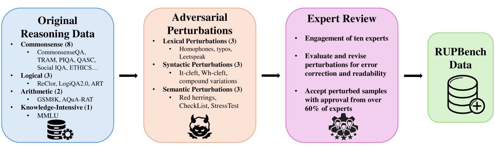
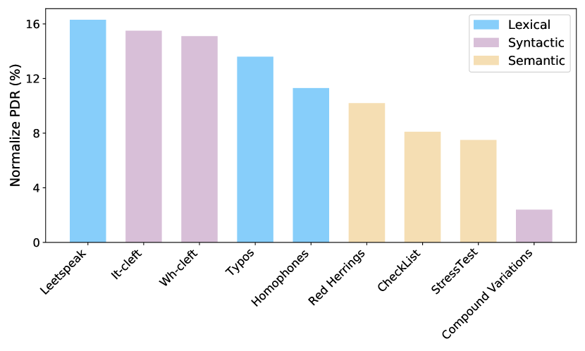
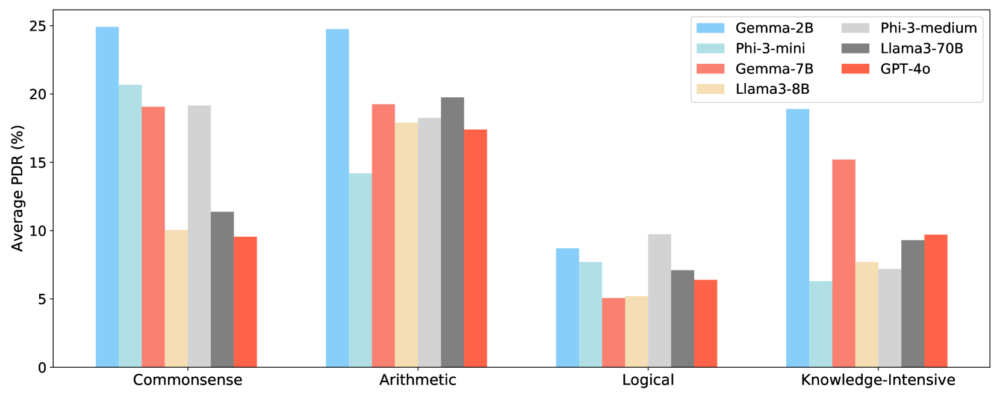

# RUPBench：大型语言模型鲁棒性评估中的扰动推理基准

发布时间：2024年06月16日

`LLM应用

这篇论文主要关注大型语言模型（LLMs）在面对复杂多变的现实环境中的鲁棒性问题，特别是对抗性输入的影响。通过引入RUPBench基准，该研究评估了多个顶尖LLMs在不同推理任务中的表现，并分析了它们的鲁棒性和错误模式。这种研究直接关联到LLMs的实际应用场景，因此属于LLM应用分类。` `人工智能` `推理任务`

> RUPBench: Benchmarking Reasoning Under Perturbations for Robustness Evaluation in Large Language Models

# 摘要

> 随着大型语言模型（LLMs）的广泛应用，确保其在复杂多变的现实环境中稳定运行变得至关重要。尽管LLMs成就斐然，但对抗性输入仍常使其陷入困境，严重削弱了其实际应用的效能。为此，我们推出了RUPBench，一个全面评估LLMs在各类推理任务中鲁棒性的基准。RUPBench涵盖15个推理数据集，并创新性地引入了九种文本扰动，从词汇、句法到语义层面全面考察。通过对比GPT-4o、Llama3、Phi-3和Gemma等顶尖LLMs在原始与扰动数据集上的表现，我们深入分析了它们的鲁棒性和错误模式。研究发现，模型越大，对扰动的抵抗力越强。通过细致的手动检查，我们还揭示了LLMs在不同推理场景下面临的特定难题。本研究为LLMs在应对复杂多变输入方面的改进方向提供了重要线索。

> With the increasing use of large language models (LLMs), ensuring reliable performance in diverse, real-world environments is essential. Despite their remarkable achievements, LLMs often struggle with adversarial inputs, significantly impacting their effectiveness in practical applications. To systematically understand the robustness of LLMs, we present RUPBench, a comprehensive benchmark designed to evaluate LLM robustness across diverse reasoning tasks. Our benchmark incorporates 15 reasoning datasets, categorized into commonsense, arithmetic, logical, and knowledge-intensive reasoning, and introduces nine types of textual perturbations at lexical, syntactic, and semantic levels. By examining the performance of state-of-the-art LLMs such as GPT-4o, Llama3, Phi-3, and Gemma on both original and perturbed datasets, we provide a detailed analysis of their robustness and error patterns. Our findings highlight that larger models tend to exhibit greater robustness to perturbations. Additionally, common error types are identified through manual inspection, revealing specific challenges faced by LLMs in different reasoning contexts. This work provides insights into areas where LLMs need further improvement to handle diverse and noisy inputs effectively.

[Arxiv](https://arxiv.org/abs/2406.11020)