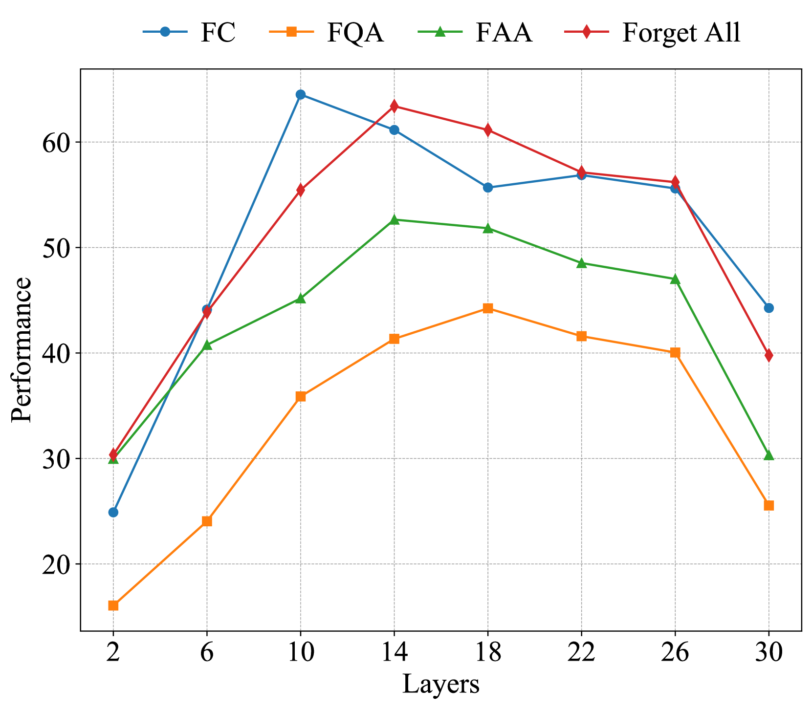

# RWKU：大型语言模型现实世界知识遗忘的基准评估

发布时间：2024年06月16日

`LLM应用

这篇论文主要讨论了大型语言模型（LLMs）中的知识遗忘问题，并提出了一种实际的知识遗忘基准（RWKU）。该研究关注的是如何从LLMs中移除敏感、版权保护和有害信息，这是通过机器遗忘技术实现的。论文中提出的基准包括了实际的遗忘场景、知识来源的选择以及评估框架的设计，这些都是针对LLMs的具体应用问题。因此，这篇论文属于LLM应用分类。` `隐私保护` `人工智能安全`

> RWKU: Benchmarking Real-World Knowledge Unlearning for Large Language Models

# 摘要

> 大型语言模型（LLMs）会不可避免地记忆训练数据中的敏感、版权保护和有害信息，因此，从模型中清除这些知识显得尤为重要。机器遗忘技术提供了一种有效途径，通过后续模型调整来移除特定信息。本文提出了一种针对LLMs的实际知识遗忘基准（RWKU），该基准基于三大核心要素设计：（1）任务设置上，我们采用了一种更为实际且挑战性强的遗忘场景，即无法获取遗忘或保留的语料库。（2）知识来源方面，我们选取了200位现实世界知名人物作为遗忘对象，并证实这类广泛传播的知识普遍存在于各类LLMs中。（3）评估框架上，我们通过遗忘集和保留集来全面评估模型在不同实际应用中的表现。遗忘集部分，我们引入了四种成员推理攻击（MIA）技术和九种对抗性测试手段，严格检验遗忘效果。保留集部分，我们通过邻域扰动、通用能力、推理能力、真实性、事实性和流畅性等指标，评估模型的局部性和实用性。我们在两种遗忘情境、两个模型及六种基准方法上进行了深入实验，并取得了一些有价值的发现。我们已将基准和代码公开于http://rwku-bench.github.io，以供后续研究使用。

> Large language models (LLMs) inevitably memorize sensitive, copyrighted, and harmful knowledge from the training corpus; therefore, it is crucial to erase this knowledge from the models. Machine unlearning is a promising solution for efficiently removing specific knowledge by post hoc modifying models. In this paper, we propose a Real-World Knowledge Unlearning benchmark (RWKU) for LLM unlearning. RWKU is designed based on the following three key factors: (1) For the task setting, we consider a more practical and challenging unlearning setting, where neither the forget corpus nor the retain corpus is accessible. (2) For the knowledge source, we choose 200 real-world famous people as the unlearning targets and show that such popular knowledge is widely present in various LLMs. (3) For the evaluation framework, we design the forget set and the retain set to evaluate the model's capabilities across various real-world applications. Regarding the forget set, we provide four four membership inference attack (MIA) methods and nine kinds of adversarial attack probes to rigorously test unlearning efficacy. Regarding the retain set, we assess locality and utility in terms of neighbor perturbation, general ability, reasoning ability, truthfulness, factuality, and fluency. We conduct extensive experiments across two unlearning scenarios, two models and six baseline methods and obtain some meaningful findings. We release our benchmark and code publicly at http://rwku-bench.github.io for future work.

[Arxiv](https://arxiv.org/abs/2406.10890)