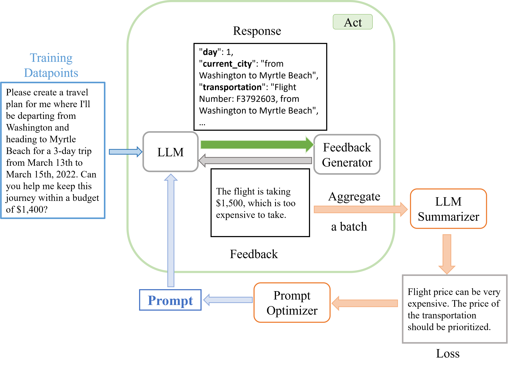

# RePrompt：为大型语言模型代理设计自动提示策略

发布时间：2024年06月16日

`Agent

这篇论文主要探讨了如何通过自动提示工程优化大型语言模型（LLMs）在特定领域内的应用，特别是在开发LLM代理以辅助日常生活中的各种工作方面。论文提出的\textsc{RePrompt}方法通过分析与LLM代理的交互历史来优化提示，从而提高LLM在特定领域内的规划能力。这与Agent分类相关，因为Agent通常指的是能够自主执行任务的智能系统，而LLM代理正是这样的系统，它们通过优化提示来改善性能，以更好地服务于特定任务或领域。` `人工智能辅助`

> RePrompt: Planning by Automatic Prompt Engineering for Large Language Models Agents

# 摘要

> 过去一年，大型语言模型（LLMs）在非传统自然语言处理领域取得了显著成就，人们开始探索其在代码生成、旅行规划和机器人控制等更贴近实际应用的领域中的应用。结合LLMs的强大能力与外部工具，人们正在开发LLM代理，旨在辅助日常生活中的各种工作。在这些领域，对LLMs的提示显著影响其生成内容及代理性能，因此自动提示工程成为研究者和用户关注的焦点。本文提出了一种名为\textsc{RePrompt}的新方法，通过分析与LLM代理的交互历史，对提示中的指令进行逐步优化，类似于“梯度下降”。优化后的提示使LLM能在特定领域内更好地规划。我们的实验证明，使用更新后的提示作为起点，\textsc{RePrompt}能有效提升不同推理任务的性能。

> In this past year, large language models (LLMs) have had remarkable success in domains outside the traditional natural language processing, and people are starting to explore the usage of LLMs in more general and close to application domains like code generation, travel planning, and robot controls. Connecting these LLMs with great capacity and external tools, people are building the so-called LLM agents, which are supposed to help people do all kinds of work in everyday life. In all these domains, the prompt to the LLMs has been shown to make a big difference in what the LLM would generate and thus affect the performance of the LLM agents. Therefore, automatic prompt engineering has become an important question for many researchers and users of LLMs. In this paper, we propose a novel method, \textsc{RePrompt}, which does "gradient descent" to optimize the step-by-step instructions in the prompt of the LLM agents based on the chat history obtained from interactions with LLM agents. By optimizing the prompt, the LLM will learn how to plan in specific domains. We have used experiments in PDDL generation and travel planning to show that our method could generally improve the performance for different reasoning tasks when using the updated prompt as the initial prompt.

[Arxiv](https://arxiv.org/abs/2406.11132)