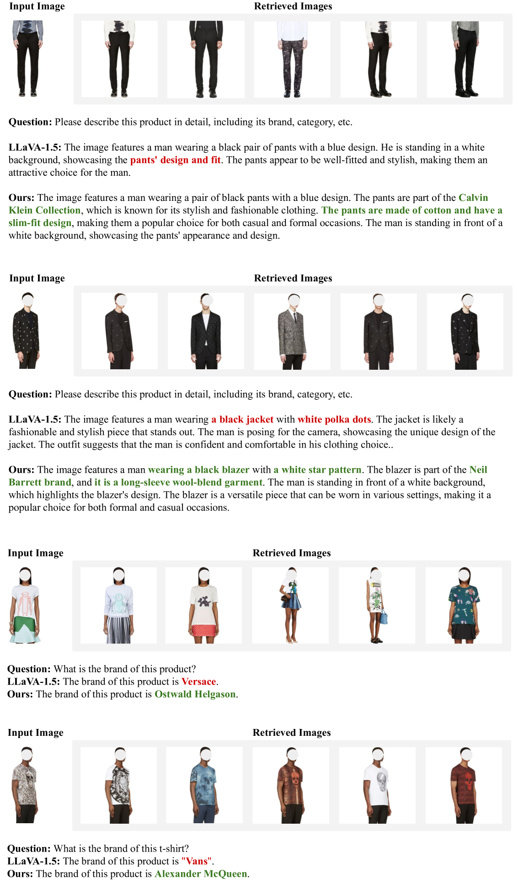

# 借助检索标签，唤醒多模态大型语言模型对物体感知知识的记忆

发布时间：2024年06月16日

`RAG

理由：这篇论文主要关注多模态大型语言模型（MLLMs）在视觉指令跟随方面的挑战，并提出了一种基于检索增强的方法（TUNA）来改进图像到文本的映射过程。这种方法涉及到使用检索增强的标签令牌来增强映射过程，这是检索增强生成（RAG）技术的一个应用。因此，这篇论文更符合RAG分类，因为它专注于通过检索增强技术来改进多模态语言模型的性能。` `计算机视觉`

> Reminding Multimodal Large Language Models of Object-aware Knowledge with Retrieved Tags

# 摘要

> 尽管多模态大型语言模型（MLLMs）在视觉指令跟随方面有所进步，但在提供精确且详细的视觉指令响应时，仍面临挑战：无法识别新物体、错误提及不存在物体及忽略物体细节。虽然增加数据量和模型大小能缓解问题，但成本高昂。本文从多模态连接器的图像到文本映射视角，探讨了这些问题，并指出训练数据不足是多模态连接器的局限。为此，我们提出使用检索增强的标签令牌，这些令牌包含丰富的物体信息，以增强映射过程。通过我们的基于标签的视觉指令调整与检索增强（TUNA）方法，我们在12个基准测试中超越了基线，并展示了在特定数据存储下的零样本能力。

> Despite recent advances in the general visual instruction-following ability of Multimodal Large Language Models (MLLMs), they still struggle with critical problems when required to provide a precise and detailed response to a visual instruction: (1) failure to identify novel objects or entities, (2) mention of non-existent objects, and (3) neglect of object's attributed details. Intuitive solutions include improving the size and quality of data or using larger foundation models. They show effectiveness in mitigating these issues, but at an expensive cost of collecting a vast amount of new data and introducing a significantly larger model. Standing at the intersection of these approaches, we examine the three object-oriented problems from the perspective of the image-to-text mapping process by the multimodal connector. In this paper, we first identify the limitations of multimodal connectors stemming from insufficient training data. Driven by this, we propose to enhance the mapping with retrieval-augmented tag tokens, which contain rich object-aware information such as object names and attributes. With our Tag-grounded visual instruction tuning with retrieval Augmentation (TUNA), we outperform baselines that share the same language model and training data on 12 benchmarks. Furthermore, we show the zero-shot capability of TUNA when provided with specific datastores.

[Arxiv](https://arxiv.org/abs/2406.10839)