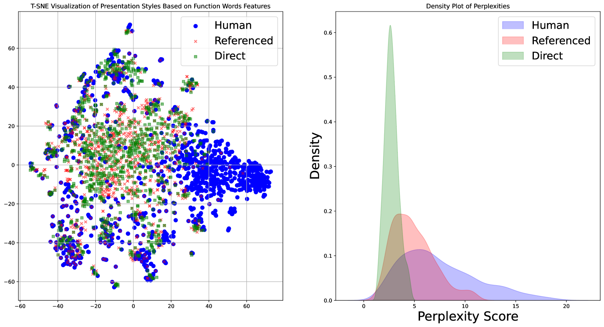
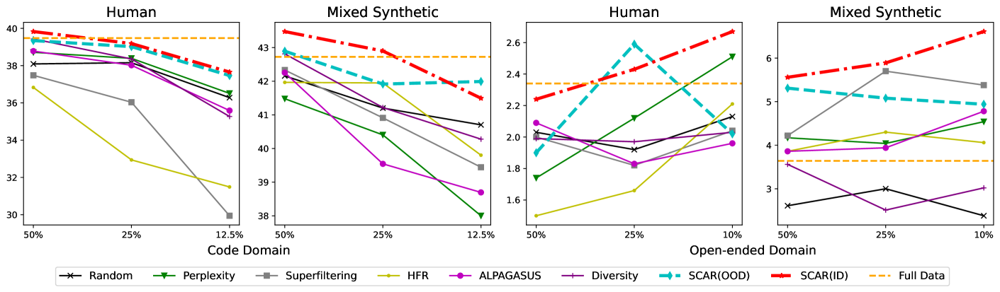
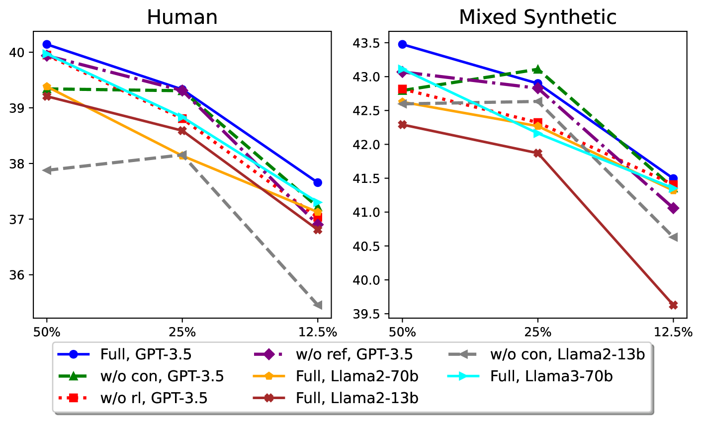

# SCAR：利用风格一致性响应排序优化大型语言模型的指令调优效率

发布时间：2024年06月16日

`LLM应用

这篇论文主要探讨了如何通过提高训练数据中回答风格的一致性来优化大型语言模型（LLMs）的性能。研究中提出了风格一致性感知回答排序（SCAR）技术，这是一种能够根据回答的风格一致性自动对训练数据进行排序的方法。通过使用风格一致性最高的样本进行微调，LLMs在特定测试中表现出了优于使用完整数据集训练的模型的性能。这一研究成果直接应用于LLM的训练和优化过程中，因此属于LLM应用分类。` `机器学习`

> SCAR: Efficient Instruction-Tuning for Large Language Models via Style Consistency-Aware Response Ranking

# 摘要

> 最新研究表明，保持专家回答风格的一致性并提升训练数据质量，能有效减少训练样本需求，同时大幅提高微调大型语言模型（LLMs）的性能。尽管如此，风格的具体定义及其与数据质量和模型性能的关系仍模糊不清。本研究将回答风格细分为呈现与构成两方面，并揭示在同等质量的训练数据中，风格一致性更强的数据能显著提升LLM性能。基于此，我们开发了风格一致性感知回答排序（SCAR），该技术能自动根据回答的风格一致性对训练数据进行排序。通过精选风格一致性最高的样本，从数据集前25%至0.7%，微调后的LLMs在编码和开放式问答测试中表现出色，甚至超越了使用完整数据集训练的模型。相关代码和数据已公开于https://github.com/zhuang-li/SCAR。

> Recent studies have shown that maintaining a consistent response style by human experts and enhancing data quality in training sets can significantly improve the performance of fine-tuned Large Language Models (LLMs) while reducing the number of training examples needed. However, the precise definition of style and the relationship between style, data quality, and LLM performance remains unclear. This research decomposes response style into presentation and composition styles and finds that, among training data of similar quality, those with higher style consistency lead to better LLM performance. Inspired by this, we introduce Style Consistency-Aware Response Ranking (SCAR), which automatically prioritizes instruction-response pairs in the training set based on their response stylistic consistency. By selecting the most style-consistent examples, ranging from the top 25% to 0.7% of the full dataset, the fine-tuned LLMs can match or even surpass the performance of models trained on the entire dataset in coding and open-ended question-answering benchmarks. Code and data are available at https://github.com/zhuang-li/SCAR .

[Arxiv](https://arxiv.org/abs/2406.10882)