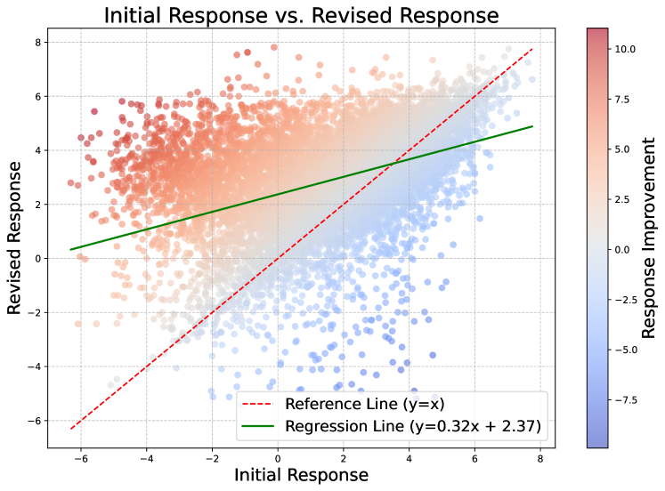
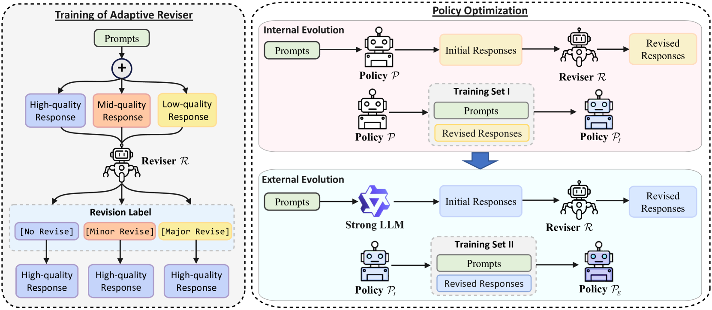
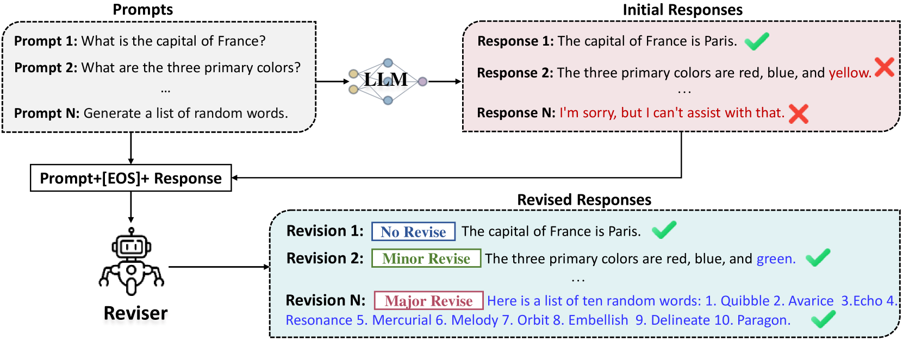
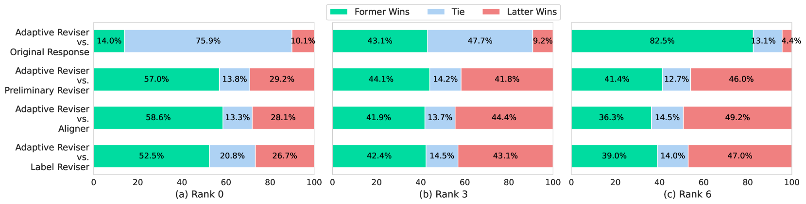
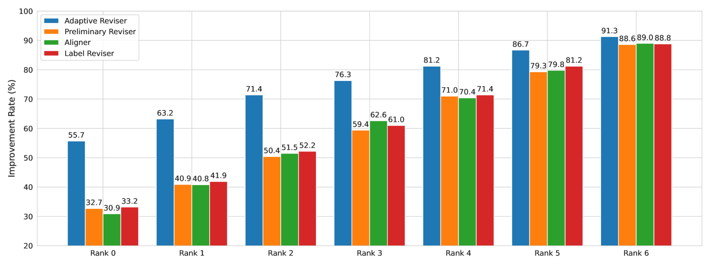
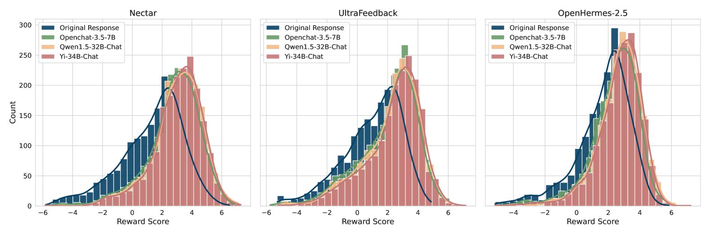
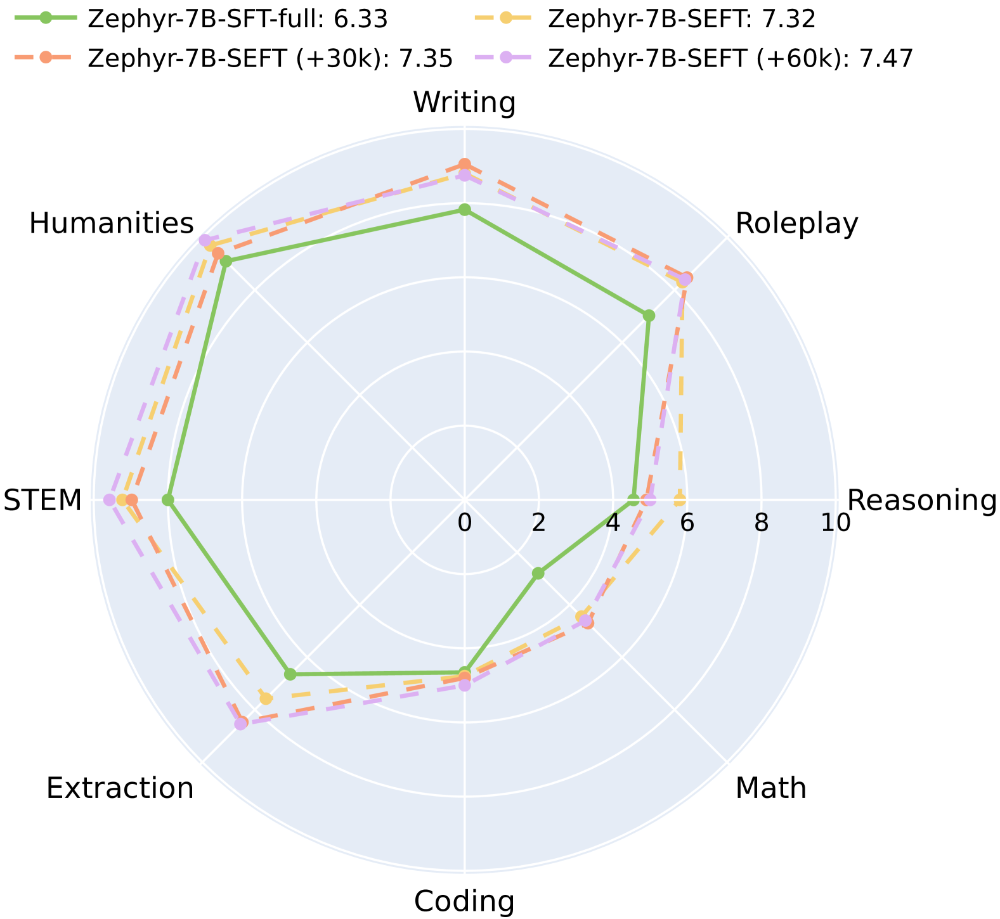
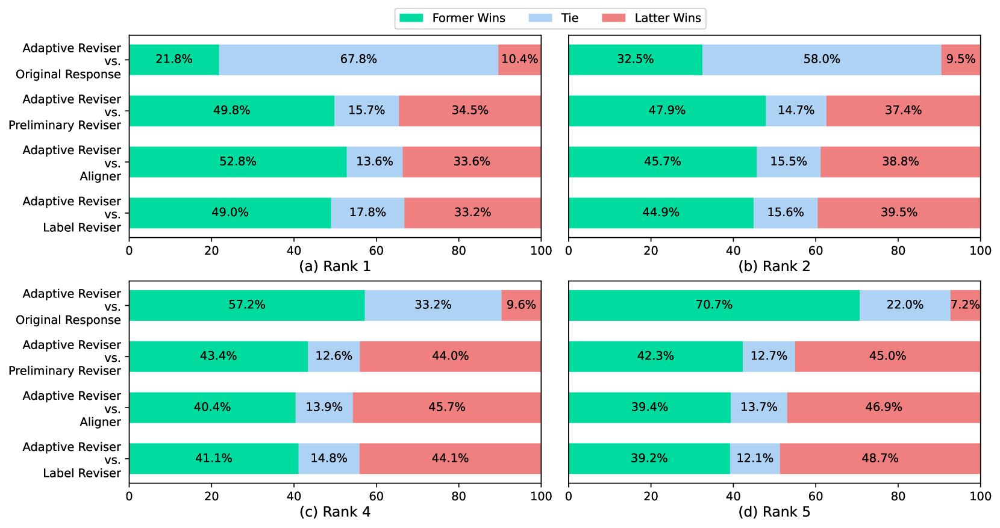

# 策略优化中的自我进化微调

发布时间：2024年06月16日

`LLM理论

理由：这篇论文主要探讨了大型语言模型（LLM）的对齐问题，并提出了一种新的策略优化方法——自进化微调（SEFT）。这种方法旨在解决现有对齐方法的局限性，如对大量高质量标注数据的依赖和复杂性问题。SEFT的创新之处在于其能够利用未标注数据进行策略优化，这涉及到LLM的理论和内部机制的改进。因此，这篇论文更偏向于LLM的理论研究，而不是具体的应用、Agent设计或RAG技术。` `人工智能`

> Self-Evolution Fine-Tuning for Policy Optimization

# 摘要

> 大型语言模型的对齐至关重要，不仅为了发挥其在特定任务中的潜力，还为了确保其响应符合人类期望并遵循安全和伦理准则。然而，现有的对齐方法如监督式微调（SFT）和基于人类反馈的强化学习（RLHF）均面临挑战。SFT需要大量高质量的标注数据，而RLHF则复杂且不稳定。为此，我们提出了自进化微调（SEFT），一种新的策略优化方法，旨在无需标注样本的同时保持SFT的稳定性和效率。SEFT通过训练一个适应性修订器，提升低质量响应并保持高质量响应，逐步引导策略优化。该方法的亮点在于能利用大量未标注数据进行策略优化。我们在AlpacaEval 2.0和MT-Bench的实验验证了SEFT的有效性，并详细分析了其相对于现有技术的优势。

> The alignment of large language models (LLMs) is crucial not only for unlocking their potential in specific tasks but also for ensuring that responses meet human expectations and adhere to safety and ethical principles. Current alignment methodologies face considerable challenges. For instance, supervised fine-tuning (SFT) requires extensive, high-quality annotated samples, while reinforcement learning from human feedback (RLHF) is complex and often unstable. In this paper, we introduce self-evolution fine-tuning (SEFT) for policy optimization, with the aim of eliminating the need for annotated samples while retaining the stability and efficiency of SFT. SEFT first trains an adaptive reviser to elevate low-quality responses while maintaining high-quality ones. The reviser then gradually guides the policy's optimization by fine-tuning it with enhanced responses. One of the prominent features of this method is its ability to leverage unlimited amounts of unannotated data for policy optimization through supervised fine-tuning. Our experiments on AlpacaEval 2.0 and MT-Bench demonstrate the effectiveness of SEFT. We also provide a comprehensive analysis of its advantages over existing alignment techniques.

[Arxiv](https://arxiv.org/abs/2406.10813)