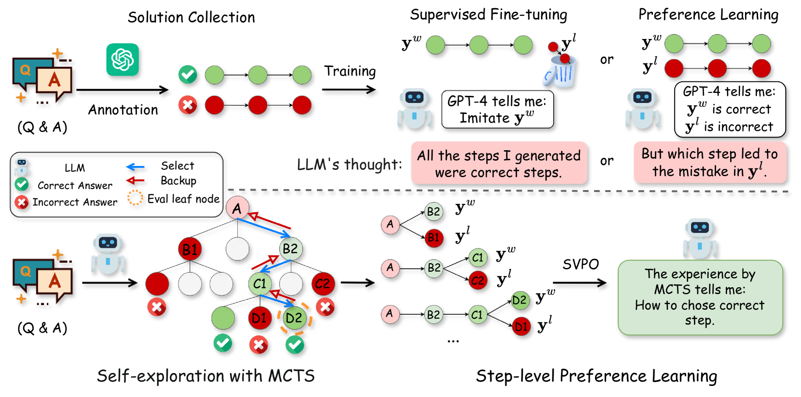
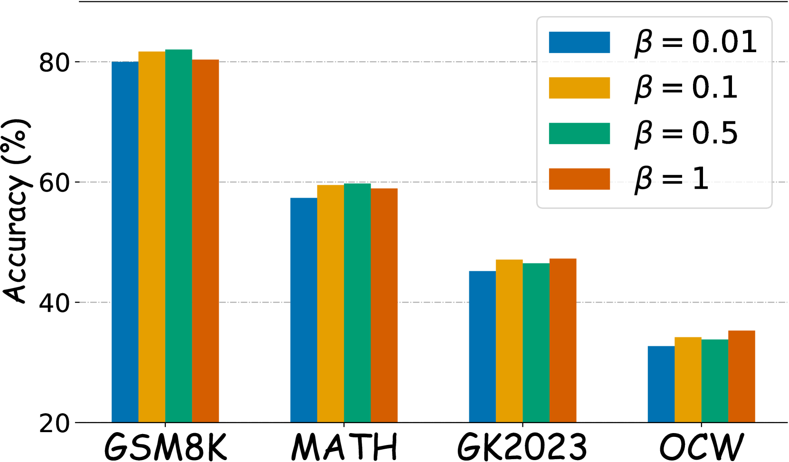
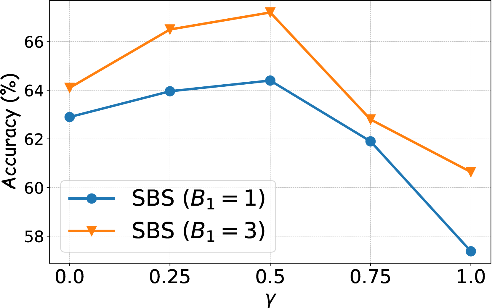
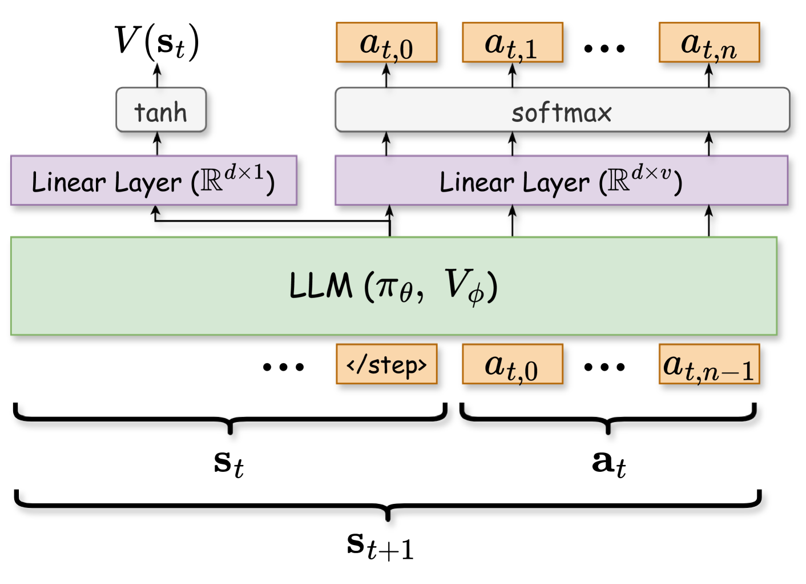

# 数学推理中的步骤级价值偏好优化

发布时间：2024年06月16日

`LLM应用

这篇论文主要介绍了针对大型语言模型（LLMs）的微调方法，特别是在处理复杂的多步骤推理任务时的优化策略。论文提出了步骤级价值偏好优化（SVPO）算法，并结合蒙特卡洛树搜索（MCTS）和学习排序的思想，以提高模型在数学推理等任务中的表现。这种方法直接应用于LLM的优化和性能提升，属于LLM应用的范畴。` `人工智能`

> Step-level Value Preference Optimization for Mathematical Reasoning

# 摘要

> 采用隐式奖励模型的直接偏好优化（DPO）为微调大型语言模型（LLMs）提供了一种有效途径，相较于依赖人类反馈的强化学习（RLHF）。但在处理复杂的多步骤推理任务，如数学推理时，现有的偏好标注方法难以细致地评估模型输出。为此，我们创新性地提出了步骤级价值偏好优化（SVPO）算法，利用蒙特卡洛树搜索（MCTS）自动为推理步骤打上偏好标签。同时，借鉴学习排序的思想，我们训练了一个显式价值模型，以模拟隐式奖励模型的行为，从而完善了偏好优化过程。这一价值模型使LLM能够在推理时以极低成本生成高奖励的响应。实验证明，我们的方法在各类数学推理测试中均取得了顶尖成绩。

> Direct Preference Optimization (DPO) using an implicit reward model has proven to be an effective alternative to reinforcement learning from human feedback (RLHF) for fine-tuning preference aligned large language models (LLMs). However, the overall preference annotations of responses do not fully capture the fine-grained quality of model outputs in complex multi-step reasoning tasks, such as mathematical reasoning. To address this limitation, we introduce a novel algorithm called Step-level Value Preference Optimization (SVPO). Our approach employs Monte Carlo Tree Search (MCTS) to automatically annotate step-level preferences for multi-step reasoning. Furthermore, from the perspective of learning-to-rank, we train an explicit value model to replicate the behavior of the implicit reward model, complementing standard preference optimization. This value model enables the LLM to generate higher reward responses with minimal cost during inference. Experimental results demonstrate that our method achieves state-of-the-art performance on both in-domain and out-of-domain mathematical reasoning benchmarks.

[Arxiv](https://arxiv.org/abs/2406.10858)