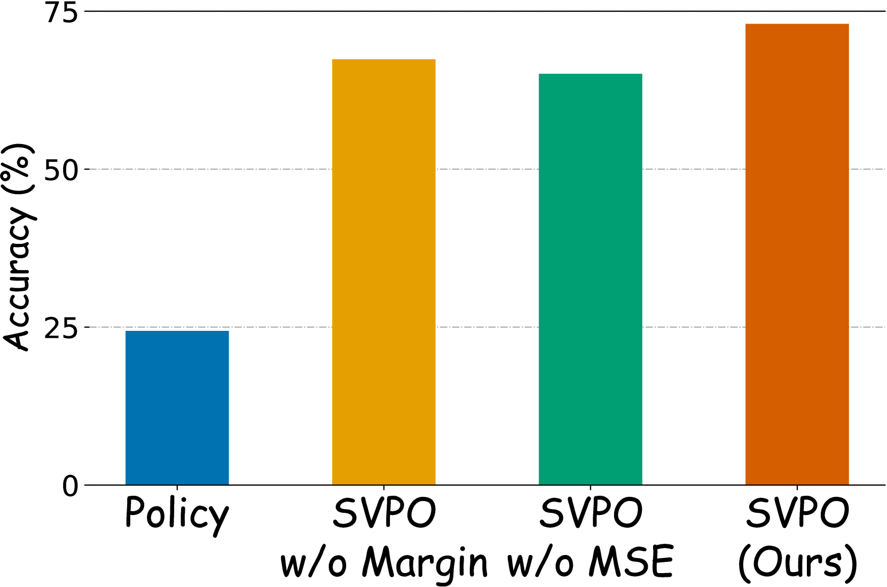

# 数学推理中的步骤级价值偏好优化

发布时间：2024年06月16日

`LLM应用

这篇论文摘要讨论了一种新的算法——步骤级价值偏好优化（SVPO），用于微调大型语言模型（LLMs）以处理复杂的多步骤推理任务，如数学推理。该方法通过蒙特卡洛树搜索（MCTS）自动为任务注释步骤级偏好，并训练了一个显式价值模型来模拟隐式奖励模型的行为。这种方法提高了LLM在推理任务中的性能，特别是在数学推理的域内和域外基准测试中表现出色。因此，这篇论文属于LLM应用类别，因为它专注于改进LLM在特定任务上的应用性能。` `人工智能`

> Step-level Value Preference Optimization for Mathematical Reasoning

# 摘要

> 利用隐式奖励模型的直接偏好优化（DPO）已成为微调大型语言模型（LLMs）偏好的一种高效替代方案，相较于传统的从人类反馈中强化学习（RLHF）。但在处理复杂的多步骤推理任务，如数学推理时，现有的偏好注释方法难以捕捉模型输出的精细质量。为此，我们创新性地提出了步骤级价值偏好优化（SVPO）算法，通过蒙特卡洛树搜索（MCTS）自动为多步骤推理任务注释步骤级偏好。同时，借鉴学习排序的思想，我们训练了一个显式价值模型，以模拟隐式奖励模型的行为，从而完善了偏好优化过程。这一价值模型使LLM在推理时能以极低成本生成更高奖励的响应。实验证明，我们的方法在数学推理的域内和域外基准测试中均取得了顶尖性能。

> Direct Preference Optimization (DPO) using an implicit reward model has proven to be an effective alternative to reinforcement learning from human feedback (RLHF) for fine-tuning preference aligned large language models (LLMs). However, the overall preference annotations of responses do not fully capture the fine-grained quality of model outputs in complex multi-step reasoning tasks, such as mathematical reasoning. To address this limitation, we introduce a novel algorithm called Step-level Value Preference Optimization (SVPO). Our approach employs Monte Carlo Tree Search (MCTS) to automatically annotate step-level preferences for multi-step reasoning. Furthermore, from the perspective of learning-to-rank, we train an explicit value model to replicate the behavior of the implicit reward model, complementing standard preference optimization. This value model enables the LLM to generate higher reward responses with minimal cost during inference. Experimental results demonstrate that our method achieves state-of-the-art performance on both in-domain and out-of-domain mathematical reasoning benchmarks.

[Arxiv](https://arxiv.org/abs/2406.10858)