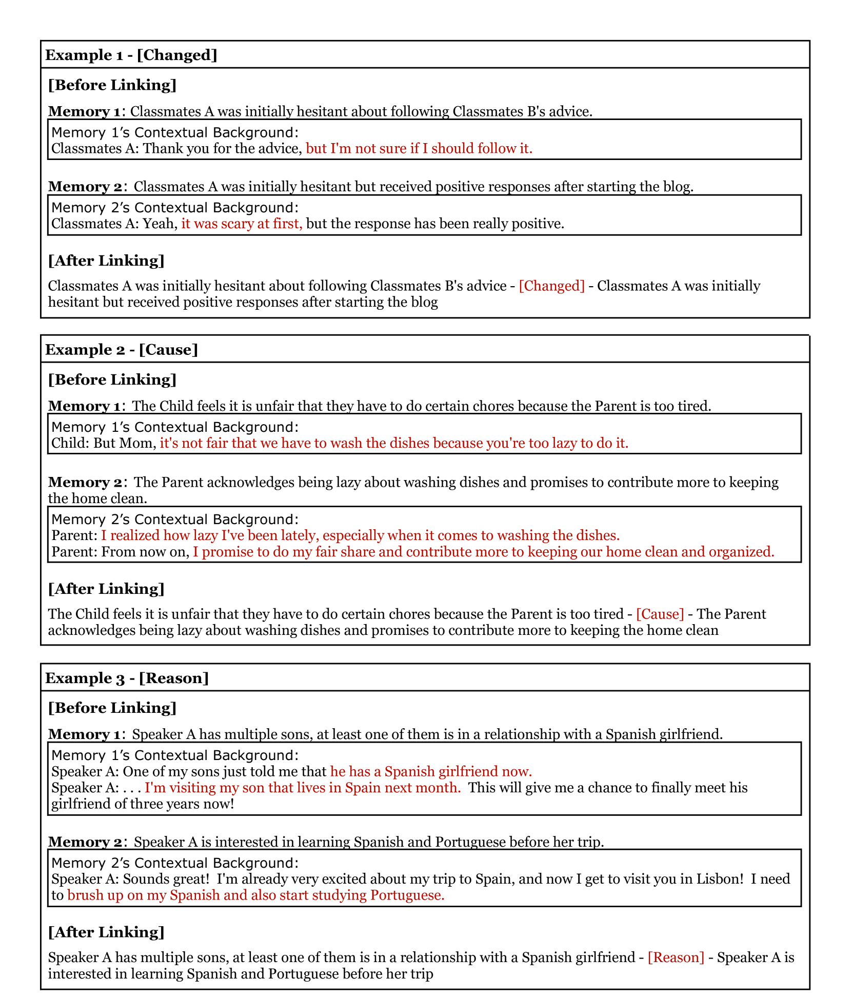

# THEANINE：重塑长期对话的内存管理，借助时间线增强响应生成技术

发布时间：2024年06月16日

`Agent

这篇论文主要探讨了如何通过记忆增强对话回应，以提升大型语言模型（LLMs）在处理长篇对话历史时的表现。论文中提出的Theanine框架和TeaFarm系统，以及相关的TeaBag数据集，都是为了优化LLMs在对话中的表现。这些工作涉及到设计特定的框架和系统来增强模型的对话能力，因此更符合Agent分类，即设计和实现能够与环境交互并执行任务的智能代理。` `对话系统` `人工智能`

> THEANINE: Revisiting Memory Management in Long-term Conversations with Timeline-augmented Response Generation

# 摘要

> 大型语言模型（LLMs）虽能处理长篇对话历史，但其回应常忽略或误记过往信息。本文探讨了在LLMs时代如何通过记忆增强对话回应。与以往研究不同，我们认为过时记忆能提供理解过往事件发展的线索，从而优化回应。我们推出了Theanine框架，通过记忆时间线——一系列展示事件发展和因果的记忆——提升LLMs的回应质量。同时，我们开发了TeaFarm，一个反事实驱动的问题回答系统，以克服G-Eval在长对话中的不足。关于我们的方法和TeaFarm评估所需的TeaBag数据集的详细信息，请访问https://theanine-693b0.web.app/。

> Large language models (LLMs) are capable of processing lengthy dialogue histories during prolonged interaction with users without additional memory modules; however, their responses tend to overlook or incorrectly recall information from the past. In this paper, we revisit memory-augmented response generation in the era of LLMs. While prior work focuses on getting rid of outdated memories, we argue that such memories can provide contextual cues that help dialogue systems understand the development of past events and, therefore, benefit response generation. We present Theanine, a framework that augments LLMs' response generation with memory timelines -- series of memories that demonstrate the development and causality of relevant past events. Along with Theanine, we introduce TeaFarm, a counterfactual-driven question-answering pipeline addressing the limitation of G-Eval in long-term conversations. Supplementary videos of our methods and the TeaBag dataset for TeaFarm evaluation are in https://theanine-693b0.web.app/.

[Arxiv](https://arxiv.org/abs/2406.10996)