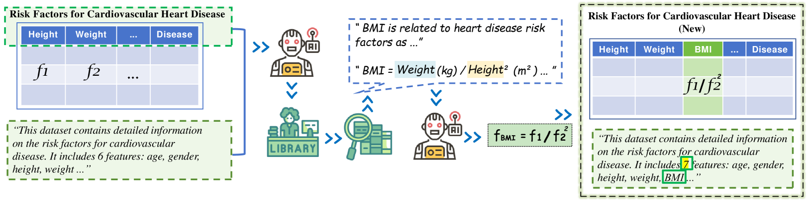
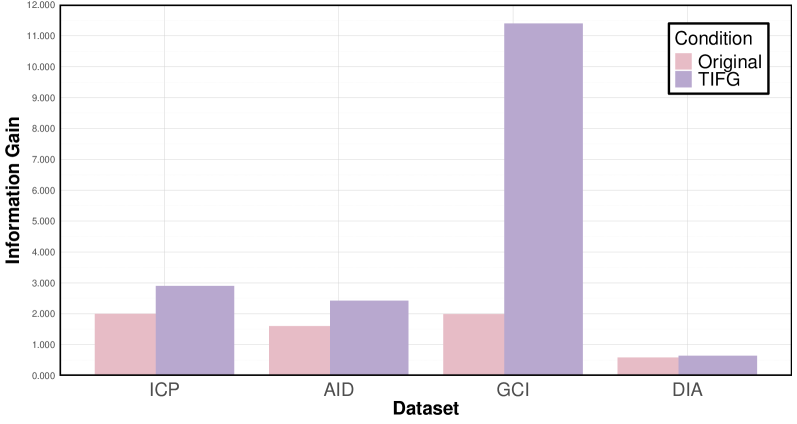
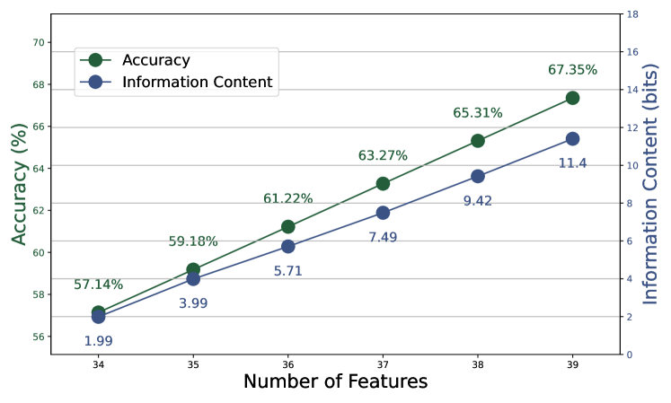
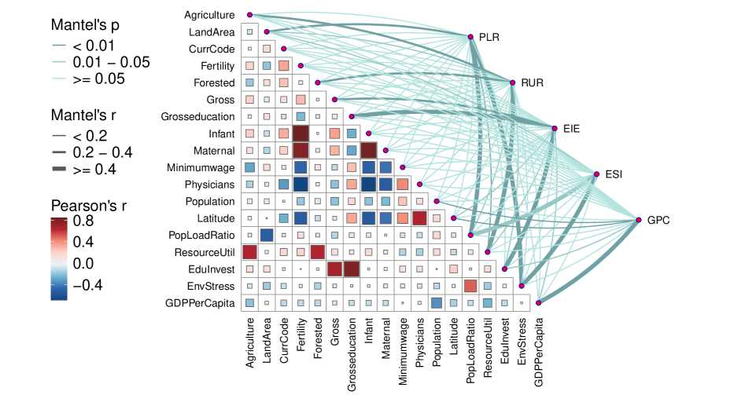
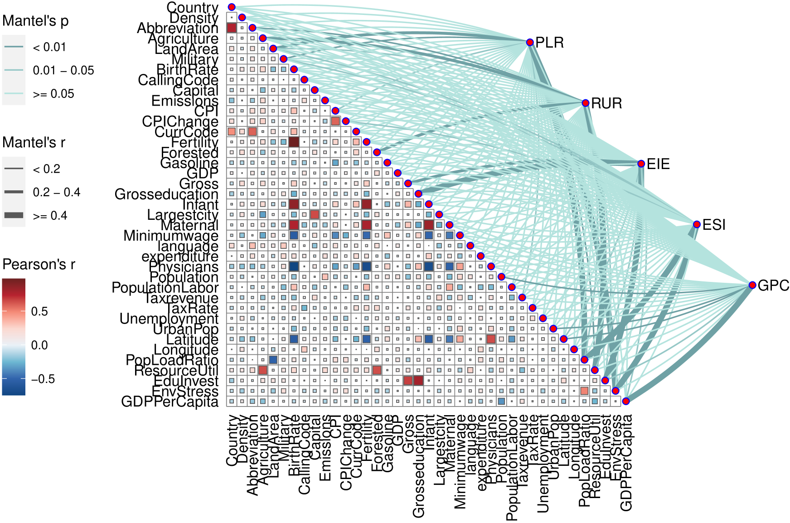

# TIFG：大型语言模型驱动下的文本引导特征生成技术

发布时间：2024年06月16日

`RAG

理由：这篇论文主要介绍了一种名为Text-Informed Feature Generation（TIFG）的新框架，该框架利用检索增强生成（RAG）技术来生成新的可解释特征。RAG技术是论文的核心，用于从外部知识中提取相关特征，这与RAG分类直接相关。虽然论文中提到了LLM，但LLM在这里是作为支持RAG技术的一个工具，而不是论文的主要研究对象。因此，将这篇论文归类为RAG更为合适。` `数据挖掘` `特征工程`

> TIFG: Text-Informed Feature Generation with Large Language Models

# 摘要

> 在数据挖掘和特征工程中，文本信息的重要性不言而喻。遗憾的是，现有方法往往只关注数据结构，忽视了伴随数据的文本信息，从而错失了挖掘文本中深层数据关系的良机。为此，我们提出了Text-Informed Feature Generation（TIFG），一种基于LLM的创新文本信息特征生成框架。TIFG通过检索增强生成（RAG）技术，利用文本信息从外部知识中提取相关特征，生成新的可解释特征，丰富特征空间，并深入挖掘特征间的关系。我们的TIFG框架自动化且持续优化，能适应新数据输入，不断提升下游任务性能。在多个下游任务的广泛实验中，TIFG展现出了生成高质量、有意义特征的能力，显著超越了现有方法。

> Textual information of data is of vital importance for data mining and feature engineering. However, existing methods focus on learning the data structures and overlook the textual information along with the data. Consequently, they waste this valuable resource and miss out on the deeper data relationships embedded within the texts. In this paper, we introduce Text-Informed Feature Generation (TIFG), a novel LLM-based text-informed feature generation framework. TIFG utilizes the textual information to generate features by retrieving possible relevant features within external knowledge with Retrieval Augmented Generation (RAG) technology. In this approach, the TIFG can generate new explainable features to enrich the feature space and further mine feature relationships. We design the TIFG to be an automated framework that continuously optimizes the feature generation process, adapts to new data inputs, and improves downstream task performance over iterations. A broad range of experiments in various downstream tasks showcases that our approach can generate high-quality and meaningful features, and is significantly superior to existing methods.

[Arxiv](https://arxiv.org/abs/2406.11177)